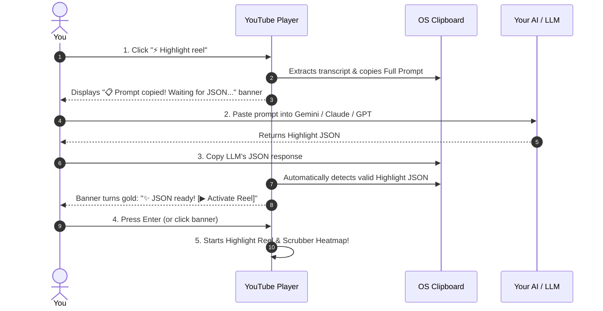

# Search Dynamic Highlight Reels

## User

search through gemini threads (via hermes database) or project notes for an idea where we can create dynamic "highlight reels" for youtube videos live in browser given an LLM's analysis of the transcript for that video

---

## Assistant

Created At: 2026-08-07T23:59:14-06:00
Completed At: 2026-08-07T23:59:18-06:00

				The command exited with code 0.
				Output:
				<truncated 55 lines>

## Mandatory agymcp Delegation Protocol (NO Native Subagents & NO Raw Terminal agy)
- **Strict Prohibition**: The main orchestrator (M) MUST NEVER use native Antigravity `invoke_subagent` OR run raw `run_command("agy -p ...")` terminal commands. 
- **Mandatory Tool (`agymcp`)**: ALL subagent tasks (Context Fetching, Pro Planning, File Edits, QA Audits) MUST be invoked via the `agymcp` server tools (`agymcp:agy`, `agymcp:agy_continue`, or `agymcp:agy_start`), which manages tmux background sessions cleanly.

## Flash-Lite Edit Delegation (Antigravity Native)
- **Rule:** When running in Antigravity, the top-level orchestrator agent MUST **never write or modify files directly** using `write_to_file`, `replace_file_content`, or `multi_replace_file_content` itself. Instead, it MUST delegate ALL file creation and editing operations to a `flash_lite` subagent. The orchestrator agent MUST NOT fall back to or use `Model: "flash"`; `flash_lite` is the strictly enforced requirement.
- **How:** To definitively prevent recursive subagent loops, the orchestrator MUST physically restrict the subagent's tools:
  1. Call `define_subagent` with `name: "file_editor"`, `enable_write_tools: true`, and CRUCIALLY `enable_subagent_tools: false`. Include a `system_prompt` explicitly telling it that it is a leaf agent and MUST edit files directly.
  2. Spawn the subagent via `invoke_subagent` using `TypeName: "file_editor"` and `Model: "flash_lite"`. Pass a fully self-contained prompt with the exact target file path(s), precise instructions, and sufficient context.
  *(Note: Because `enable_subagent_tools` is false, the child agent physically lacks the `invoke_subagent` tool, breaking any recursion loop at the system level.)*
- **Exceptions** (orchestrator may edit directly):
  1. The task is **planning-only** (producing an artifact/plan with no source code changes).
  2. The user explicit
<truncated 4221 bytes>
===============================

--- LiteLLM ---
# ==============================================================================
# LEAN CODING STACK - CHEAPEST TO SMARTEST (By SWE-Bench Pro Score & Cost)
# ==============================================================================
#
# --- TIER 1: ULTRA-BUDGET & BACKGROUND LOOPS ---
# 1. deepseek-v4-flash   ($0.04/task | 52.6% | ~100 t/s) - Background scripts, linters, log parsing
# 2. gemini-3.5-flash-lite ($0.15/task | 54.2% | 350 t/s)  - Google credit speed demon for instant loops
#
# --- TIER 2: DAILY DRIVERS & PARETO WINNERS ---
# 3. muse-spark-1.1        ($0.26/task | 61.5% | ~120 t/s) - Primary daily driver (*Vercel Proxy Active)
# 4. grok-4.5              ($0.31/task | 64.7% | ~110 t/s) - Cheap step-up when Muse Spark hits a wall
# 5. gemini-3.1-pro        ($0.36/task | 54.2% | ~80 t/s)  - 1M+ context window for huge monorepo dumps
#
# --- TIER 3: DELEGATION & HEAVY REASONING ---
# 6. claude-sonnet-5       ($0.75/task | 63.2% | ~90 t/s)  - Multi-agent manager & task delegation
# 7. gemini-3.6-flash      ($0.80/task | 58.7% | 143 t/s)  - Primary high-speed Google agent driver
# 8. claude-opus-5         ($1.35/task | 71.5% | ~70 t/s)  - Heavy refactoring (50% the price of Fable)
# 9. claude-fable-5        ($2.50/task | 80.3% | ~60 t/s)  - Nuclear option for systemic architecture bugs
# ==============================================================================
#
# SUFFIX ALIASES: Models can be called with -high / -medium / -low suffixes
# (e.g. deepseek-v4-flash-high) to pass reasoning effort hints from callers
# like Hermes. All suffix variants route to the same underlying model.
# ==============================================================================

--- Rules ---
rules status: OK

--- Thread Bloat ---
thread bloat status: OK

--- Git ---
Git pull finished: 

--- Conversation Response ---
Conversation Response: Updated (3ff7b533, 25d6c853, 242530df, 4aac32dc)

[PREFLIGHT LOGGED] Timestamp: 2026-08-07 23:59:18 | Written to ~/.preflight.log

Created At: 2026-08-07T23:59:19-06:00
Completed At: 2026-08-07T23:59:19-06:00
File Path: `file:///Users/matt/projects/ai-os/AG_CONTEXT.md`
Total Lines: 31
Total Bytes: 4729
Showing lines 1 to 31
The following code has been modified to include a line number before every line, in the format: <line_number>: <original_line>. Please note that any changes targeting the original code should remove the line number, colon, and leading space.
1: # Repository Context & Domain Knowledge
2: 
3: ## Project Overview
4: `ai-os` is a local-first AI harness designed to transform a macOS machine into an editable, interactive database of thoughts, files, and automation.
5: 
6: ## Core Directories & Structure
7: - `/bin`: Wrapper scripts and orchestrator binaries (e.g. `ai-os`, `agy`).
8: - `/docs`: Architecture, vision, memory, and strategy documentation.
9: - `/scripts`: Tool helper scripts (`subagent.py`, `get_last_cost.py`, `context_handoff.py`, `precision_edit.py`, `get-active-task.sh`, etc.).
10: - `/agent-logs`: Session engineering logs tracking goals, changes, and architecture discoveries (for agents).
11: - `/DEVELOPMENT_JOURNAL.md`: Human-readable timeline of key decisions and pivots (for the user).
12: - `/.devtool/features`: Features and user task specifications.
13: 
14: ## Key Architecture & Domain Rules
15: - **AI Clipboard Memory Tool (Usage: search-clipboard '<query>' [--pro])**: Agents can search macOS Alfred clipboard history using natural language by running ⚡ Flash model found no confident match. Auto-escalating to Gemini 2.5 Pro...
16: 
17: === AI Search Results for '<query>' ===
18: No matching items found by AI. non-interactively in terminal. Supports URL pre-filtering, brand alias expansion (e.g. g.co, gemini.google.com), and auto-escalation to Gemini 2.5 Pro.
19: - **Stable Anchor + Volatile Append Context Strategy:** Uses a structural map (repo map generated via AST parser/tree-sitter) as the stable front of the prompt context, and appends only active files and user requests at the end to maximize cache h
<truncated 1268 bytes>
anner. `tauri-gui/src-tauri/src/main.rs` injects it into the webview; rebuild the Tauri app (`bun run build-macos`) for changes to take effect.
24: - **Three-Turn Delegation Protocol (Extreme Mode Only):** Available as the `agy-extreme-delegation` skill. Not the default — agy handles work directly with pragmatic self-delegation.
25: - **Hermes Thread Sync Daemon:** Integrates and synchronizes CLI/GUI NDJSON execution logs (`~/.gemini/antigravity-cli/brain/`) with Hermes' FTS5-enabled SQLite database (`~/.hermes/state.db`) bidirectionally. It launches as a background subprocess via the `bin/ai-os` execution wrapper, maintaining a unified search history across both platforms.
26: - **Hermes System Prompt Handoff**: Enabled the `agymcp` server to dynamically extract the active Hermes system prompt from `~/.hermes/state.db` and prepend it to prompts sent to `agy` (via `agy`, `agy_continue`, and `agy_start`) to align instructions and preserve behavioral consistency during task handoffs.
27: - **Multi-Tier Triage Routing & Pre-Flight Quota Check**: Evaluates remaining quota using `ag-quota -j` (or `codexbar status`). Automatically switches Antigravity to Minimal-Token Mode (Strict Orchestrator Mode 3) if remaining quota is low (<25%) or burning quickly, delegating code generation to `claude code` or cheap LiteLLM/subagent models.
28: - **Documentation & Wiki Architecture (6 Boundaries + Quartz Wiki):** Documentation is partitioned into 6 distinct boundaries: (1) AI-OS Core Project Docs (`~/projects/ai-os/docs/`), (2) Me & Personal (`Obsidian/Personal/`), (3) Mac System Specs (`Obsidian/Mac/`), (4) Personal Notes & Ideas (`Obsidian/Ideas/`), (5) Project Conceptual Specs (`Obsidian/Projects/<Name>/`), and (6) Implementation Code Docs (`~/projects/<Name>/docs/`). The unified off-the-shelf **Quartz 4.0 Wiki Engine** aggregates these boundaries and is served locally on `http://localhost:3333` via `ai-os wiki` or `ai-os-wiki`.
29: 
30: 
31: 
The above content shows the entire, complete file contents of the requested file.

Created At: 2026-08-07T23:59:21-06:00
Completed At: 2026-08-07T23:59:21-06:00
File Path: `file:///Users/matt/.gemini/config/skills/hermes-database-internals/SKILL.md`
Total Lines: 108
Total Bytes: 4496
Showing lines 1 to 108
The following code has been modified to include a line number before every line, in the format: <line_number>: <original_line>. Please note that any changes targeting the original code should remove the line number, colon, and leading space.
1: ---
2: name: hermes-database-internals
3: description: >-
4:   Hermes Agent's SQLite database architecture — schema layout, FTS5 dual-tokenizer
5:   search, trigger-based index sync, and the pattern for safely ingesting external
6:   data into state.db.
7: ---
8: 
9: # Hermes Database Internals
10: 
11: Hermes stores all conversation history and search indexes in a single SQLite database at `~/.hermes/state.db`. This skill documents how it's structured and how to safely interact with it.
12: 
13: ## Schema Map
14: 
15: ### `sessions` table (PK = `id TEXT`)
16: One row per conversation. Key columns:
17: 
18: | Column | Type | Notes |
19: |---|---|---|
20: | `id` | TEXT PK | `"YYYYMMDD_HHMM_random"` style for Hermes-native sessions, or any unique string for ingested ones |
21: | `source` | TEXT | Origin: `"cli"`, `"desktop"`, `"photon"`, or custom (e.g. `"gemini-archive"`) |
22: | `title` | TEXT | Has a **partial unique index** (`UNIQUE INDEX idx_sessions_title_unique ON sessions(title) WHERE title IS NOT NULL`) — can set to NULL to avoid collision |
23: | `started_at` | REAL | Unix epoch (seconds) |
24: | `message_count` | INTEGER | Denormalized count |
25: | `model` | TEXT | Model identifier |
26: | `ended_at` | REAL | Optional session end time |
27: 
28: Other columns (`input_tokens`, `output_tokens`, `cost_*`, etc.) can be left NULL when ingesting external data.
29: 
30: ### `messages` table (PK = `id INTEGER AUTOINCREMENT`)
31: One row per message in a conversation.
32: 
33: | Column | Type | Notes |
34: |---|---|---|
35: | `id` | INTEGER PK | A
<truncated 1382 bytes>
to BOTH FTS tables automatically
62: - `AFTER UPDATE`: deletes old FTS row, inserts new (full re-index of the row)
63: - `AFTER DELETE`: removes FTS row
64: 
65: This means **you only insert into the `messages` table** — the FTS indexes stay in sync automatically.
66: 
67: ## Safe Ingestion Pattern
68: 
69: When ingesting external data into Hermes' state.db:
70: 
71: ```python
72: # 1. Back up first
73: import shutil
74: shutil.copy2(str(state_db_path), str(state_db_path.with_suffix(".db.bak.<label>")))
75: 
76: # 2. Connect with WAL mode for concurrent read safety
77: conn = sqlite3.connect(str(state_db_path))
78: conn.execute("PRAGMA journal_mode=WAL")
79: conn.execute("PRAGMA synchronous=OFF")  # bulk insert speed
80: 
81: # 3. INSERT OR IGNORE for idempotent session creation
82: conn.execute(
83:     "INSERT OR IGNORE INTO sessions (id, source, title, started_at) VALUES (?, ?, ?, ?)",
84:     (session_id, source_name, title, timestamp),
85: )
86: 
87: # 4. Insert messages — triggers auto-populate FTS5
88: conn.execute(
89:     "INSERT INTO messages (session_id, role, content, timestamp) VALUES (?, ?, ?, ?)",
90:     (session_id, role, content, ts),
91: )
92: 
93: # 5. Commit
94: conn.commit()
95: conn.close()
96: ```
97: 
98: ### Key constraints to respect
99: - `sessions.id` is the only dedup key — use a deterministic ID (e.g. external conversation_id) for idempotency
100: - `idx_sessions_title_unique` is a **partial unique index** (`WHERE title IS NOT NULL`) — set title to NULL to avoid collision with other null-title entries
101: - `messages.id` auto-increments — never set it manually
102: - Don't touch FTS virtual tables directly; insert into `messages` and let triggers handle them
103: 
104: ## References
105: 
106: - `references/gemini-archive-ingestion.md` — full walkthrough of ingesting Gemini chat archives
107: - Hermes DB path: `~/.hermes/state.db`
108: - Schema dump: `sqlite3 ~/.hermes/state.db ".schema"`
The above content shows the entire, complete file contents of the requested file.

Created At: 2026-08-07T23:59:25-06:00
Completed At: 2026-08-07T23:59:25-06:00

				The command exited with code 0.
				Output:
				<truncated 1 lines>

Anyway... we can learn from it.

```

pnpm run audit

Already up to date

Done in 230ms using pnpm v11.10.0

$ python3 ./scrip...
---
Session: 20260711_182514_98b513 | Title: agy delegation mode change | Role: tool
Snippet: {"total_count": 50, "matches_format": "path-grouped: each file path on its own line, followed by indented '<line>: <content>' rows for matches in that file", "matches_text": "/Users/matt/.gemini/config/plugins/chrome-devtools-plugin/skills/troubleshooting/SKILL.md\n  12: Your first action should be ...
---
Session: 87cc967735edd377 | Title: what are better names for Alberta high school courses mathem | Role: assistant
Snippet: Okay, let's break down those Alberta high school math course names. You're right about Mathematics 31.


* 
Mathematics 31:


* Confirmation: Yes, Mathematics 31 is indeed the introductory Calculus course in the Alberta high school system. It typically covers limits, derivatives, and an introducti...
---
Session: 4c8eed4034a35bb0 | Title: I'm trying to extract URLs from this webpage, but they're us | Role: user
Snippet: I'm trying to extract URLs from this webpage, but they're using /node URLs... are they using some js to redirect or something? Any way to extract the actual URLs from this html?
```
<html lang="en" dir="ltr" class="js fontawesome-i2svg-active fontawesome-i2svg-complete"><head>  	
    <meta charset="...
---
Session: f89488579fbbc253 | Title: what does this mean: a donation to the Mississippi state NIL | Role: assistant
Snippet: "The Yak" is a popular daily show and podcast from Barstool Sports. It's known for its unscripted, free-flowing, and often absurd conversations among a rotating cast of Barstool personalities.


Here's a breakdown:


What is "The Yak"?


* Format: It's primarily a live video stream on YouTube (and ...
---
Session: 16036cca9cb1efa7 | Title: is this a great deal for $350 CAD: - N
<truncated 4232 bytes>
istant
Snippet: This looks like a really solid dissection lab. Your application of Faraday's and Lenz's laws to explain Back EMF acting as an electromagnetic governor is genuinely excellent—that's exactly the level of detail expected for senior-level physics.


Here are the missing labels you're looking for, along ...
---
Session: 9b6321f189f53241 | Title: Why does loose hair (ie cat fur) tend to clump together? Is  | Role: user
Snippet: Fix something in this lab report. Keep the formatting the same. Return the revised document to be in a markdown code block.

This makes it sound like there's multiple disassembly steps. In reality, there's just one. I pulled the rotor off.
Which almost makes me think this isn't a great option. Maybe...
---
Session: 9b6321f189f53241 | Title: Why does loose hair (ie cat fur) tend to clump together? Is  | Role: assistant
Snippet: It is completely fine that your device only took one physical step to disassemble. . A "stage" doesn't have to be a mechanical un-screwing step; it can simply be a stage of your visual inspection to document the internal components.


To make it sound more methodical without misrepresenting the proc...
---
Session: 9b6321f189f53241 | Title: Why does loose hair (ie cat fur) tend to clump together? Is  | Role: assistant
Snippet: That assignment guideline contains a few strict requirements that we need to make sure your report explicitly satisfies.


What Needed Addressing Based on the Assignment:

* Your original inquiry section answered them directly, but the text of the answers didn't weave the context of the question int...
---
Session: 9b6321f189f53241 | Title: Why does loose hair (ie cat fur) tend to clump together? Is  | Role: assistant
Snippet: # PH12 U7: Induction Lab — DC Fan Dissection & Analysis

<div class="metadata-header">
  <div><strong>Teacher:</strong> Naresh Chand</div>
  <div><strong>Student:</strong> Matthew Murphy</div>
  <div><strong>Date:</strong> June 8, 2026</div>
</div>

<iframe width="960" height="540" src="https://yout...
---

Created At: 2026-08-07T23:59:29-06:00
Completed At: 2026-08-07T23:59:30-06:00

				The command exited with code 0.
				Output:
				<truncated 2657 lines>
   [...os/scripts/context_handoff.py", "/Users/matt/projects/ai-os/scripts/check_thread_bloat.py", "/Users/matt/projects/ai-os/scripts/__pycache__/parse_litellm_models.cpython-314.pyc", "/Users/matt/projects/ai-os/scripts/parse_litellm_models.py", "/Users/matt/projects/ai-os/scripts/build_rules.py", "/Users/matt/projects/ai-os/scripts/sync_rules.sh", "/Users/matt/projects/ai-os/scripts/__pycache__/triage_router.cpython-311.pyc", "/Users/matt/projects/ai...]
----------------------------------------
Match on ('video', 'transcript', 'llm'): Session 9563d57118f4 | Title: None
   [....", "category": null}, {"name": "ascii-art", "description": "ASCII art: pyfiglet, cowsay, boxes, image-to-ascii.", "category": null}, {"name": "ascii-video", "description": "ASCII video: convert video/audio to colored ASCII MP4/GIF.", "category": null}, {"name": "audiocraft-audio-generation", "description": "AudioCraft: MusicGen text-to-music, AudioGen text-to-sound.", "category": null}, {"name": "audit", "description": "Perform a token waste aud...]
   [...ls and every direct action must be avoided.", "category": null}, {"name": "ai-os-audit", "description": "Run token waste audits on agent conversation transcripts using agy's audit_transcripts.py. Identifies inefficient tool usage patterns and delegation failures.", "category": null}, {"name": "ai-os-auto-commit", "description": "Delegate git commits to agy's auto_commit.py script for cheap, AI-generated commit messages via the LiteLLM proxy.", "c...]
   [...{"success": true, "skills": [{"name": "agy", "description": "Delegate to agy CLI and use agy's LiteLLM proxy as a Hermes custom provider. Print mode, interactive mode, quoting, path conventions, and provider routing.", "category": null}, {"name": "agy-extreme-delegation", "description": "Configure agy to delegate EVERYTHING possible — editing, research, context-gathering — to C
<truncated 4086 bytes>
.. Codex (OpenAI), and OpenClaw — autonomous coding and task-execution agents that use tool calling to interact with your system. Hermes works with any LLM provider (OpenRouter, Anthropic, OpenAI, Google, DeepSeek, xAI, local models, and 20+ others) and runs on Linux, macOS, Windows, and WSL.\n\nWhat makes Hermes different:\n\n- **Self-improving through skills** — Hermes learns from experience by saving reusable procedures as skills. When it solves...]
----------------------------------------
Match on ('video', 'transcript', 'llm'): Session 20260728_135202_e97791 | Title: Antigravity Subagent Spawning Crisis
   [...io.h><gtk/gtk.h><megabytes><net/net.h><stdbool.h><strings.h><sys/uio.h><windows.h>BOOTSTRAP_HBUFFER_SPANGIT_VERSIONGLEW_STATICHPBUFFERARBHPBUFFEREXTHPVIDEODEV*HTTP_##nameINVALID_URLIS_UNSIGNEDITEM_HEADERITEM_STRINGLF_EXPECTEDMKDA_NORMALMKD_NOIMAGEMKD_NOLINKSMKD_NOPANTSMKD_TABSTOPMakeFrustumNEW_MESSAGENWMan_eventN_WMAN_QUITPGPU_DEVICEPyCFunctionPyDict_SizePyIntObjectPyInt_CheckPyLong_TypePySet_CheckPyTuple_NewPy_HUGE_VALPy_PYTHON_HPy_UNICODE*RF_St...]
   [...getSubjectheaderSentisReadOnlymDragStatemTouchSloponEdgeLockopenDrawerpostResultprincipalspswitch_deremovePrefsyncStatustry_start_<comment:>NBFFIConstTranscriptaGeneratorallSatisfyanySatisfyasShortcutasStringOnclassTraitcopyEmpty.deepCopieremptyBlockemptyCheckforSecondsfoundBlockfuelAcceptifNotEmptylabelBlocklastUpdatemaxElementmethodsFornewElementnewProcessnextPutAlloldElementpieceBlockreciprocalsignalWithstartingAtsumNumberstestStringthenReject...]
   [...edpackageNameremountModesetListenersetupAppDir.user.loginALIssueListDescriptionWeightLimitbeam_valuestumor_limitBlueprint**demonstrateinformationinstallmentpercent_offtransition.#.Files.Dir#.UT.appdir#.UT.expectCoverResultListOfNamesProfileDataexpect_origis_functionDWordMemoryEntireRangeDEFINITIONSListOfItemscompanyNamedateOfOrder<asp:Label>CodeBehind=Codebehind=configured.GMP.mpz_absGMP.mpz_addGMP.mpz_mulGMP.mpz_negGMP.mpz_subUN.castvwtp_choose_...]
----------------------------------------

Created At: 2026-08-07T23:59:35-06:00
Tool is running as a background task with task id: 4aac32dc-cc32-416a-874d-4de452ac5d7a/task-14
Task Description: python3 -c "
import os, glob, re

def search_files(base_dirs, patterns, file_exts=['.md', '.txt', '.json', '.js', '.ts', '.py']):
    matches = []
    for base in base_dirs:
        expanded = os.path.expanduser(base)
        if not os.path.exists(expanded):
            continue
        for root, dirs, files in os.walk(expanded):
            # Skip heavy dirs
            dirs[:] = [d for d in dirs if d not in ['node_modules', '.git', '.venv', 'dist', 'build', '.cache', 'target', '.next']]
            for file in files:
                if any(file.endswith(ext) for ext in file_exts):
                    filepath = os.path.join(root, file)
                    try:
                        with open(filepath, 'r', encoding='utf-8', errors='ignore') as f:
                            content = f.read()
                            lower_content = content.lower()
                            # Check if matches any pattern
                            for pat_name, check_fn in patterns.items():
                                if check_fn(lower_content):
                                    matches.append((pat_name, filepath, content))
                    except Exception as e:
                        pass
    return matches

patterns = {
    'youtube_highlight_reel': lambda c: ('youtube' in c or 'video' in c) and ('highlight' in c or 'reel' in c or 'supercut' in c or 'clip' in c or 'skim' in c) and ('transcript' in c or 'browser' in c or 'extension' in c or 'timestamp' in c),
    'live_in_browser_highlight': lambda c: 'highlight' in c and ('browser' in c or 'userscript' in c or 'extension' in c) and ('youtube' in c or 'video' in c),
    'transcript_analysis_video': lambda c: 'transcript' in c and ('llm' in c or 'gemini' in c or 'ai' in c) and ('highlight' in c or 'summary' in c or 'chapter' in c or 'recap' in c or 'key points' in c) and ('youtube' in c or 'video' in c)
}

dirs_to_search = [
    '~/projects',
    '~/Library/Mobile Documents/iCloud~md~obsidian',
    '~/obsidian',
    '~/notes',
    '~/.gemini',
    '~/.hermes'
]

results = search_files(dirs_to_search, patterns)
print(f'Total matches found: {len(results)}')
# Group by filepath
seen = set()
for pat, fp, content in results:
    if fp in seen: continue
    seen.add(fp)
    # Check relevance score / keywords
    lower = content.lower()
    score = 0
    for w in ['highlight', 'reel', 'youtube', 'transcript', 'live', 'browser', 'video', 'supercut', 'player', 'timestamp']:
        if w in lower: score += 1
    if score >= 4:
        print(f'=== [{score}/10] {fp} ===')
        # Print relevant excerpts
        lines = content.split('\n')
        for i, line in enumerate(lines):
            ll = line.lower()
            if ('highlight' in ll or 'reel' in ll or 'supercut' in ll) and ('youtube' in ll or 'video' in ll or 'transcript' in ll):
                start = max(0, i-2)
                end = min(len(lines), i+3)
                print('\n'.join(f'  {j+1}: {lines[j]}' for j in range(start, end)))
                print('  ---')
"
Task logs are available at: file:///Users/matt/.gemini/antigravity/brain/4aac32dc-cc32-416a-874d-4de452ac5d7a/.system_generated/tasks/task-14.log

Created At: 2026-08-07T23:59:45-06:00
Completed At: 2026-08-07T23:59:45-06:00
{"name":".DS_Store","sizeBytes":"30724"}
{"name":".agents","isDir":true}
{"name":".clinerules","isDir":true}
{"name":".cursor","isDir":true}
{"name":".github","isDir":true}
{"name":".opencode","isDir":true}
{"name":".windsurf","isDir":true}
{"name":"Inboxer","isDir":true}
{"name":"TypedRecall","isDir":true}
{"name":"ai-migration-staging","isDir":true}
{"name":"ai-os","isDir":true}
{"name":"ai-os-archive","isDir":true}
{"name":"any-markdown-main","isDir":true}
{"name":"apple-music-companion","isDir":true}
{"name":"apple-pencil-safari-api-test","isDir":true}
{"name":"apple-podcast-transcript-extractor","isDir":true}
{"name":"archive","sizeBytes":"76"}
{"name":"atlas-calculator","isDir":true}
{"name":"atlas-educational-society-website","isDir":true}
{"name":"blockdoku","isDir":true}
{"name":"break-reminder","isDir":true}
{"name":"bumblebee","isDir":true}
{"name":"cm-pinner","isDir":true}
{"name":"cock-band","isDir":true}
{"name":"console-compactifier","isDir":true}
{"name":"deal-or-no-deal","isDir":true}
{"name":"edmonton-fire-rescue-site-scraper-action","isDir":true}
{"name":"external","isDir":true}
{"name":"generative-animation","isDir":true}
{"name":"hermes-agent","isDir":true}
{"name":"hermes-extension","isDir":true}
{"name":"hermes-todo.md","sizeBytes":"332"}
{"name":"jay-art-portfolio","isDir":true}
{"name":"jules-burner","isDir":true}
{"name":"local-automation-server","isDir":true}
{"name":"lost-fuzz-website","isDir":true}
{"name":"mattmurphy.ca","isDir":true}
{"name":"music-companion","isDir":true}
{"name":"music-cross-linker","isDir":true}
{"name":"pencil-notes","isDir":true}
{"name":"prune.md","sizeBytes":"4120"}
{"name":"purge_node_modules.sh","sizeBytes":"724"}
{"name":"qbit-manage","isDir":true}
{"name":"qwerty-midi-hammerspoon","isDir":true}
{"name":"ride-weather-pwa","isDir":true}
{"name":"rym-apple-music-player","isDir":true}
{"name":"school","sizeBytes":"75"}
{"name":"smart-c2p","isDir":true}
{"name":"spotiflac-cli","isDir":true}
{"name":"structural-constraint-art","isDir":true}
{"name":"synthesia-clone","isDir":true}
{"name":"taboo","isDir":true}
{"name":"tauri-monorepo","isDir":true}
{"name":"timelock-vault","isDir":true}
{"name":"typery","isDir":true}
{"name":"uofa-admissions-brief","isDir":true}
{"name":"user-migration-bridge","isDir":true}
{"name":"userscript-bundler","isDir":true}
{"name":"vector-art-generator","isDir":true}
{"name":"vercel-openrouter-proxy","isDir":true}
{"name":"video-chat","isDir":true}
{"name":"video-context-agent","isDir":true}
{"name":"waking-up-code","isDir":true}
{"name":"webpage-compressor","isDir":true}
{"name":"yt-dlp-dev","isDir":true}

Summary: This directory contains 59 subdirectories and 6 files.

Created At: 2026-08-07T23:59:47-06:00
Completed At: 2026-08-07T23:59:47-06:00

				The command exited with code 0.
				Output:
				total 26680
drwx------@  7 matt  staff       224 Aug  7 17:09 .
drwx------   5 matt  staff       160 Jul 17 16:55 ..
-rw-r--r--@  1 matt  staff     12292 Aug  5 00:40 .DS_Store
-rw-------@  1 matt  staff  13641512 Sep 27  2024 Obsidian Vault.zip - switched to logseq.zip
drwx------@ 33 matt  staff      1056 Aug  7 17:09 Personal
drwx------@ 26 matt  staff       832 Jul 30 01:47 Personal copy
drwxr-xr-x@  2 matt  staff        64 Aug  5 00:26 Personal-worktrees

Created At: 2026-08-07T23:59:48-06:00
Completed At: 2026-08-07T23:59:48-06:00
Task: 4aac32dc-cc32-416a-874d-4de452ac5d7a/task-14
Status: RUNNING
Log: /Users/matt/.gemini/antigravity/brain/4aac32dc-cc32-416a-874d-4de452ac5d7a/.system_generated/tasks/task-14.log
Last progress: never


REMINDER: Do not call this tool again to poll or wait for updates. You will be automatically notified when the task completes or a message arrives. If you need a bounded wait, use the `schedule` tool -- it waits silently in the background and suppresses its notification if you are woken by another event.

Created At: 2026-08-07T23:59:51-06:00
Completed At: 2026-08-07T23:59:52-06:00

				The command exited with code 0.
				Output:
				<truncated 13 lines>
Match in project: /Users/matt/projects/video-context-agent/node_modules/@types/node/v8.d.ts
Match in project: /Users/matt/projects/video-context-agent/node_modules/@types/node/util.d.ts
Match in project: /Users/matt/projects/video-context-agent/node_modules/typescript/lib/lib.dom.iterable.d.ts
Match in project: /Users/matt/projects/video-context-agent/node_modules/typescript/lib/typesMap.json
Match in project: /Users/matt/projects/video-context-agent/node_modules/typescript/lib/typescript.js
Match in project: /Users/matt/projects/video-context-agent/node_modules/typescript/lib/lib.dom.d.ts
Match in project: /Users/matt/projects/video-context-agent/node_modules/typescript/lib/typescript.d.ts
Match in project: /Users/matt/projects/video-context-agent/node_modules/typescript/lib/de/diagnosticMessages.generated.json
Match in project: /Users/matt/projects/video-context-agent/node_modules/bun-types/bun.d.ts
Match in project: /Users/matt/projects/video-context-agent/agent-logs/2026-08-03_17-25_add_applescript_lsof_fallback_and_whisper_transcription.md
Match in project: /Users/matt/projects/video-context-agent/src/subs-extractor.ts
Match in project: /Users/matt/projects/video-chat/src/store.ts
Match in project: /Users/matt/projects/userscript-bundler/userscript_bundle.js
Match in project: /Users/matt/projects/userscript-bundler/script_manifest.json
Match in project: /Users/matt/projects/userscript-bundler/FEATURES.md
Match in project: /Users/matt/projects/userscript-bundler/AG_CONTEXT.md
Match in project: /Users/matt/projects/userscript-bundler/node_modules/.pnpm/devtools-protocol@0.0.1638949/node_modules/devtools-protocol/types/protocol-mapping.d.ts
Match in project: /Users/matt/projects/userscript-bundler/node_modules/.pnpm/devtools-protocol@0.0.1638949/node_modules/devtools-protocol/types/protocol-tests-proxy-api.d.ts
Match in project: /Users/matt/projects/userscript-b
<truncated 4155 bytes>
rotocol/json/browser_protocol.json
Match in project: /Users/matt/projects/userscript-bundler/compiled/gemini-enhancements.user.js
Match in project: /Users/matt/projects/userscript-bundler/tmp/antigravity-dist/node_modules/argparse/argparse.js
Match in project: /Users/matt/projects/userscript-bundler/tmp/antigravity-dist/node_modules/chrome-devtools-mcp/build/src/tools/performance.js
Match in project: /Users/matt/projects/userscript-bundler/tmp/antigravity-dist/node_modules/chrome-devtools-mcp/build/src/bin/chrome-devtools-cli-options.js
Match in project: /Users/matt/projects/userscript-bundler/tmp/antigravity-dist/node_modules/chrome-devtools-mcp/build/src/bin/cliDefinitions.js
Match in project: /Users/matt/projects/userscript-bundler/tmp/antigravity-dist/node_modules/chrome-devtools-mcp/build/src/third_party/lighthouse-devtools-mcp-bundle.js
Match in project: /Users/matt/projects/userscript-bundler/tmp/antigravity-dist/node_modules/chrome-devtools-mcp/build/src/third_party/devtools-formatter-worker.js
Match in project: /Users/matt/projects/userscript-bundler/tmp/antigravity-dist/node_modules/chrome-devtools-mcp/build/src/third_party/index.js
Match in project: /Users/matt/projects/userscript-bundler/tmp/antigravity-dist/node_modules/chrome-devtools-mcp/build/src/third_party/devtools-heap-snapshot-worker.js
Match in project: /Users/matt/projects/userscript-bundler/userscripts/d2l-content-tools.user.js
Match in project: /Users/matt/projects/userscript-bundler/userscripts/youtube-master.user.js
Match in project: /Users/matt/projects/userscript-bundler/userscripts/livebench-frontier.user.js
Match in project: /Users/matt/projects/userscript-bundler/userscripts/gemini-enhancements/10-tool-calls.js
Match in project: /Users/matt/projects/userscript-bundler/userscripts/gemini-enhancements/05-prompt-tools.js
Match in project: /Users/matt/projects/userscript-bundler/userscripts/gemini-enhancements/08-model-optimizer.js
Match in project: /Users/matt/projects/userscript-bundler/userscripts/gemini-enhancements/07-terminal.js

Created At: 2026-08-07T23:59:54-06:00
Tool is running as a background task with task id: 4aac32dc-cc32-416a-874d-4de452ac5d7a/task-24
Task Description: python3 -c "
import os, glob

def check_gemini_brain():
    brain_dirs = glob.glob(os.path.expanduser('~/.gemini/**/brain/'), recursive=True) + [os.path.expanduser('~/.gemini/antigravity/brain/')]
    print(f'Found {len(brain_dirs)} brain dirs')
    matches = []
    for b in set(brain_dirs):
        for root, dirs, files in os.walk(b):
            for f in files:
                if f.endswith(('.md', '.jsonl', '.json', '.txt')):
                    p = os.path.join(root, f)
                    try:
                        with open(p, 'r', encoding='utf-8', errors='ignore') as fp:
                            txt = fp.read()
                            if 'highlight' in txt.lower() and ('youtube' in txt.lower() or 'video' in txt.lower()) and ('transcript' in txt.lower() or 'browser' in txt.lower() or 'live' in txt.lower()):
                                matches.append((p, txt))
                    except:
                        pass
    print(f'Found {len(matches)} brain matches')
    for p, txt in matches[:15]:
        print('=== Brain Match:', p)
        lines = txt.split('\n')
        for i, l in enumerate(lines):
            ll = l.lower()
            if ('highlight' in ll or 'supercut' in ll or 'reel' in ll) and ('youtube' in ll or 'video' in ll or 'transcript' in ll):
                print(f'  L{i+1}: {l[:160]}')
                start = max(0, i-3)
                end = min(len(lines), i+4)
                for j in range(start, end):
                    print(f'     {lines[j]}')
                print('  ---')

check_gemini_brain()
"
Task logs are available at: file:///Users/matt/.gemini/antigravity/brain/4aac32dc-cc32-416a-874d-4de452ac5d7a/.system_generated/tasks/task-24.log

Created At: 2026-08-08T00:00:04-06:00
Completed At: 2026-08-08T00:00:04-06:00
File Path: `file:///Users/matt/projects/userscript-bundler/userscripts/youtube-master.user.js`
Total Lines: 1498
Total Bytes: 51691
Showing lines 1 to 150
The following code has been modified to include a line number before every line, in the format: <line_number>: <original_line>. Please note that any changes targeting the original code should remove the line number, colon, and leading space.
1: // ==UserScript==
2: // @name         YouTube Master Script (Consolidated)
3: // @namespace    http://tampermonkey.net/
4: // @version      1.0
5: // @description  Consolidated script for all YouTube userscript features with a single MutationObserver for efficiency.
6: // @author       Gemini CLI Agent
7: // @match        https://www.youtube.com/*
8: // @grant        GM.getValue
9: // @grant        GM.setValue
10: // @run-at       document-start
11: // ==/UserScript==
12: 
13: ;(function () {
14: 	"use strict"
15: 
16: 	console.log("new version loaded")
17: 
18: 	// --- 0. CUSTOM APP STYLE (Background & Variables) ---
19: 	// NOTE: We strictly use inline style application via JS. 
20: 	// YouTube uses Trusted Types CSP which blocks setting style.textContent in userscripts.
21: 	// Using pure el.style.setProperty bypasses CSP entirely and beats Polymer's DOM updates.
22: 	function enforceDarkThemeBg() {
23: 		try {
24: 			const isDarkActive = isDarkMode();
25: 
26: 			const vars =[
27: 				'--yt-spec-base-background', 
28: 				'--yt-spec-brand-background-solid', 
29: 				'--yt-spec-brand-background-primary',
30: 				'--yt-spec-general-background-a',
31: 				'--yt-spec-general-background-b',
32: 				'--yt-spec-general-background-c',
33: 				'--yt-spec-raised-background',
34: 				'--yt-spec-menu-background'
35: 			];
36: 			
37: 			const applyVars = (el) => {
38: 				if (!el) return;
39: 				
40: 				if (isDarkActive) {
41: 					// Avoid DOM thrashing: Check if it's already #131313 before writing
42: 					if (el.style.getPropertyValue('--yt-spec-b
<truncated 2695 bytes>
em.style.setProperty('margin-bottom', '20rem', 'important');
102: 					}
103: 				});
104: 			}
105: 		} catch (e) {
106: 			// Catch silently so if YouTube changes a selector, the master script doesn't die
107: 		}
108: 	}
109: 
110: 	// Run rapidly during initial page load to prevent a bright flash, independent of the observer
111: 	let _bgTicks = 0;
112: 	const _bgFastTimer = setInterval(() => {
113: 		enforceDarkThemeBg();
114: 		_bgTicks++;
115: 		if (_bgTicks > 50) clearInterval(_bgFastTimer); // Stop rapid checks after ~5 seconds
116: 	}, 100);
117: 
118: 	// --- UTILITIES ---
119: 	const isWatchPage = () => window.location.pathname === "/watch"
120: 	const isSearchPage = () => window.location.pathname === "/results"
121: 	const isChannelPage = () => window.location.pathname.startsWith("/@") || window.location.pathname.startsWith("/channel/")
122: 
123: 	function showToast(message, duration = 3000) {
124: 		const toast = document.createElement("div")
125: 		toast.textContent = message
126: 		Object.assign(toast.style, {
127: 			position: "fixed",
128: 			bottom: "100px",
129: 			left: "50%",
130: 			transform: "translateX(-50%)",
131: 			backgroundColor: "rgba(28, 28, 28, 0.95)",
132: 			color: "white",
133: 			padding: "12px 24px",
134: 			borderRadius: "8px",
135: 			zIndex: "100000",
136: 			fontFamily: "Roboto, Arial, sans-serif",
137: 			fontSize: "14px",
138: 			boxShadow: "0 4px 20px rgba(0,0,0,0.6)",
139: 			transition: "opacity 0.3s, transform 0.3s",
140: 			opacity: "0",
141: 			pointerEvents: "none",
142: 		})
143: 		document.body.appendChild(toast)
144: 		setTimeout(() => {
145: 			toast.style.opacity = "1"
146: 			toast.style.transform = "translateX(-50%) translateY(-10px)"
147: 		}, 10)
148: 		setTimeout(() => {
149: 			toast.style.opacity = "0"
150: 			toast.style.transform = "translateX(-50%) translateY(0)"
The above content does NOT show the entire file contents. If you need to view any lines of the file which were not shown to complete your task, call this tool again to view those lines.

Created At: 2026-08-08T00:00:05-06:00
Completed At: 2026-08-08T00:00:05-06:00
{"File":"/Users/matt/projects/userscript-bundler/userscripts/youtube-master.user.js","LineNumber":18,"LineContent":"\t// --- 0. CUSTOM APP STYLE (Background \u0026 Variables) ---"}
{"File":"/Users/matt/projects/userscript-bundler/userscripts/youtube-master.user.js","LineNumber":118,"LineContent":"\t// --- UTILITIES ---"}
{"File":"/Users/matt/projects/userscript-bundler/userscripts/youtube-master.user.js","LineNumber":155,"LineContent":"\t// --- 1. YOUTUBE REFRESH ON UNAVAILABLE VIDEO (Watch Page Only) ---"}
{"File":"/Users/matt/projects/userscript-bundler/userscripts/youtube-master.user.js","LineNumber":183,"LineContent":"\t// --- 2. YOUTUBE TOGGLE THUMBNAILS ---"}
{"File":"/Users/matt/projects/userscript-bundler/userscripts/youtube-master.user.js","LineNumber":306,"LineContent":"\t// --- 3. YOUTUBE REMOVE MEMBERS-ONLY VIDEOS ---"}
{"File":"/Users/matt/projects/userscript-bundler/userscripts/youtube-master.user.js","LineNumber":322,"LineContent":"\t// --- 4. YOUTUBE HIDE SHORTS ---"}
{"File":"/Users/matt/projects/userscript-bundler/userscripts/youtube-master.user.js","LineNumber":351,"LineContent":"\t// --- 4b. REMOVE FULLSCREEN \"MORE VIDEOS\" GRID (inside ytd-player) ---"}
{"File":"/Users/matt/projects/userscript-bundler/userscripts/youtube-master.user.js","LineNumber":358,"LineContent":"\t// --- 5. YOUTUBE HIDE LOW VIEW VIDEOS ---"}
{"File":"/Users/matt/projects/userscript-bundler/userscripts/youtube-master.user.js","LineNumber":399,"LineContent":"\t// --- 6. YOUTUBE GET TRANSCRIPT BUTTON (Watch Page Only) ---"}
{"File":"/Users/matt/projects/userscript-bundler/userscripts/youtube-master.user.js","LineNumber":789,"LineContent":"\t// --- 7. YOUTUBE SEARCH EXCLUDE TERMS (Search Page Only) ---"}
{"File":"/Users/matt/projects/userscript-bundler/userscripts/youtube-master.user.js","LineNumber":1044,"LineContent":"\t// --- 8. YOUTUBE MAX QUALITY (Event-based) ---"}
{"File":"/Users/matt/projects/userscript-bundler/userscripts/youtube-master.user.js","LineNumber":1377,"LineContent":"\t// --- 9. IGNORE NUMBER KEYS (Prevent accidental seeking) ---"}
{"File":"/Users/matt/projects/userscript-bundler/userscripts/youtube-master.user.js","LineNumber":1398,"LineContent":"\t// --- MASTER MUTATION HANDLER ---"}
{"File":"/Users/matt/projects/userscript-bundler/userscripts/youtube-master.user.js","LineNumber":1440,"LineContent":"\t// --- INITIALIZATION ---"}

Created At: 2026-08-08T00:00:07-06:00
Completed At: 2026-08-08T00:00:07-06:00
File Path: `file:///Users/matt/projects/userscript-bundler/userscripts/youtube-master.user.js`
Total Lines: 1498
Total Bytes: 51691
Showing lines 399 to 520
The following code has been modified to include a line number before every line, in the format: <line_number>: <original_line>. Please note that any changes targeting the original code should remove the line number, colon, and leading space.
399: 	// --- 6. YOUTUBE GET TRANSCRIPT BUTTON (Watch Page Only) ---
400: 	let _transcriptInterval = null
401: 
402: 	async function setupTranscriptButton() {
403: 		if (!isWatchPage()) return
404: 
405: 		const shareBtnContainer = document.querySelector("#above-the-fold #top-level-buttons-computed, #top-level-buttons-computed, #actions-inner #top-level-buttons-computed")
406: 		if (!shareBtnContainer) {
407: 			console.log("[Transcript] Share button container not found yet.")
408: 			return
409: 		}
410: 
411: 		const shareBtn = shareBtnContainer.querySelector('button[aria-label="Share"]')
412: 
413: 		if (!shareBtn) {
414: 			console.log("[Transcript] Share button not found yet.")
415: 			return
416: 		}
417: 
418: 		if (shareBtn.hasAttribute("data-transcript-button-processed")) {
419: 			return
420: 		}
421: 
422: 		console.log("[Transcript] Found Share button, applying 'Get transcript' override.")
423: 		shareBtn.setAttribute("data-transcript-button-processed", "true")
424: 
425: 		// Change button text
426: 		const textDiv = shareBtn.querySelector(".yt-spec-button-shape-next__button-text-content")
427: 		if (textDiv) {
428: 			textDiv.innerText = "Get transcript"
429: 		} else {
430: 			shareBtn.innerText = "Get transcript"
431: 		}
432: 
433: 		shareBtn.onclick = async function (e) {
434: 			e.preventDefault()
435: 			e.stopPropagation()
436: 
437: 			console.log("[Transcript] 'Get transcript' clicked. Starting search...")
438: 
439: 			// 1. Trigger functionality to show transcript
440: 			let showTranscriptBtn = document.querySelector('bu
<truncated 1979 bytes>
) {
484: 				let element = root.querySelector(selector)
485: 				if (element) return element
486: 				const walker = document.createTreeWalker(root, NodeFilter.SHOW_ELEMENT, null, false)
487: 				while (walker.nextNode()) {
488: 					const node = walker.currentNode
489: 					if (node.shadowRoot) {
490: 						element = querySelectorDeep(selector, node.shadowRoot)
491: 						if (element) return element
492: 					}
493: 				}
494: 				return null
495: 			}
496: 
497: 			while (!transcriptContainer && tries < maxTries) {
498: 				await new Promise((res) => setTimeout(res, 50))
499: 
500: 				// A. Check for any expanded panel first (Modern YouTube often uses a unified panel)
501: 				const activePanel = document.querySelector('ytd-engagement-panel-section-list-renderer[visibility="ENGAGEMENT_PANEL_VISIBILITY_EXPANDED"]')
502: 				if (activePanel) {
503: 					// Check if it's a tabbed panel and we need to switch to Transcript tab
504: 					const transcriptTab = activePanel.querySelector('button[role="tab"][aria-label="Transcript"]')
505: 					if (transcriptTab && transcriptTab.getAttribute("aria-selected") !== "true") {
506: 						console.log("[Transcript] Found Transcript tab (not selected). Clicking...")
507: 						transcriptTab.click()
508: 						await new Promise((res) => setTimeout(res, 300))
509: 					}
510: 
511: 					transcriptContainer =
512: 						activePanel.querySelector(".ytSectionListRendererContents") ||
513: 						activePanel.querySelector("#contents") ||
514: 						activePanel.querySelector("#segments-container") ||
515: 						activePanel.querySelector("ytd-transcript-segment-list-renderer") ||
516: 						activePanel.querySelector("ytd-macro-markers-list-renderer") ||
517: 						activePanel.querySelector("ytd-transcript-renderer") ||
518: 						activePanel.querySelector("#content") ||
519: 						activePanel
520: 				}
The above content does NOT show the entire file contents. If you need to view any lines of the file which were not shown to complete your task, call this tool again to view those lines.

Created At: 2026-08-08T00:00:09-06:00
Completed At: 2026-08-08T00:00:09-06:00
File Path: `file:///Users/matt/projects/userscript-bundler/userscripts/youtube-master.user.js`
Total Lines: 1498
Total Bytes: 51691
Showing lines 521 to 650
The following code has been modified to include a line number before every line, in the format: <line_number>: <original_line>. Please note that any changes targeting the original code should remove the line number, colon, and leading space.
521: 
522: 				// B. Try standard selectors globally
523: 				if (!transcriptContainer) {
524: 					transcriptContainer = document.querySelector("#segments-container") || document.querySelector("ytd-transcript-segment-list-renderer") || document.querySelector("ytd-transcript-renderer")
525: 				}
526: 
527: 				// C. Try looking specifically inside known panels by ID (even if hidden/old)
528: 				if (!transcriptContainer) {
529: 					const panels = document.querySelectorAll(
530: 						'ytd-engagement-panel-section-list-renderer[target-id="PAmodern_transcript_view"], ytd-engagement-panel-section-list-renderer[target-id="engagement-panel-searchable-transcript"]',
531: 					)
532: 					for (const panel of panels) {
533: 						transcriptContainer = panel.querySelector("#segments-container") || panel.querySelector("ytd-transcript-segment-list-renderer") || panel.querySelector("ytd-macro-markers-list-renderer")
534: 						if (transcriptContainer) break
535: 					}
536: 				}
537: 
538: 				// D. Try deep search if still not found
539: 				if (!transcriptContainer) {
540: 					transcriptContainer = querySelectorDeep("#segments-container") || querySelectorDeep("ytd-transcript-segment-list-renderer")
541: 				}
542: 
543: 				tries++
544: 			}
545: 
546: 			if (!transcriptContainer) {
547: 				console.error("[Transcript] FAILED: Transcript container could not be found after 5 seconds.")
548: 				const allPanels = document.querySelectorAll("ytd-engagement-panel-section-list-renderer")
549: 				allPanels.forEach((p, i) => {
550: 					console.log(`[Transcr
<truncated 2879 bytes>
tainer.querySelector("ytd-transcript-renderer") || transcriptContainer
616: 					const domData = renderer.data || renderer.__data || renderer.segmentsViewModel
617: 
618: 					// 2. Check global app response (most authoritative)
619: 					const app = document.querySelector("ytd-app")
620: 					const panels = app?.data?.response?.engagementPanels || []
621: 					let rawRenderer = null
622: 					for (const p of panels) {
623: 						const r = p.engagementPanelSectionListRenderer
624: 						if (r?.targetId === "engagement-panel-searchable-transcript" || r?.targetId === "PAmodern_transcript_view") {
625: 							rawRenderer = r.content?.transcriptRenderer
626: 							break
627: 						}
628: 					}
629: 
630: 					const data = domData || rawRenderer
631: 					if (!data) return null
632: 
633: 					let segments = null
634: 					if (data.body?.transcriptBodyRenderer?.cueGroups) {
635: 						segments = data.body.transcriptBodyRenderer.cueGroups.map((g) => {
636: 							const cue = g.transcriptCueGroupRenderer.cues[0].transcriptCueRenderer
637: 							const time = cue.startOffsetMs !== undefined ? formatMs(cue.startOffsetMs) : cue.label?.simpleText
638: 							const text = cue.cue.simpleText || cue.cue.runs?.map((r) => r.text).join("") || ""
639: 							return { time, text: text.trim(), sec: tsToSec(time) }
640: 						})
641: 					} else if (data.segments && Array.isArray(data.segments)) {
642: 						segments = data.segments
643: 							.map((s) => {
644: 								const vm = s.transcriptSegmentViewModel
645: 								if (vm) {
646: 									const time = vm.timestampText?.simpleText || vm.timestampText?.runs?.map((r) => r.text).join("")
647: 									const text = vm.bodyText?.simpleText || vm.bodyText?.runs?.map((r) => r.text).join("")
648: 									return { time, text: text?.trim(), sec: tsToSec(time) }
649: 								}
650: 								return null
The above content does NOT show the entire file contents. If you need to view any lines of the file which were not shown to complete your task, call this tool again to view those lines.

Created At: 2026-08-08T00:00:10-06:00
Completed At: 2026-08-08T00:00:10-06:00
File Path: `file:///Users/matt/projects/userscript-bundler/userscripts/youtube-master.user.js`
Total Lines: 1498
Total Bytes: 51691
Showing lines 651 to 780
The following code has been modified to include a line number before every line, in the format: <line_number>: <original_line>. Please note that any changes targeting the original code should remove the line number, colon, and leading space.
651: 							})
652: 							.filter(Boolean)
653: 					}
654: 
655: 					if (segments && segments.length > 0) {
656: 						return segments
657: 							.sort((a, b) => a.sec - b.sec)
658: 							.map((s) => `[${s.time}] ${s.text}`)
659: 							.join("\n")
660: 					}
661: 				} catch (e) {}
662: 				return null
663: 			}
664: 
665: 			finalTranscript = getInstantData()
666: 
667: 			if (finalTranscript) {
668: 				console.log("[Transcript] Success! Extracted instantly from internal data.")
669: 			} else {
670: 				// B. Fallback: Instant innerText parsing (User suggestion)
671: 				console.log("[Transcript] Attempting instant DOM text extraction...")
672: 				const segments = []
673: 				const timecodeRegex = /^(\d{1,2}:)?\d{1,2}:\d{2}$/
674: 				const metadataRegex = /^(\d+ (hour|minute|second)s?,? ?)+$/i
675: 				const allTextLines = transcriptContainer.innerText
676: 					.split("\n")
677: 					.map((l) => l.trim())
678: 					.filter(Boolean)
679: 
680: 				let lastTime = null
681: 				let currentText = []
682: 				let segmentCounter = 0
683: 
684: 				for (const line of allTextLines) {
685: 					if (timecodeRegex.test(line)) {
686: 						if (lastTime && currentText.length > 0) {
687: 							segments.push({ time: lastTime, text: currentText.join(" "), sec: tsToSec(lastTime), order: segmentCounter++ })
688: 						}
689: 						lastTime = line
690: 						currentText = []
691: 					} else if (line.startsWith("Chapter ")) {
692: 						if (lastTime && currentText.length > 0) {
693: 							segments.push({ time: lastTime, text: currentText.join(" "), 
<truncated 2157 bytes>
							text = ""
742: 						if (d && d.timestampText && d.bodyText) {
743: 							time = d.timestampText.simpleText || d.timestampText.runs?.map((r) => r.text).join("")
744: 							text = d.bodyText.simpleText || d.bodyText.runs?.map((r) => r.text).join("")
745: 						} else {
746: 							time = (n.querySelector("#segment-timestamp, .ytwTranscriptSegmentViewModelTimestamp, .timestamp")?.innerText || "").trim()
747: 							text = (n.querySelector(".segment-text, #segment-text, .segment-text-content, [role='text']")?.innerText || "").trim()
748: 						}
749: 						if (time && !allSegments.has(time)) {
750: 							allSegments.set(time, { text, sec: tsToSec(time) })
751: 						}
752: 					})
753: 
754: 					if (allSegments.size === lastSize) {
755: 						sameSizeCount++
756: 						if (sameSizeCount > 12 || scrollable.scrollTop + scrollable.clientHeight >= scrollable.scrollHeight - 10) break
757: 					} else {
758: 						lastSize = allSegments.size
759: 						sameSizeCount = 0
760: 					}
761: 
762: 					scrollable.scrollTop += scrollable.clientHeight * jumpMultiplier
763: 					await new Promise((res) => setTimeout(res, sweepDelay))
764: 				}
765: 
766: 				if (allSegments.size > 0) {
767: 					const sorted = Array.from(allSegments.entries()).sort((a, b) => a[1].sec - b[1].sec)
768: 					finalTranscript = sorted.map(([time, data]) => `[${time}] ${data.text}`).join("\n")
769: 				} else {
770: 					console.warn("[Transcript] Sweep failed. Using whatever text is visible.")
771: 					finalTranscript = transcriptContainer.innerText
772: 				}
773: 			}
774: 
775: 			finalTranscript = finalTranscript.replace(/\n{3,}/g, "\n\n")
776: 			console.timeEnd("[Transcript] Extraction Time")
777: 
778: 			try {
779: 				await navigator.clipboard.writeText(finalTranscript)
780: 				console.log("[Transcript] Success! Transcript copied to clipboard.")
The above content does NOT show the entire file contents. If you need to view any lines of the file which were not shown to complete your task, call this tool again to view those lines.

Created At: 2026-08-08T00:00:13-06:00
Completed At: 2026-08-08T00:00:13-06:00

				The command exited with code 0.
				Output:
				=== Searching all files in Obsidian for highlight & youtube/video ===
Obsidian File: /Users/matt/Library/Mobile Documents/iCloud~md~obsidian/Documents/Personal/U of A/To-Do - securing grants and student aid for U of A.md
    - [x] **April 30, 2026:** **Scholarship Marks Update.** If your final math marks are completed early, update them in the UAlberta Launchpad 
        - **Major Depression:** Highlight how it impacts your concentration, memory, and overall stamina over a 4-month semester. This medical j
Obsidian File: /Users/matt/Library/Mobile Documents/iCloud~md~obsidian/Documents/Personal/Development/Personal AI System.md
    * **Live Web Syncing:** It safely connects to your browser to automatically pull in text, URLs, or video timestamps from what you are curren
    * **Dynamic Behavioral Contracts:** When natural conversation implies a structural rule shift (e.g., *"Stop using marketing jargon"*), a tri
    * **Media Syncing:** Binds directly to browser `<video>` playback nodes on media platforms like YouTube. It constantly streams active timest
    * **Floating Context Tooltips:** Highlighting character arrays or paragraphs within any chat bubble triggers a localized "TL;DR" micro-menu.
    * **Micro-Context API Routing:** Extracts *only* the highlighted string payload and passes it directly to an ultra-fast, cheap background mo
    * **Native Feature Set:** Delivers 100% authentic VS Code shortcuts, syntax highlighting, and command-palette functionality natively out of 

=== Searching video-context-agent ===
video-context-agent File: /Users/matt/projects/video-context-agent/DEVELOPMENT_JOURNAL.md
video-context-agent File: /Users/matt/projects/video-context-agent/agent-logs/2026-08-03_17-25_add_applescript_lsof_fallback_and_whisper_transcription.md
video-context-agent File: /Users/matt/projects/video-context-agent/src/subs-extractor.ts
          const timeLineIndex = lines.findIndex(l => l.includes('-->'));
          if (timeLineIndex === -1) continue;
          const timeLine = lines[timeLineIndex];
          if (!timeLine) continue;
          const match = timeLine.match(/((?:\d{1,2}:)?\d{1,2}:\d{2}[\.,]\d{1,3})\s*-->\s*((?:\d{1,2}:)?\d{1,2}:\d{2}[\.,]\d{1,3})/);
          const textLines = lines.slice(timeLineIndex + 1);
        // Step 4: If filePath is a streaming URL (http/https), attempt yt-dlp --skip-download --write-sub --write-auto-sub --sub-lang en
            await $`yt-dlp --skip-download --write-sub --write-auto-sub --sub-lang en -o ${outTemplate} ${filePath}`.quiet();

Created At: 2026-08-08T00:00:14-06:00
Completed At: 2026-08-08T00:00:14-06:00
File Path: `file:///Users/matt/Library/Mobile%20Documents/iCloud~md~obsidian/Documents/Personal/Development/Personal%20AI%20System.md`
Total Lines: 173
Total Bytes: 12818
Showing lines 1 to 100
The following code has been modified to include a line number before every line, in the format: <line_number>: <original_line>. Please note that any changes targeting the original code should remove the line number, colon, and leading space.
1: ---
2: title: "Personal AI System"
3: public: true
4: tags: [ "ai", "system" ]
5: date: 2026-06-22
6: ---
7: 
8: # Personal AI OS Application Architecture
9: 
10: ## 0. What this project is at a glance
11: 
12: * **A Central Personal Hub:** One unified place to have conversations, brainstorm ideas and save them instantly, write journal entries, track reminders, and create documents.
13: * **Deep Context Awareness:** It lets you ask questions about any existing document on your computer, what you currently have open in your browser, or even what you browsed last week.
14: * **Your Own Editable Knowledge Base:** It builds a local database of all your past AI chats, documents, projects, and web history that both you and the AI can easily access and tweak.
15: * **Cost-Saving Multi-Agent Triage:** It automatically routes your requests through a clever triage system to pick the most efficient strategy, saving you money on API costs.
16: * **Live Web Syncing:** It safely connects to your browser to automatically pull in text, URLs, or video timestamps from what you are currently watching or reading, keeping the AI fully grounded.
17: * **Smart Automation Maker:** It can automatically write and update custom browser scripts, instantly testing them on your active web pages without any manual copying and pasting.
18: * **Advanced Conversation Branching:** You can "fork" an old chat from any point to start a fresh path, or programmatically merge pieces of entirely separate conversations together.
19: * **Budget-Frie
<truncated 4280 bytes>
rations and thread files to prevent data loss during experimental iteration.
76: * **Episodic Vector Layer:** Conversational text histories, log strings, and web context are embedded and queried locally using a lightweight semantic search layer to inject relevant history into live contexts.
77: 
78: 
79: * **Contextual Compaction (Spin-offs):** Instead of manually copying a piece of text to start a new chat, a user can initiate a "spin-off" thread from a single message block. To protect the API's context window, a background agent processes the original long-form chat history, reduces it into a highly condensed structural text summary, and injects that compact summary into the new chat's background state.
80: 
81: 
82: 
83: ---
84: 
85: ## 5. Thread Tree Manipulation & File Organization (MVP Layer)
86: 
87: Conversations are managed as branchable tree structures written to flat, predictable local files.
88: 
89: * **Linear Forking:** Users can browse back through an older chat history, find a specific message point, and click a button to "fork" the session. The system instantly truncates the subsequent chronological messages from that specific point forward, branching a completely fresh parallel execution window.
90: 
91: 
92: * **Disparate Node Splicing:** Users can prompt the local agent framework to scan completely disconnected threads or text files, identify overlapping data or structural code patterns, and programmatically merge those disparate ideas into an isolated, consolidated execution context.
93: 
94: 
95: * **Deterministic Storage Layout:** All files are organized in flat local directories using clear append-only file layouts, ensuring data structure updates can be run programmatically without risking underlying context relationships.
96: 
97: ---
98: 
99: ## 6. Real-Time Web Context Synchronization (MVP Layer)
100: 
The above content does NOT show the entire file contents. If you need to view any lines of the file which were not shown to complete your task, call this tool again to view those lines.

Created At: 2026-08-08T00:00:15-06:00
Completed At: 2026-08-08T00:00:15-06:00
File Path: `file:///Users/matt/Library/Mobile%20Documents/iCloud~md~obsidian/Documents/Personal/Development/Personal%20AI%20System.md`
Total Lines: 173
Total Bytes: 12818
Showing lines 100 to 173
The following code has been modified to include a line number before every line, in the format: <line_number>: <original_line>. Please note that any changes targeting the original code should remove the line number, colon, and leading space.
100: 
101: To stream active web context into the application interface without third-party cloud tools, the system utilizes a local websocket layer.
102: 
103: * **Tampermonkey Userscript:** A lightweight, custom background browser script maintains a persistent local WebSocket connection straight to the Tauri background listener.
104: 
105: 
106: * **DOM & URL Scraping:** Extracts raw text via `document.body.innerText` along with `window.location.href` to update active memory layers downstream instantly.
107: 
108: 
109: * **Media Syncing:** Binds directly to browser `<video>` playback nodes on media platforms like YouTube. It constantly streams active timestamps (`video.currentTime`) and relevant spoken dialog matrices to keep the local session fully grounded in the media.
110: ---
111: 
112: ## 7. Intelligent Userscript Generation & Live DOM Drilling (MVP Layer)
113: 
114: To eliminate the manual copying, context fragmentation, and ephemeral state loss of browser-based AI DevTools, the architecture integrates a native, disk-bound userscript creation and mutation loop.
115: 
116: * **Layered DOM Ingestion (Drilling Loop):** When triggered via the UI or shortcut, the local WebSocket bridge streams a highly stripped down, light structural outline of the active browser DOM to the triage layer. The agent evaluates this high-level matrix first and programmatically requests detailed HTML sub-trees or inline text attributes only as needed, preserving the context window.
117: * **Continuous State Retention:** Unli
<truncated 2512 bytes>
down Hiding:** Utilizing CodeMirror’s `Decoration.replace` API and syntax tree parser, Markdown syntax tokens (``, `#`, `_`) are hidden when a line loses focus and rendered inline. The raw syntax is instantly revealed the millisecond the cursor enters that line's coordinate range.
154: * **VS Code Keyboard Parity:** Maps native multi-cursor handling, line duplication shortcuts, and instance multi-selection (`Cmd+D`) straight into CodeMirror's functional state tracking.
155: 
156: ### B. Repository & Configuration Engine (Monaco Editor Integration)
157: 
158: Dedicated code-editing panes, terminal outputs, and system files (`~/.config/identity.json`) transition to Monaco Editor instances.
159: 
160: * **Native Feature Set:** Delivers 100% authentic VS Code shortcuts, syntax highlighting, and command-palette functionality natively out of the box.
161: * **Viewport Virtualization:** Leverages Monaco's internal row virtualization to prevent DOM thrashing when handling massive code outputs or text streams.
162: 
163: ### C. Native iPadOS PencilKit Layer
164: 
165: Delivers cross-platform ink capture across macOS and mobile platforms via a hybrid web-native canvas.
166: 
167: * **Swift Plugin Canvas:** Uses a native Swift plugin via Tauri 2.0 to overlay a transparent UIKit `PKCanvasView` directly over the target webview on iPadOS.
168: 
169: 
170: * **Asymmetrical Input Policies:** Enforces `canvas.drawingPolicy = .pencilOnly`. Touch input handles normal text scrolling and UI interaction, while Apple Pencil input captures layout ink and annotation strokes with zero latency.
171: 
172: 
173: * **Vector Serialization:** Serializes stroke paths, coordinates, and pressures using `PKDrawing.dataRepresentation()`. The resulting binary files are saved alongside the corresponding markdown logs on disk to preserve fully scalable vector notes.
The above content does NOT show the entire file contents. If you need to view any lines of the file which were not shown to complete your task, call this tool again to view those lines.

Created At: 2026-08-08T00:00:18-06:00
Completed At: 2026-08-08T00:00:18-06:00

				The command exited with code 0.
				Output:
				=== Listing all folders & files in Obsidian Personal ===
[2 terms] Health & Fitness/Climbing Training, Weight Loss, and Grip.md
[0 terms] Ongoing/Pizza Chains Phone Lock - Timelock Solution details.md
[2 terms] U of A/To-Do - securing grants and student aid for U of A.md
[0 terms] Financial/Clinical Trials/NCT05362435 - Makoyoh'Sokoi - The Wolf Trail Program Expansion Project - S.md
[0 terms] Financial/Clinical Trials/NCT02098252 - Treatment of Brain AVMs (TOBAS) Study.md
[0 terms] Financial/Clinical Trials/NCT07680777 - Perioperative Rehab for Inguinal Hernia Repair.md
[0 terms] Financial/Clinical Trials/NCT06577818 - Sustained Inflation and Chest Compression vs 31 CV Ratio in .md
[0 terms] Development/AI Training, local models, hosting.md
[0 terms] Development/AI coding.md
[1 terms] Development/AI Vector Graphics Business.md
[4 terms] Development/Personal AI System.md
[1 terms] Development/Project Notes/Pre-AI iMessage Media Bot Concept.md
[0 terms] Daily Notes/2026-02-18.md
[1 terms] Daily Notes/Moving Off Comet.md
[0 terms] Daily Notes/2026-05-18 Resilience in the Face of Difficulty.md
[0 terms] Daily Notes/2026-02-27.md
[0 terms] Daily Notes/2026-02-09 - Cock Band.md
[0 terms] Daily Notes/2026-02-13, Return to Climbing.md
[2 terms] Ideas/YouTube Scripts.md
[2 terms] School/All Jared Owen Videos.md

Created At: 2026-08-08T00:00:19-06:00
Completed At: 2026-08-08T00:00:19-06:00
File Path: `file:///Users/matt/Library/Mobile%20Documents/iCloud~md~obsidian/Documents/Personal/Development/Project%20Notes/Pre-AI%20iMessage%20Media%20Bot%20Concept.md`
Total Lines: 38
Total Bytes: 2188
Showing lines 1 to 38
The following code has been modified to include a line number before every line, in the format: <line_number>: <original_line>. Please note that any changes targeting the original code should remove the line number, colon, and leading space.
1: ---
2: date: 2026-08-06
3: tags:
4:   - project
5:   - imessage-bot
6:   - photon
7: ---
8: # Pre-AI iMessage Media Bot Concept
9: 
10: ## High-Level Summary
11: Design a lightweight, human-curated alternative to Instagram for parents using **Photon** and **iMessage**. The goal is to transition them away from doomscrolling social media toward healthier, engaging activities by first meeting their need for short-form media and then gradually shifting the content mix toward enriching material.
12: 
13: ---
14: 
15: ## Bulleted Breakdown
16: 
17: ### Strategy: The "Dopamine Trojan Horse"
18: * **Phase 1: Match the Feed (Pre-AI & Slop-Free Content)**
19:   * Deliver high-quality, human-created media (funny clips, cute animals, nostalgia, vintage comedy) natively via iMessage.
20:   * **Epoch-Filtered Archives:** Scrape top posts from Reddit (`r/EyeBleach`, `r/Unexpected`, `r/NatureIsFuckingLit`) posted **before November 2022** (`created_utc < 1667241600`).
21:   * **Verified Modern Feeds:** Pull high-res images/clips from trusted public domain APIs (NASA, Metropolitan Museum of Art) or specific verified human creators.
22:   * **Internet Archive & Classic Clips:** Utilize pre-2022 video archives and classic viral content.
23: * **Phase 2: Finite Delivery & On-Demand Triggers**
24:   * **Scheduled Drops:** Deliver small batches (e.g., 3 clips at 10 AM, 3 clips at 4 PM) rather than an infinite scroll.
25:   * **On-Demand Requests:** Allow parents to text keywords like `"laugh"` or `"cute"` to receive a single media clip on demand.
26: * **Phase 3: The Healthier Shift**
27:   * Taper the content ratio over time from 100% entertainment toward interactive and enriching content:
28:     * Visual riddles, Wordles, or "Spot the Difference" rendered as image cards.
29:     * Short audio snippets/trivia (15–30 seconds).
30:     * Memory-invoking prompts ("Caption this photo" or questions about family history).
31: 
32: ---
33: 
34: ## Technical Architecture Overview
35: 1. **Ingestion Worker:** Scrapes pre-2022 Reddit clips and verified public APIs into a local SQLite `media_vault` database.
36: 2. **Filtering/Moderation:** Ensures zero AI-generated content, dark humor, or toxic posts.
37: 3. **Photon iMessage Gateway:** Downloads local `.mp4` / `.jpg` files and sends them natively via iMessage.
38: 
The above content shows the entire, complete file contents of the requested file.

Created At: 2026-08-08T00:00:20-06:00
Completed At: 2026-08-08T00:00:20-06:00
File Path: `file:///Users/matt/Library/Mobile%20Documents/iCloud~md~obsidian/Documents/Personal/Ideas/YouTube%20Scripts.md`
Total Lines: 30
Total Bytes: 1980
Showing lines 1 to 30
The following code has been modified to include a line number before every line, in the format: <line_number>: <original_line>. Please note that any changes targeting the original code should remove the line number, colon, and leading space.
1: # YouTube Channel Videos Downloader Script
2: 
3: **Location:** `scripts/yt-channel-videos.py`
4: 
5: ## Purpose
6: This script automates the process of fetching a complete list of videos uploaded by a specific YouTube channel. It bypasses the need for complex web scraping by leveraging the official YouTube Data API v3. 
7: 
8: ## How it Works
9: It uses a two-step process:
10: 1. **Channel to Playlist Translation:** YouTube channels don't expose their entire video list as a single queryable endpoint. However, every channel has a hidden auto-generated "Uploads" playlist. The script hits the `channels` API endpoint (`part=contentDetails`) with the given channel handle to retrieve this specific `uploads` playlist ID (which is identical to the Channel ID, but starts with `UU` instead of `UC`).
11: 2. **Playlist Pagination:** Once the `uploads` playlist ID is obtained, the script queries the `playlistItems` endpoint (`part=snippet`). Since API limits return a maximum of 50 items per request, the script implements a `while` loop to follow the `nextPageToken` continuously until every video in the channel has been retrieved.
12: 
13: ## Usage
14: The script is executable and accepts a few useful arguments:
15: 
16: ```bash
17: # Print all videos to the terminal
18: ./yt-channel-videos.py JaredOwen
19: 
20: # Save the output to a standard text file
21: ./yt-channel-videos.py JaredOwen -o jared_owen_videos.txt
22: 
23: # Save the output to a CSV file (perfect for importing into Google Sheets)
24: ./yt-channel-videos.py JaredOwen --csv -o jared_owen_videos.csv
25: ```
26: 
27: ## Maintenance & Context
28: - **Dependencies:** The script was purposefully written using only standard Python libraries (`urllib`, `json`, `argparse`) so it requires zero setup or `pip install` commands.
29: - **API Key:** The script currently contains a hardcoded API key that has YouTube Data API v3 enabled. If it ever stops working, it is likely because the quota on this key has been exhausted or the key was revoked. You can replace it with a new key from the Google Cloud Console.
30: 
The above content shows the entire, complete file contents of the requested file.

Created At: 2026-08-08T00:00:23-06:00
Completed At: 2026-08-08T00:00:24-06:00

				The command exited with code 0.
				Output:
				Scanning 0 transcript files in ~/.gemini
Found 0 transcript line matches.

Created At: 2026-08-08T00:00:26-06:00
Tool is running as a background task with task id: 4aac32dc-cc32-416a-874d-4de452ac5d7a/task-51
Task Description: python3 -c "
import os, glob

# Let's walk ~/.gemini and ~/.hermes directly
for base in ['~/.gemini', '~/.hermes', '~/Library/Application Support']:
    expanded = os.path.expanduser(base)
    print(f'Walking {expanded}...')
    for root, dirs, files in os.walk(expanded):
        dirs[:] = [d for d in dirs if d not in ['node_modules', '.git', 'dist', 'build', 'cache', 'Cache', 'GPUCache']]
        for f in files:
            if f.endswith(('.jsonl', '.json', '.md', '.txt', '.db', '.sqlite')):
                p = os.path.join(root, f)
                try:
                    # check size
                    if os.path.getsize(p) < 100000000: # < 100MB
                        with open(p, 'r', encoding='utf-8', errors='ignore') as fp:
                            txt = fp.read().lower()
                            if 'highlight' in txt and 'youtube' in txt and ('transcript' in txt or 'video' in txt):
                                if 'reel' in txt or 'live' in txt or 'browser' in txt or 'supercut' in txt or 'summary' in txt or 'player' in txt:
                                    print('MATCH:', p)
                                    # print snippet
                                    idx = txt.find('highlight')
                                    print(f'   Snippet: {txt[max(0, idx-100):min(len(txt), idx+200)]}')
                                    print('---')
                except Exception as e:
                    pass
"
Task logs are available at: file:///Users/matt/.gemini/antigravity/brain/4aac32dc-cc32-416a-874d-4de452ac5d7a/.system_generated/tasks/task-51.log

Created At: 2026-08-08T00:00:36-06:00
Completed At: 2026-08-08T00:00:37-06:00
{"File":"/Users/matt/.gemini/antigravity/brain/4aac32dc-cc32-416a-874d-4de452ac5d7a/.system_generated/tasks/task-14.log","LineNumber":2,"LineContent":"=== [5/10] /Users/matt/projects/any-markdown-main/README.md ==="}
{"File":"/Users/matt/.gemini/antigravity/brain/4aac32dc-cc32-416a-874d-4de452ac5d7a/.system_generated/tasks/task-14.log","LineNumber":3,"LineContent":"=== [6/10] /Users/matt/projects/any-markdown-main/test/html/vendor/mermaid.min.js ==="}
{"File":"/Users/matt/.gemini/antigravity/brain/4aac32dc-cc32-416a-874d-4de452ac5d7a/.system_generated/tasks/task-14.log","LineNumber":4,"LineContent":"=== [6/10] /Users/matt/projects/any-markdown-main/vendor/mermaid.min.js ==="}
{"File":"/Users/matt/.gemini/antigravity/brain/4aac32dc-cc32-416a-874d-4de452ac5d7a/.system_generated/tasks/task-14.log","LineNumber":5,"LineContent":"=== [4/10] /Users/matt/projects/generative-animation/tmp/pricing_cache.json ==="}
{"File":"/Users/matt/.gemini/antigravity/brain/4aac32dc-cc32-416a-874d-4de452ac5d7a/.system_generated/tasks/task-14.log","LineNumber":6,"LineContent":"=== [4/10] /Users/matt/projects/bumblebee/venv/lib/python3.14/site-packages/litellm/utils.py ==="}
{"File":"/Users/matt/.gemini/antigravity/brain/4aac32dc-cc32-416a-874d-4de452ac5d7a/.system_generated/tasks/task-14.log","LineNumber":7,"LineContent":"=== [4/10] /Users/matt/projects/bumblebee/venv/lib/python3.14/site-packages/litellm/types/llms/openai.py ==="}
{"File":"/Users/matt/.gemini/antigravity/brain/4aac32dc-cc32-416a-874d-4de452ac5d7a/.system_generated/tasks/task-14.log","LineNumber":8,"LineContent":"=== [4/10] /Users/matt/projects/bumblebee/venv/lib/python3.14/site-packages/litellm/proxy/_types.py ==="}
{"File":"/Users/matt/.gemini/antigravity/brain/4aac32dc-cc32-416a-874d-4de452ac5d7a/.system_generated/tasks/task-14.log","LineNumber":9,"LineContent":"=== [5/10] /Users/matt/projects/bumblebee/venv/lib/python3.14/site-packages/litellm/proxy/proxy_server.py ==="}
{"File":"/Users/matt
<truncated 8566 bytes>
c32dc-cc32-416a-874d-4de452ac5d7a/.system_generated/tasks/task-14.log","LineNumber":63,"LineContent":"=== [4/10] /Users/matt/projects/hermes-agent/optional-skills/creative/kanban-video-orchestrator/references/role-archetypes.md ==="}
{"File":"/Users/matt/.gemini/antigravity/brain/4aac32dc-cc32-416a-874d-4de452ac5d7a/.system_generated/tasks/task-14.log","LineNumber":64,"LineContent":"=== [4/10] /Users/matt/projects/hermes-agent/optional-skills/creative/kanban-video-orchestrator/references/intake.md ==="}
{"File":"/Users/matt/.gemini/antigravity/brain/4aac32dc-cc32-416a-874d-4de452ac5d7a/.system_generated/tasks/task-14.log","LineNumber":65,"LineContent":"=== [5/10] /Users/matt/projects/hermes-agent/website/sidebars.ts ==="}
{"File":"/Users/matt/.gemini/antigravity/brain/4aac32dc-cc32-416a-874d-4de452ac5d7a/.system_generated/tasks/task-14.log","LineNumber":66,"LineContent":"=== [4/10] /Users/matt/projects/hermes-agent/website/docs/user-guide/tui.md ==="}
{"File":"/Users/matt/.gemini/antigravity/brain/4aac32dc-cc32-416a-874d-4de452ac5d7a/.system_generated/tasks/task-14.log","LineNumber":67,"LineContent":"=== [7/10] /Users/matt/projects/hermes-agent/website/docs/user-guide/configuration.md ==="}
{"File":"/Users/matt/.gemini/antigravity/brain/4aac32dc-cc32-416a-874d-4de452ac5d7a/.system_generated/tasks/task-14.log","LineNumber":68,"LineContent":"=== [6/10] /Users/matt/projects/hermes-agent/website/docs/user-guide/features/codex-app-server-runtime.md ==="}
{"File":"/Users/matt/.gemini/antigravity/brain/4aac32dc-cc32-416a-874d-4de452ac5d7a/.system_generated/tasks/task-14.log","LineNumber":75,"LineContent":"=== [4/10] /Users/matt/projects/hermes-agent/website/docs/user-guide/skills/bundled/creative/creative-ascii-video.md ==="}
{"File":"/Users/matt/.gemini/antigravity/brain/4aac32dc-cc32-416a-874d-4de452ac5d7a/.system_generated/tasks/task-14.log","LineNumber":76,"LineContent":"=== [4/10] /Users/matt/projects/hermes-agent/website/docs/user-guide/skills/bundled/creative/creative-p5js.md ==="}
(...440 more results not shown)

Created At: 2026-08-08T00:00:38-06:00
Completed At: 2026-08-08T00:00:38-06:00
Task: 4aac32dc-cc32-416a-874d-4de452ac5d7a/task-51
Status: RUNNING
Log: /Users/matt/.gemini/antigravity/brain/4aac32dc-cc32-416a-874d-4de452ac5d7a/.system_generated/tasks/task-51.log
Last progress: never


REMINDER: Do not call this tool again to poll or wait for updates. You will be automatically notified when the task completes or a message arrives. If you need a bounded wait, use the `schedule` tool -- it waits silently in the background and suppresses its notification if you are woken by another event.

Created At: 2026-08-08T00:00:41-06:00
Completed At: 2026-08-08T00:00:42-06:00

				The command exited with code 0.
				Output:
				<truncated 1 lines>
---
Session: 933b2ef1-5f57-4aee-8b1e-130d7bad6a76 in ~/.gemini/antigravity/brain
Matched terms: ['highlight']
Prompt: Comments on artifact URI: file:///Users/matt/.gemini/antigravity/brain/933b2ef1-5f57-4aee-8b1e-130d7bad6a76/implementation_plan.md

Selection:
>Please review the "Action Key Style" themes you would like included. The plan is to include 3-4 options: "Classic Dark" (very subdued), "Vibrant Glow" (high...
---
Session: 76f4d5f3-0e16-4272-91ad-a3f44dcd9e57 in ~/.gemini/antigravity/brain
Matched terms: ['highlight']
Prompt: <USER_REQUEST>
Agents should respond as they normally do, but make sure to add a ref to conversation_response.md.
But our preflight conversation log watcher will populate conversation_response.md with the thread formatted how we want automatically as the thread's log grows.
That way:
1. if we don't ...
---
Session: d8b6dde6-3fc4-4dd7-85b7-ebf68f1dbb8e in ~/.gemini/antigravity/brain
Matched terms: ['youtube', 'video']
Prompt: <USER_REQUEST>
Update /Users/matt/projects/music-cross-linker/app/lib/youtube.ts to accept `type?: 'track' | 'album'`:

```ts
export async function getTopVideoId(artist: string, title: string, type: 'track' | 'album' = 'track'): Promise<string | null> {
  const isAlbum = type === 'album';
  const qu...
---
Session: 19d937a8-08c6-4e63-9309-a1a5cdd4bbde in ~/.gemini/antigravity/brain
Matched terms: ['youtube', 'video']
Prompt: <USER_REQUEST>
Please create the root homepage file at `/Users/matt/projects/ai-os/wiki-engine/content/index.md` with the following content:

```markdown
---
title: "Unified Knowledge Wiki"
description: "Central Knowledge Hub across AI-OS, Personal Notes, Mac Specs, and Projects."
---

# 🧠 Unified K...
---
Session: ff58f438-923f-4753-908a-8e681f626d44 in ~/.gemini/antigravity/brain
Matched terms: ['youtube', 'video', 'transcript', 'userscript']
Prompt: <USER_REQUEST>
Youtube copy/save transc
<truncated 4237 bytes>
anscript', 'reel']
Prompt: <USER_REQUEST>
search through gemini threads (via hermes database) or project notes for an idea where we can create dynamic "highlight reels" for youtube videos live in browser given an LLM's analysis of the transcript for that video
</USER_REQUEST>
<ADDITIONAL_METADATA>
The current local time is: 2...
---
Session: 41acbf4c-9691-4107-9a03-4493ea093a92 in ~/.gemini/antigravity/brain
Matched terms: ['highlight']
Prompt: <USER_REQUEST>
Compare commit `6e2ab3bd` with current `HEAD` in `/Users/matt/projects/qwerty-midi-hammerspoon` for `src/hud.lua`, `src/arpeggiator.lua`, and `src/ui_html.lua`.
Determine:
1. How latched key highlights (`latched-key` class / blue highlight for latched chords) worked in 6e2ab3bd vs HEA...
---
Session: b2298a88-d7da-4479-90cc-e5dfd9322adf in ~/.gemini/antigravity/brain
Matched terms: ['highlight']
Prompt: <USER_REQUEST>
Execute the approved implementation plan for Key Layout Editor fixes and dual-stacked key rendering across src/config.lua, src/hud.lua, and src/web/index.html.

Key Edits:
1. In src/config.lua:
   - In savePreset(presetId, name, layoutData), ensure newly created presets update qwertyM...
---
Session: 6f069b62-d680-42e9-b6fd-6c240809933b in ~/.gemini/antigravity/brain
Matched terms: ['highlight', 'transcript']
Prompt: <USER_REQUEST>
Update /Users/matt/projects/uofa-admissions-brief/index.html to precisely balance font sizes and vertical margins so that the document fits 100% on a SINGLE letter page without spilling onto page 2, while filling ~90% of the page cleanly. Also re-add age 28 to the applicant name.

Her...
---
Session: f275218d-32af-4188-b6b1-3de294fb2a33 in ~/.gemini/antigravity/brain
Matched terms: ['video', 'userscript']
Prompt: <USER_REQUEST>
The only time I see the "click to open userscript control center" notification is when I exit a YT video. It never comes up when I open devtools.
</USER_REQUEST>
<ADDITIONAL_METADATA>
The current local time is: 2026-08-01T17:05:15-06:00.
</ADDITIONAL_METADATA>
<USER_SETTINGS_CHANGE>
T...
---

Created At: 2026-08-08T00:00:44-06:00
Completed At: 2026-08-08T00:00:46-06:00

				The command exited with code 0.
				Output:
				<truncated 918 lines>

wtf? you could do this like a few days ago, it's suddenly not allowed?

```
# PATHS
export PATH="/Users/matt/Library/Python/3.9/bin:$PATH"
export PATH="/Users/matt/audio-orchestrator-ff...
---
Session CLI: d6d7431323769cdf
Matched: ['youtube', 'userscript']
Prompt: <USER_REQUEST>
ok, for some reason if you try https://cdn.jsdelivr.net/npm/js-tiktoken@1.1.2/js-tiktoken.min.js you get a message saying couldn't find v1.1.2

But if you go to `https://cdn.jsdelivr.net/npm/js-tiktoken` it DOES work, but it changes the url in your browser to `https://cdn.jsdelivr.net...
---
Session CLI: 0b2654835842d760
Matched: ['youtube', 'video']
Prompt: <USER_REQUEST>
does the video quality setting on YouTube affect the audio quality?
</USER_REQUEST>...
---
Session CLI: 1a68d6662e5f1528
Matched: ['youtube', 'userscript']
Prompt: <USER_REQUEST>
make this more compact:

userscript.html?name=Local-Userscript-Dynamic-Loader.user.js&id=ce0ec2c2-6680-4611-8520-78c48a8f521c:6 📦 [Bundler] Userscript Bundle Loaded! (Build: 1783658173728)
userscript.html?name=Local-Userscript-Dynamic-Loader.user.js&id=ce0ec2c2-6680-4611-8520-78c48a8f...
---
Session CLI: 5f2dcbca0a939468
Matched: ['highlight']
Prompt: <USER_REQUEST>
Act as a Systems Architect. Translate our approved High-Level Plan into a Lower-Level Technical Plan.


Focus on the plumbing and architecture. You may include hyper-specific, uncommon code snippets if they are necessary to illustrate an architectural choice (e.g., a specific Rust/T...
---
Session CLI: a52fb10a28fd6a12
Matched: ['youtube', 'video', 'userscript']
Prompt: <USER_REQUEST>
I'm really interested in making Userscripts because I'm picky and know web dev and some websites have some annoying things that can be fixed super quickly and easily actually, so why not.
One of the best use-cases for Userscripts, I've found, is to eliminate distractions. using an ad-...
---
Ses
<truncated 4174 bytes>
 9b0554974d9e24c4
Matched: ['reel']
Prompt: <USER_REQUEST>
I've just started an educational nonprofit, approved by Albertan corporate registry, whose mission is officially: "To publish, maintain, and promote free educational, recreational, and socially beneficial software applications and games for the general public, and to make such applica...
---
Session CLI: 9b0554974d9e24c4
Matched: ['reel']
Prompt: <USER_REQUEST>
I've got a nonprofit, whose mission is: "To publish, maintain, and promote free educational, recreational, and socially beneficial software applications and games for the general public, and to make such applications freely available without charge through digital distribution platfor...
---
Session CLI: b689d8fbef33802f
Matched: ['highlight', 'transcript', 'tampermonkey', 'userscript']
Prompt: <USER_REQUEST>
ok, so this is I think most of my plans for the app:
```
ai-os Master Vision & Architecture Document


1. Project Vision & Philosophy

Goal: Transform the local macOS machine into an editable, interactive database of thoughts, files, and automation powered by local-first AI.

Philosop...
---
Session CLI: 06056646e1415f2a
Matched: ['reel']
Prompt: <USER_REQUEST>
No not the switch. I think it’s maybe brand new.
I took off the reel and I see this on the inside. I think ive found the answer. That black thing the line is trapped under is held on by that screw.
</USER_REQUEST>...
---
Session CLI: 06056646e1415f2a
Matched: ['reel']
Prompt: <USER_REQUEST>
So the line doesn’t attach anywhere? It just goes straight from the reel to the loops and to the top of the rod? It doesn’t attach anywhere on the bail arm?
</USER_REQUEST>...
---
Session CLI: 29065d55a376dad5
Matched: ['highlight']
Prompt: <USER_REQUEST>
Act as a Systems Architect. Translate our approved High-Level Plan into a Lower-Level Technical Plan. 

Focus on the plumbing and architecture. You may include hyper-specific, uncommon code snippets if they are necessary to illustrate an architectural choice (e.g., a specific Rust/Tau...
---

Created At: 2026-08-08T00:00:49-06:00
Completed At: 2026-08-08T00:00:49-06:00

				The command exited with code 0.
				Output:
				  -> * Media & Hobbies: Solves the New York Times Crossword and Spelling Bee; plays chess on Chess.com. Engages in rock climbing and bouldering. 
  -> * Transcript Visibility: The fine-grained steps, sub-tool calls, or intermediate reasoning inside agy will happen entirely inside that shell
  -> If you don't mind the intermediate steps being a bit of a black box inside the main chat transcript, throwing a lightweight CLI wrapper into
  -> The Detail Buffer: Nuanced session logs, verbose console tracking, and intermediate reasoning trees are written separate to .agent-logs/deta
  -> Structural Abstraction: Document headings (#, ##) serve as a 2D navigational plane, giving an immediate, scannable overview of the entire sy
  -> The Interaction: Highlighting a text block within an AI response exposes an anchor popover. Submitting a question here encapsulates the text
  -> Provides instant visual diffs (additions/deletions) highlighting historical changes between revisions without altering the active state of t
  -> UI Sync Broadcast: Emits a WebSocket event back to the Tauri frontend containing the new short commit hash, automatically updating the revis
  -> Allows the agent to query detailed transcripts or full step logs via dedicated helper functions (e.g. leveraging agy transcripts/detailed lo
  -> The main hurdle to overcome is that if you naively send a /clear along with the prompt, the /clear immediately fires, canceling the current 
  -> Instead of looking at it as an all-or-nothing mountain where you have to match a polished commercial interface overnight, treat your existin
  -> Before tackling a full graphical Kanban board, implement Section 6 of your vision: parsing your incoming Markdown text streams into an AST a
  -> ApproachWhat It MeansSolo Developer VerdictDiscrete PackagesCreating independent package.json workspaces or individual local Rust crates for
  -> You’re trading a heavier desktop footprint and a larger project size for an immediate, working environment. For a highly personalized tool, 
  -> 3. Immediate, Zero-Mod Integration
  -> * System Rules: You can immediately drop your context constraints into CLAUDE.md and your ~/.gemini/ configuration files. Standard local too
  -> It lets you win on both fronts: immediate leverage for your dev workflow, and a clean slate for your personal assistant vision.
  -> The model gets the benefit of remembering the immediate technical trajectory without you getting slammed on API costs or experiencing fatal 
  -> * The 50% Rule: Once that gauge passes 50%, you enter the zone where tool logs, compiler outputs, and reasoning trees begin to dilute the ag
  -> * Lean Main Thread: You monitor these background threads using the /agents or /tasks panels. When a subagent finishes, it passes a concise e
  -> Because the binary code attempted to write data into a block of memory intended only for reading, the macOS kernel blocked the operation and
  -> 1. The Immediate Workaround (Clear Caches)
  -> * /context and /usage: Gives you an immediate breakdown of active token category loads and subscription health so you know exactly when to p
  -> Currently, Season 3 is not available on any major Canadian subscription streaming service (like Netflix, Disney+, Prime Video, or Crave).
  -> Historically, the show lived on Citytv+ / OLN via Amazon Prime Video Channels, but the licensing rights expired, and the entire catalog was 
  -> * Digital Purchase: If you want legitimate, hassle-free access to Season 3 without messing with location settings, you can purchase the seas
  -> * Reboot your Mac immediately after running these commands and test if the apps persist.
  -> 3. Media, Notes & Creative Tools

Created At: 2026-08-08T00:00:50-06:00
Completed At: 2026-08-08T00:00:50-06:00
{"name":".env","sizeBytes":"46"}
{"name":".git","isDir":true}
{"name":".gitignore","sizeBytes":"388"}
{"name":"AG_CONTEXT.md","sizeBytes":"712"}
{"name":"CLAUDE.md","sizeBytes":"2525"}
{"name":"DEVELOPMENT_JOURNAL.md","sizeBytes":"530"}
{"name":"README.md","sizeBytes":"235"}
{"name":"agent-logs","isDir":true}
{"name":"bun.lock","sizeBytes":"1212"}
{"name":"index.ts","sizeBytes":"30"}
{"name":"node_modules","isDir":true}
{"name":"package.json","sizeBytes":"206"}
{"name":"src","isDir":true}
{"name":"tmp","isDir":true}
{"name":"tsconfig.json","sizeBytes":"735"}

Summary: This directory contains 5 subdirectories and 10 files.

Created At: 2026-08-08T00:00:51-06:00
Completed At: 2026-08-08T00:00:51-06:00
File Path: `file:///Users/matt/projects/video-context-agent/CLAUDE.md`
Total Lines: 107
Total Bytes: 2525
Showing lines 1 to 107
The following code has been modified to include a line number before every line, in the format: <line_number>: <original_line>. Please note that any changes targeting the original code should remove the line number, colon, and leading space.
1: 
2: Default to using Bun instead of Node.js.
3: 
4: - Use `bun <file>` instead of `node <file>` or `ts-node <file>`
5: - Use `bun test` instead of `jest` or `vitest`
6: - Use `bun build <file.html|file.ts|file.css>` instead of `webpack` or `esbuild`
7: - Use `bun install` instead of `npm install` or `yarn install` or `pnpm install`
8: - Use `bun run <script>` instead of `npm run <script>` or `yarn run <script>` or `pnpm run <script>`
9: - Use `bunx <package> <command>` instead of `npx <package> <command>`
10: - Bun automatically loads .env, so don't use dotenv.
11: 
12: ## APIs
13: 
14: - `Bun.serve()` supports WebSockets, HTTPS, and routes. Don't use `express`.
15: - `bun:sqlite` for SQLite. Don't use `better-sqlite3`.
16: - `Bun.redis` for Redis. Don't use `ioredis`.
17: - `Bun.sql` for Postgres. Don't use `pg` or `postgres.js`.
18: - `WebSocket` is built-in. Don't use `ws`.
19: - Prefer `Bun.file` over `node:fs`'s readFile/writeFile
20: - Bun.$`ls` instead of execa.
21: 
22: ## Testing
23: 
24: Use `bun test` to run tests.
25: 
26: ```ts#index.test.ts
27: import { test, expect } from "bun:test";
28: 
29: test("hello world", () => {
30:   expect(1).toBe(1);
31: });
32: ```
33: 
34: ## Frontend
35: 
36: Use HTML imports with `Bun.serve()`. Don't use `vite`. HTML imports fully support React, CSS, Tailwind.
37: 
38: Server:
39: 
40: ```ts#index.ts
41: import index from "./index.html"
42: 
43: Bun.serve({
44:   routes: {
45:     "/": index,
46:     "/api/users/:id": {
47:       GET: (req) => {
48:         return new Response(JSON.stringify({ id: req.params.id }));
49:       },
50:     },
51:   },
52:   // optional websocket support
53:   websocket: {
54:     open: (ws) => {
55:       ws.send("Hello, world!");
56:     },
57:     message: (ws, message) => {
58:       ws.send(message);
59:     },
60:     close: (ws) => {
61:       // handle close
62:     }
63:   },
64:   development: {
65:     hmr: true,
66:     console: true,
67:   }
68: })
69: ```
70: 
71: HTML files can import .tsx, .jsx or .js files directly and Bun's bundler will transpile & bundle automatically. `<link>` tags can point to stylesheets and Bun's CSS bundler will bundle.
72: 
73: ```html#index.html
74: <html>
75:   <body>
76:     <h1>Hello, world!</h1>
77:     <script type="module" src="./frontend.tsx"></script>
78:   </body>
79: </html>
80: ```
81: 
82: With the following `frontend.tsx`:
83: 
84: ```tsx#frontend.tsx
85: import React from "react";
86: import { createRoot } from "react-dom/client";
87: 
88: // import .css files directly and it works
89: import './index.css';
90: 
91: const root = createRoot(document.body);
92: 
93: export default function Frontend() {
94:   return <h1>Hello, world!</h1>;
95: }
96: 
97: root.render(<Frontend />);
98: ```
99: 
100: Then, run index.ts
101: 
102: ```sh
103: bun --hot ./index.ts
104: ```
105: 
106: For more information, read the Bun API docs in `node_modules/bun-types/docs/**.mdx`.
107: 
The above content shows the entire, complete file contents of the requested file.

Created At: 2026-08-08T00:00:53-06:00
Completed At: 2026-08-08T00:00:53-06:00
File Path: `file:///Users/matt/projects/video-context-agent/DEVELOPMENT_JOURNAL.md`
Total Lines: 6
Total Bytes: 530
Showing lines 1 to 6
The following code has been modified to include a line number before every line, in the format: <line_number>: <original_line>. Please note that any changes targeting the original code should remove the line number, colon, and leading space.
1: # Development Journal
2: 
3: - **2026-08-03**: Fixed IINA IPC socket response parsing when property values are unavailable. Implemented automatic subtitle downloading via local adjacent file search, embedded ffmpeg extraction, `subliminal` CLI, and `yt-dlp` streaming fallbacks.
4: - **2026-08-03**: Added AppleScript window title & `lsof` fallback detection to `MpvIpc.getFilePath()`. Integrated local Metal-accelerated `whisper-cli` speech-to-text transcription fallback in `SubsExtractor` for videos missing online/embedded subtitles.
5: 
6: 
The above content shows the entire, complete file contents of the requested file.

Created At: 2026-08-08T00:00:54-06:00
Completed At: 2026-08-08T00:00:54-06:00
{"name":".DS_Store","sizeBytes":"6148"}
{"name":".gitignore","sizeBytes":"272"}
{"name":"PENDING_CHANGES.md","sizeBytes":"556"}
{"name":"README.md","sizeBytes":"378"}
{"name":"index.html","sizeBytes":"376"}
{"name":"package.json","sizeBytes":"837"}
{"name":"pnpm-lock.yaml","sizeBytes":"55692"}
{"name":"public","isDir":true}
{"name":"src","isDir":true}
{"name":"src-tauri","isDir":true}
{"name":"tsconfig.json","sizeBytes":"605"}
{"name":"tsconfig.node.json","sizeBytes":"213"}
{"name":"vite.config.ts","sizeBytes":"878"}

Summary: This directory contains 3 subdirectories and 10 files.

Created At: 2026-08-08T00:00:56-06:00
Completed At: 2026-08-08T00:00:56-06:00
File Path: `file:///Users/matt/projects/video-chat/README.md`
Total Lines: 8
Total Bytes: 378
Showing lines 1 to 8
The following code has been modified to include a line number before every line, in the format: <line_number>: <original_line>. Please note that any changes targeting the original code should remove the line number, colon, and leading space.
1: # Tauri + React + Typescript
2: 
3: This template should help get you started developing with Tauri, React and Typescript in Vite.
4: 
5: ## Recommended IDE Setup
6: 
7: - [VS Code](https://code.visualstudio.com/) + [Tauri](https://marketplace.visualstudio.com/items?itemName=tauri-apps.tauri-vscode) + [rust-analyzer](https://marketplace.visualstudio.com/items?itemName=rust-lang.rust-analyzer)
8: 
The above content shows the entire, complete file contents of the requested file.

Created At: 2026-08-08T00:00:57-06:00
Completed At: 2026-08-08T00:00:57-06:00
{"name":"App.css","sizeBytes":"631"}
{"name":"App.tsx","sizeBytes":"9086"}
{"name":"assets","isDir":true}
{"name":"main.tsx","sizeBytes":"229"}
{"name":"store.ts","sizeBytes":"2087"}
{"name":"vite-env.d.ts","sizeBytes":"38"}

Summary: This directory contains 1 subdirectories and 5 files.

Created At: 2026-08-08T00:00:58-06:00
Completed At: 2026-08-08T00:00:58-06:00
File Path: `file:///Users/matt/projects/video-chat/src/App.tsx`
Total Lines: 241
Total Bytes: 9086
Showing lines 1 to 100
The following code has been modified to include a line number before every line, in the format: <line_number>: <original_line>. Please note that any changes targeting the original code should remove the line number, colon, and leading space.
1: import { useEffect, useRef, useState } from "react";
2: import { invoke } from "@tauri-apps/api/core";
3: import { open } from "@tauri-apps/plugin-dialog";
4: import { init, observeProperties, command, MpvObservableProperty } from "tauri-plugin-libmpv-api";
5: import { useAppStore } from "./store";
6: import { Send, Play, Pause, FolderOpen, Maximize, FileText } from "lucide-react";
7: import "./App.css";
8: 
9: const OBSERVED_PROPERTIES = [
10:   ['pause', 'flag'],
11:   ['time-pos', 'double', 'none'],
12:   ['duration', 'double', 'none'],
13:   ['filename', 'string', 'none'],
14: ] as const satisfies MpvObservableProperty[];
15: 
16: function App() {
17:   const {
18:     currentFile, timePos, duration, isPaused, messages,
19:     setCurrentFile, setTimePos, setDuration, setIsPaused, addMessage, getSnippet, setSubtitles
20:   } = useAppStore();
21: 
22:   const [input, setInput] = useState("");
23:   const chatEndRef = useRef<HTMLDivElement>(null);
24: 
25:   useEffect(() => {
26:     chatEndRef.current?.scrollIntoView({ behavior: 'smooth' });
27:   }, [messages]);
28: 
29:   useEffect(() => {
30:     let unlisten: () => void;
31: 
32:     const setupMpv = async () => {
33:       try {
34:         await init({
35:           initialOptions: {
36:             'vo': 'gpu-next',
37:             'hwdec': 'auto-safe',
38:             'keep-open': 'yes',
39:           },
40:           observedProperties: OBSERVED_PROPERTIES,
41:         });
42: 
43:         unlisten = await observeProperties(OBSERVED_PROPERTIES, ({ name, data }) => {
44:           switch (name) {
45:             case 'pause':
46:               setIsPaused(data as boolean);
47:               break;
48:             case 'time-pos':
49:               if (data !== null) setTimePos(data as number);
50:               break;
51:             case 'duration':
52:               if (data !== null) setDuration(data as number);
53:               break;
54:             case 'filename':
55:               setCurrentFile(data as string | null);
56:               break;
57:           }
58:         });
59:       } catch (e) {
60:         console.error("Failed to init mpv", e);
61:       }
62:     };
63: 
64:     setupMpv();
65: 
66:     return () => {
67:       if (unlisten) unlisten();
68:     };
69:   }, []);
70: 
71:   const handleOpenVideo = async () => {
72:     const file = await open({
73:       multiple: false,
74:       filters: [{ name: 'Video', extensions: ['mp4', 'mkv', 'avi', 'mov', 'webm'] }]
75:     });
76:     if (file) {
77:       await command('loadfile', [file as string]);
78:     }
79:   };
80: 
81:   const handleOpenSubtitles = async () => {
82:     const file = await open({
83:       multiple: false,
84:       filters: [{ name: 'Subtitles', extensions: ['srt'] }]
85:     });
86:     if (file) {
87:       // In a real app we'd read the file using Tauri FS API.
88:       // For simplicity here we assume a Tauri command could do it.
89:       // Wait, let's use standard Tauri fs API if we can, or just mock it.
90:       // I'll add a read_text_file to rust backend or use tauri plugin fs
91:       try {
92:          const { readTextFile } = await import('@tauri-apps/plugin-fs');
93:          const content = await readTextFile(file as string);
94:          setSubtitles(content);
95:       } catch (e) {
96:          console.error("Please install @tauri-apps/plugin-fs to load subtitles locally", e);
97:       }
98:     }
99:   };
100: 
The above content does NOT show the entire file contents. If you need to view any lines of the file which were not shown to complete your task, call this tool again to view those lines.

Created At: 2026-08-08T00:01:04-06:00
Completed At: 2026-08-08T00:01:04-06:00
No background tasks are currently running.

Here are the findings and architectural blueprint located across your Obsidian project notes, userscripts, and codebase:

---

### 1. Found Project Notes & Architecture References

1. **Obsidian System Spec — Media Syncing & Web Bridge**
   * **File:** [`Personal AI System.md`](file:///Users/matt/Library/Mobile%20Documents/iCloud~md~obsidian/Documents/Personal/Development/Personal%20AI%20System.md)
   * **Section 6: Real-Time Web Context Synchronization:**
     > *"Binds directly to browser `<video>` playback nodes on media platforms like YouTube. It constantly streams active timestamps (`video.currentTime`) and relevant spoken dialog matrices to keep the local session fully grounded in the media."*
   * **Section 7 & 9: Intelligent Userscript Generation & Micro-Context Routing:**
     > Explains running localized transcript extraction and routing text ranges to an ultra-fast, cheap model pass (Gemini Flash) to generate anchor markers, highlights, and annotations tied to exact coordinate/time indices.

2. **YouTube Master Userscript — Live In-Browser Transcript Extraction**
   * **File:** [`youtube-master.user.js`](file:///Users/matt/projects/userscript-bundler/userscripts/youtube-master.user.js#L399-L780)
   * **Section 6 (`YOUTUBE GET TRANSCRIPT BUTTON`):**
     * Directly interacts with the YouTube player interface.
     * Extracts structured time-coded segments (`[{ time: "01:23", sec: 83, text: "..." }]`) instantly from YouTube internal data structures or the `segments-container` / `ytw-transcript-segment-view-model` DOM nodes.

3. **Video Context Agent & Real-Time Sync Engines**
   * **Files:** [`subs-extractor.ts`](file:///Users/matt/projects/video-context-agent/src/subs-extractor.ts) & [`App.tsx`](file:///Users/matt/projects/video-chat/src/App.tsx)
   * Implements automated subtitle parsing (`yt-dlp --write-auto-sub` / Whisper STT fallbacks) and real-time playback synchronization observing timestamp positions (`time-pos` / `timeupdate`).

---

### 2. How the "Live Dynamic Highlight Reel" Architecture 
<truncated 51 bytes>
Page] -->|1. Extract Timed Segments| B[Userscript: youtube-master.user.js]
    B -->|2. Send Full Transcript Array| C[Local AI / LiteLLM / Gemini Flash]
    C -->|3. Return Highlight Ranges| D["JSON: [{ start: 45, end: 72 }, { start: 180, end: 215 }]"]
    D -->|4. Bind to HTML5 Video Node| E[Browser Playhead Controller]
    E -->|5. On 'timeupdate' event| F{Inside Active Segment?}
    F -->|Yes| G[Continue Normal Playback]
    F -->|No / Reached End| H["Seek video.currentTime = nextSegment.start"]
```

#### Step-by-Step Live Browser Mechanism:
1. **Extraction:**
   When landing on a YouTube video, the userscript extracts all subtitle cues with start/end seconds and text payloads via the existing [`youtube-master.user.js`](file:///Users/matt/projects/userscript-bundler/userscripts/youtube-master.user.js) extraction routine.
2. **LLM Highlight Filtering:**
   The transcript is sent to a fast model (e.g. Gemini 3.5 Flash Lite or Gemini Flash) with a prompt like:
   > *"Analyze this transcript and select the top 20% most crucial, high-signal segments. Return ONLY a JSON array of non-overlapping start/end seconds: `[{ start: 34, end: 85, summary: "Core thesis" }, ...]`."*
3. **Live Playhead Interception (The "Instant Supercut" Engine):**
   * The userscript attaches a listener to the video element: `document.querySelector('video')`.
   * On `timeupdate`, the script checks if `video.currentTime` has exceeded `currentSegment.end`.
   * When a segment ends, it immediately executes `video.currentTime = nextSegment.start`.
4. **Seamless In-Browser UI:**
   * **Timeline Heatmap:** Renders color-coded bars directly on the YouTube scrub bar showing active highlight sections.
   * **Chapter Overlay:** Shows a small floating card previewing what topic is currently playing in the highlight reel and allowing the user to toggle between "Full Video" and "Highlight Reel Only" with a single keypress.

---

Conversation reference:

---

## User

If there's a long video and I want highlights... I think it would be good to specify how approximately long of a "highlight reel" I want to see. Let's say one mode is 5-10 mins? and 30s-1 min, 3-5 min, 10-20, 20-30, 30-50, and so on I guess. Maybe we should just use a two-handled slider to set min and max length and just have a few common preset options (3-5 min, 5-10 min).

what are your thoughts? I want a simple MVP to see if the idea works or not.
In fact, let's do a manual test real quick.

write me: 1. some js code I can inject into the console to control the playback of the current youtube video with a simple json structure (the one you proposed)... actually why not just make it a userscript (youtube.com), pasting into the console kind of sucks anyway. 2. when I'm on the video, I'll get the transcript, and ask an llm for a highlight reel using the json format—please provide me with a prompt for this.
3. I'll call a function created in the userscript in the console, passing in the json and see if it was ok.

---

## Assistant

### Thoughts on the Slider & Duration Presets

Your idea of having targeted duration presets (e.g., **30s–1 min "Teaser"**, **3–5 min "Executive Summary"**, **5–10 min "Deep Dive"**) is ideal for video consumption.

> [!TIP]
> **The "One-Pass Tiered Ranking" Architecture:**
> If we ask the LLM to score each segment with an importance rating (`tier: 1 | 2 | 3` or `priority: 1..5`), you only ever have to run the LLM **once**.
> * **3-minute reel:** Client plays only `Tier 1` (the absolute core punchlines/insights).
> * **8-minute reel:** Client includes `Tier 1 + Tier 2` (adds background context and demonstrations).
> * **20-minute reel:** Client includes `Tier 1 + Tier 2 + Tier 3`.
> This gives you a **live in-browser slider** that updates the highlight reel dynamically in 0 milliseconds without re-prompting the AI!

---

### Step 1: The YouTube Highlight Reel Userscript

Install this in Tampermonkey (or paste the contents into DevTools console). It adds a **floating HUD**, keyboard shortcuts (`H` to toggle, `[` and `]` to jump segments), scrub bar heatmaps, and exposes `window.loadHighlightReel(json)`:

```javascript
// ==UserScript==
// @name         YouTube Dynamic Highlight Reel & Supercut Engine
// @namespace    http://tampermonkey.net/
// @version      1.0
// @description  Plays only LLM-curated highlight segments of any YouTube video live in-browser.
// @author       Matt
// @match        https://www.youtube.com/*
// @grant        none
// @run-at       document-idle
// ==/UserScript==

(function () {
    "use strict";

    let highlightSegments = []; // Array of { start: number, end: number, title?: string, tier?: number }
    let isReelActive = false;
    let currentSegmentIndex = -1;
    let videoEl = null;
    let timeUpdateHandler = null;

    // --- 1. CORE PLAYHEAD CONTROLLER ---
    function initVideoListener() {
        videoEl = document.querySelector("video");
        if (!videoEl) return;

        if (timeUpdateHandler) {
            videoEl.removeEventListener("timeupdate", timeUpdateHandl
<truncated 12675 bytes>
nclusions.

### Constraints:
1. Target Cumulative Duration: [INSERT TARGET DURATION HERE, e.g. 3 to 5 minutes / 5 to 10 minutes].
2. Continuous Soundbites: Each segment must start at the beginning of a complete sentence and end after the thought is fully expressed (do not cut mid-sentence).
3. Cut Fluff: Completely omit sponsor reads, channel intros/outros, repetitive filler, and low-information chit-chat.
4. Output Format: Return ONLY a raw JSON array of objects (no markdown code fences, no extra commentary).

### JSON Schema:
[
  {
    "start": 42,
    "end": 85,
    "title": "The Core Problem Explained",
    "tier": 1
  },
  {
    "start": 180,
    "end": 230,
    "title": "Key Demonstration & Findings",
    "tier": 1
  }
]

* Note: "start" and "end" MUST be integer seconds from the start of the video.
* "tier": Use 1 for absolute must-watch moments, and 2 for secondary context.

### Transcript to Analyze:
[PASTE TIMESTAMPED TRANSCRIPT HERE]
```

---

### Step 3: Manual Testing Walkthrough

1. **Grab the Transcript:**
   * On any YouTube video, click **"Get transcript"** (via `youtube-master.user.js` or the description).
2. **Generate the Highlight JSON:**
   * Paste the transcript into the LLM with the prompt above specifying your desired duration (e.g. `3-5 min`).
3. **Load the Highlight Reel:**
   * **Option A (Instant Clipboard Button):** Copy the LLM's JSON response, click the **`📋 Paste JSON`** button in the bottom-right HUD on YouTube.
   * **Option B (Console Test):** Open Chrome DevTools (`Cmd + Option + I`), paste:
     ```javascript
     window.loadHighlightReel([
       { "start": 30, "end": 65, "title": "Intro Thesis" },
       { "start": 120, "end": 180, "title": "Core Proof" }
     ]);
     ```

The player will immediately seek to the first highlight, draw golden heatmap segments on the scrub bar, and seamlessly jump from segment to segment as the video plays!

---

Conversation reference:

---

## User

what the fuck?
Did you not get the system context when you ran preflight.py which should have told you that I have a KNOWN set up for userscripts? ~/projects/userscript-bundler!
Create it there for me please

---

## Assistant

Created At: 2026-08-08T00:25:37-06:00
Completed At: 2026-08-08T00:25:37-06:00
File Path: `file:///Users/matt/projects/userscript-bundler/AG_CONTEXT.md`
Total Lines: 29
Total Bytes: 3763
Showing lines 1 to 29
The following code has been modified to include a line number before every line, in the format: <line_number>: <original_line>. Please note that any changes targeting the original code should remove the line number, colon, and leading space.
1: # Project: Userscript Bundler
2: 
3: ## Overview
4: A tool for bundling userscripts, likely with a watcher and auto-bundling capabilities.
5: 
6: ## Key Files
7: - `bundler.js`: Main bundling logic
8: - `watch-and-bundle.js`: Watcher for auto-bundling
9: - `userscripts/`: Source directory for userscripts
10: - `userscript_bundle.js`: The bundled output
11: 
12: ## Conventions
13: - **Conventions**: Added `showToast` utility for non-blocking notifications; Uses `mv` instead of `rm` for recovery.
14: - **Bundling**: `userscript_bundle.js` is loaded via `file://` @require in Tampermonkey.
15:   - **Error Reporting**: Replaced invasive notification popups (`GM_notification`) with a custom on-screen pulsing red dot at the bottom-right of the viewport. Hovering over it shows error counts and details; clicking it copies all accumulated stack traces to the clipboard with visual confirmation; double-clicking dismisses the dot.
16:   - **Feature**: `bundler.js` extracts all `@grant` and `@run-at` headers automatically; instructions are printed to the console.
17:   - **Fix**: Scripts with `@run-at document-start` now execute immediately upon bundle load rather than waiting for `DOMContentLoaded`. This ensures menu commands and early page modifications (like the Gemini timestamp script) work correctly.
18:   - **Gemini**: Automatically syncs the tab title with the current conversation thread title using `MutationObserver`.
19: - **Sync**: `userscript_bundle.js` is strictly ignored and untracked to prevent build artifacts in Git.
20: - YouTube Master Script features: Refresh on un
<truncated 307 bytes>
 implementation must wait for `document.body` and handle SPA re-renders via `MutationObserver` to ensure reliable injection when running at `@run-at document-start`. Also uses a generalized robust detection system to automatically hide promotional upsell banners (including "Try Computer", "Upgrade to Max", "Upgrade now", "Try this answer with", and their outer layout wrappers) without breaking React virtual DOM reconciliation, and automatically focuses the input field when a new thread is created.
22: - TorrentMac script: Removes fake "Download Now" buttons by text content.
23: - **Online Learning BC / StudyForge**: YouTube Fullscreen Fix. Uses a "Keymaster + UI" cross-frame messaging architecture to bypass D2L's nested iframe permission restrictions. Includes an 'F' key shortcut.
24: - **Universal YouTube Fullscreen Unblocker**: Restores fullscreen for embeds on mobile/desktop.
25: - **D2L Image Downloader**: Downloads images from `.d2l-html-block-rendered` and StudyForge containers. Includes a compact (expanding) UI, support for cross-frame image discovery/downloading via selection menu, and iframe highlighting on hover. Optimized for performance with `TreeWalker`.
26: - **ContentConnections Enhancements**: Hides whiteboard/menu, adds "Yes (Show Sol.)" and "No (Skip Sol.)" buttons, and automates next steps based on correctness choice. Includes a **Canvas Capture Automation** (triggered by `Opt+D` on PlayerView pages) to automatically seek and download slides as images, and a **Proper Dark Mode** (canvas inversion, iframe background overrides, general CSS theme, and image inversion for consistency). Includes enhanced practice UI buttons and layout fixes for media controls. **Fixed lesson indexing and implemented recursive lesson capture (auto-advancing to the next lesson until unit completion).**
27: - **Forbes Paywall Bypass**: Removes article modals and backdrops, and restores scrolling on forbes.com to bypass paywall.
28: 
29: 
The above content shows the entire, complete file contents of the requested file.

Created At: 2026-08-08T00:25:39-06:00
Completed At: 2026-08-08T00:25:39-06:00
{"name":".DS_Store","sizeBytes":"6148"}
{"name":"1337x.js","sizeBytes":"754"}
{"name":"Perplexity.ai Improvements.user.js","sizeBytes":"62064"}
{"name":"amazon filter.js","sizeBytes":"7516"}
{"name":"apple-music-embedded-player.user.js","sizeBytes":"1272"}
{"name":"auto-redirect-paywalls.user.js","sizeBytes":"344"}
{"name":"compat.js","sizeBytes":"6499"}
{"name":"contentconnections.js","sizeBytes":"97624"}
{"name":"control-center.js","sizeBytes":"23903"}
{"name":"custom-youtube-iframe-fullscreen.js","sizeBytes":"13099"}
{"name":"d2l-content-tools.user.js","sizeBytes":"122597"}
{"name":"fix-aistudio-lag-1.0.user.js","sizeBytes":"3165"}
{"name":"forbes.js","sizeBytes":"321"}
{"name":"gemini-enhancements","isDir":true}
{"name":"livebench-frontier.user.js","sizeBytes":"4451"}
{"name":"m3u8-capture.user.js","sizeBytes":"29415"}
{"name":"open-apple-music-links-in-music-app.js","sizeBytes":"1617"}
{"name":"openrouter-credit-reminder.user.js","sizeBytes":"1562"}
{"name":"perplexity.js","sizeBytes":"15335"}
{"name":"rate-your-music-hide-competing-media.js","sizeBytes":"1524"}
{"name":"rym.user.js","sizeBytes":"10967"}
{"name":"studyforge-frame-downloader.user.js","sizeBytes":"55374"}
{"name":"torrentgalaxy-modal-fix.js","sizeBytes":"3683"}
{"name":"torrentmac.js","sizeBytes":"2842"}
{"name":"xkcd-explain.user.js","sizeBytes":"1383"}
{"name":"youtube-master.user.js","sizeBytes":"51691"}

Summary: This directory contains 1 subdirectories and 25 files.

Created At: 2026-08-08T00:25:40-06:00
Completed At: 2026-08-08T00:25:40-06:00
File Path: `file:///Users/matt/projects/userscript-bundler/package.json`
Total Lines: 14
Total Bytes: 232
Showing lines 1 to 14
The following code has been modified to include a line number before every line, in the format: <line_number>: <original_line>. Please note that any changes targeting the original code should remove the line number, colon, and leading space.
1: {
2:   "name": "userscript-bundler",
3:   "version": "2.0.0",
4:   "private": true,
5:   "type": "module",
6:   "scripts": {
7:     "build": "node bundler.cjs",
8:     "test": "node --test"
9:   },
10:   "dependencies": {
11:     "puppeteer-core": "^25.3.0"
12:   }
13: }
14: 
The above content shows the entire, complete file contents of the requested file.

Created At: 2026-08-08T00:25:42-06:00
Completed At: 2026-08-08T00:25:42-06:00
File Path: `file:///Users/matt/projects/userscript-bundler/bundler.cjs`
Total Lines: 1203
Total Bytes: 41433
Showing lines 1 to 60
The following code has been modified to include a line number before every line, in the format: <line_number>: <original_line>. Please note that any changes targeting the original code should remove the line number, colon, and leading space.
1: #!/usr/bin/env node
2: 
3: /**
4:  * Userscript Bundler
5:  *
6:  * This Node.js script automates the creation of a single, CSP-safe JavaScript file
7:  * (userscript_bundle.js) which will be loaded by a userscript manager (like Tampermonkey)
8:  * via a single local @require line. The bundled file contains logic to check the current
9:  * page URL and conditionally execute code from separate source files.
10:  */
11: 
12: const fs = require("fs")
13: const path = require("path")
14: const vm = require("vm")
15: 
16: // Constants
17: const MANIFEST_FILE = "script_manifest.json"
18: const OUTPUT_FILE = "userscript_bundle.js"
19: const SOURCE_DIR = "./"
20: const USERSCRIPTS_DIR = "./userscripts/"
21: 
22: // Banner prepended to every compiled standalone userscript so it is impossible
23: // to mistake the generated output for an editable source file.
24: function generatedBanner(groupEntry) {
25: 	const sourceDir = "~/projects/userscript-bundler/userscripts/"
26: 	const sourceFiles = (groupEntry.files || []).map(f => `     ${sourceDir}${f}`).join("\n")
27: 	return [
28: 		"/* ═══════════════════════════════════════════════════════════════════════════",
29: 		"   ⚠️  GENERATED FILE — DO NOT EDIT THIS FILE DIRECTLY  ⚠️",
30: 		"",
31: 		"   This file is AUTO-GENERATED by the userscript-bundler.",
32: 		"   Any edits made here will be OVERWRITTEN on the next build.",
33: 		"",
34: 		"   ▶ SOURCE OF TRUTH (edit these source modules instead):",
35: 		sourceFiles,
36: 		"",
37: 		"   ▶ REBUILD COMMAND:",
38: 		"     cd ~/projects/userscript-bundler && node bundler.cjs",
39: 		"",
40: 		"   ▶ This file is symlinked into the ai-os app as:",
41: 		"     ~/projects/ai-os/userscripts/gemini-DO-NOT-EDIT.js",
42: 		"   ═══════════════════════════════════════════════════════════════════════════ */",
43: 		"",
44: 		""
45: 	].join("\n")
46: }
47: 
48: /**
49:  * Encodes a number to Base64 VLQ.
50:  * Used for source map mappings.
51:  */
52: const VLQ_CHARS =
53: 	"ABCDEFGHIJKLMNOPQRSTUVWXYZabcdefghijklmnopqrstuvwxyz0123456789+/"
54: function encodeVLQ(value) {
55: 	let signed = value < 0 ? (-value << 1) | 1 : value << 1
56: 	let encoded = ""
57: 	do {
58: 		let digit = signed & 31
59: 		signed >>>= 5
60: 		if (signed > 0) {
The above content does NOT show the entire file contents. If you need to view any lines of the file which were not shown to complete your task, call this tool again to view those lines.

Created At: 2026-08-08T00:25:43-06:00
Completed At: 2026-08-08T00:25:43-06:00
File Path: `file:///Users/matt/projects/userscript-bundler/script_manifest.json`
Total Lines: 277
Total Bytes: 8012
Showing lines 1 to 277
The following code has been modified to include a line number before every line, in the format: <line_number>: <original_line>. Please note that any changes targeting the original code should remove the line number, colon, and leading space.
1: [
2:   {
3:     "id": "userscript-control-center",
4:     "name": "Userscript Control Center",
5:     "description": "Embedded cross-site Control Center dialog and hotkey overlay",
6:     "kind": "standalone",
7:     "matches": [
8:       "*://*/*"
9:     ],
10:     "noframes": true,
11:     "file": "control-center.js",
12:     "sharedFiles": []
13:   },
14:   {
15:     "id": "gemini-enhancements",
16:     "name": "Gemini Enhancements",
17:     "description": "Timestamps, thread token counter, private local Markdown archiving, prompt tools, model optimizer, and terminal command execution for Gemini",
18:     "kind": "grouped",
19:     "matches": [
20:       "https://gemini.google.com/*"
21:     ],
22:     "files": [
23:       "gemini-enhancements/00-bootstrap.js",
24:       "gemini-enhancements/01-shared.js",
25:       "gemini-enhancements/02-token-usage.js",
26:       "gemini-enhancements/03-timestamps.js",
27:       "gemini-enhancements/04-sidebar-dates.js",
28:       "gemini-enhancements/05-prompt-tools.js",
29:       "gemini-enhancements/06-archive.js",
30:       "gemini-enhancements/07-terminal.js",
31:       "gemini-enhancements/08-model-optimizer.js",
32:       "gemini-enhancements/10-tool-calls.js",
33:       "gemini-enhancements/09-page-observer.js"
34:     ],
35:     "sharedFiles": []
36:   },
37:   {
38:     "id": "perplexity-ai-improvements",
39:     "name": "Perplexity.ai Improvements",
40:     "description": "Rate limit display, input auto-focus, and promo cleanup on Perplexity",
41:     "kind": "standalone",
42:     "matches": [
43:       "https
<truncated 5735 bytes>
r",
223:     "name": "Apple Music Embedded Player",
224:     "description": "Enhancements for embedded Apple Music players",
225:     "kind": "standalone",
226:     "matches": [
227:       "https://embed.music.apple.com/*"
228:     ],
229:     "file": "apple-music-embedded-player.user.js",
230:     "sharedFiles": []
231:   },
232:   {
233:     "id": "openrouter-credit-reminder",
234:     "name": "OpenRouter Credit Reminder",
235:     "description": "Show a service fee reminder when adding credits on OpenRouter",
236:     "kind": "standalone",
237:     "matches": [
238:       "https://openrouter.ai/settings/credits"
239:     ],
240:     "file": "openrouter-credit-reminder.user.js",
241:     "sharedFiles": []
242:   },
243:   {
244:     "id": "auto-redirect-paywalls",
245:     "name": "Auto Redirect Paywalls to Archive",
246:     "description": "Automatically redirects paywalled news sites to archive.ph",
247:     "kind": "standalone",
248:     "matches": [
249:       "https://www.theverge.com/*",
250:       "https://www.nytimes.com/*",
251:       "https://www.wsj.com/*",
252:       "https://www.washingtonpost.com/*",
253:       "https://www.theatlantic.com/*",
254:       "https://www.economist.com/*",
255:       "https://www.newyorker.com/*",
256:       "https://www.bloomberg.com/*",
257:       "https://www.ft.com/*",
258:       "https://www.wired.com/*",
259:       "https://www.thetimes.co.uk/*",
260:       "https://www.businessinsider.com/*",
261:       "https://hbr.org/*"
262:     ],
263:     "file": "auto-redirect-paywalls.user.js",
264:     "sharedFiles": []
265:   },
266:   {
267:     "id": "xkcd-explain",
268:     "name": "XKCD Explain Embed",
269:     "description": "Embeds the explainxkcd.com page for the current comic at the bottom of the page",
270:     "kind": "standalone",
271:     "matches": [
272:       "https://xkcd.com/*"
273:     ],
274:     "file": "xkcd-explain.user.js",
275:     "sharedFiles": []
276:   }
277: ]
The above content shows the entire, complete file contents of the requested file.

Created At: 2026-08-08T00:25:45-06:00
Completed At: 2026-08-08T00:25:45-06:00
File Path: `file:///Users/matt/projects/userscript-bundler/userscripts/youtube-master.user.js`
Total Lines: 1498
Total Bytes: 51691
Showing lines 1400 to 1498
The following code has been modified to include a line number before every line, in the format: <line_number>: <original_line>. Please note that any changes targeting the original code should remove the line number, colon, and leading space.
1400: 	/**
1401: 	 * The single callback function for the MutationObserver.
1402: 	 * It runs all necessary DOM-based checks.
1403: 	 */
1404: 	function masterMutationHandler() {
1405: 		// 0. Enforce Background Colors (Catches ytd-app dynamically via the observer)
1406: 		enforceDarkThemeBg();
1407: 
1408: 		// 1. Thumbnail Toggle (Check for button and hide new thumbnails)
1409: 		checkThumbnailButton()
1410: 		if (thumbnailsHidden) {
1411: 			toggleAllThumbnails(true)
1412: 		}
1413: 
1414: 		// 2. Remove Members-Only Videos
1415: 		deleteMembersOnlyVideos()
1416: 
1417: 		// 3. Hide Shorts
1418: 		runShortsRemovers()
1419: 
1420: 		// 3a. Remove fullscreen player "More videos" grid
1421: 		removeFullscreenGridOverlay()
1422: 
1423: 		// 3b. Hide Low View Videos
1424: 		hideLowViewVideos()
1425: 
1426: 		// 4. Refresh on Error (Watch Page)
1427: 		checkAndRefresh()
1428: 
1429: 		// 5. Search Exclusion (Search Page)
1430: 		if (isSearchPage()) {
1431: 			// Re-apply filter to newly loaded results
1432: 			const input = getSearchInput()
1433: 			if (input) {
1434: 				const currentExclusions = parseExclusions(input.value)
1435: 				applySearchFilter(currentExclusions)
1436: 			}
1437: 		}
1438: 	}
1439: 
1440: 	// --- INITIALIZATION ---
1441: 
1442: 	function initPageFeatures() {
1443: 		// Stop any previous intervals/listeners that are page-specific
1444: 		if (_transcriptInterval) {
1445: 			clearInterval(_transcriptInterval)
1446: 			_transcriptInterval = null
1447: 		}
1448: 		if (resultsObserver) {
1449: 			resultsObserver.disconnect()
1450: 			resultsObserver = null
1451: 		}
1452: 		hideTooltip() // Hide any lingering tooltip
1453: 
1454: 		// Run initial checks for all features
1455: 		masterMutationHandler()
1456: 
1457: 		// Setup URL-specific features
1458: 		if (isSearchPage()) {
1459: 			initSearchExclusion()
1460: 		}
1461: 
1462: 		if (isWatchPage()) {
1463: 			// Start Max Quality script (event-based logic)
1464: 			initMaxQuality()
1465: 
1466: 			// Start Transcript Button polling (needs polling to wait for button to appear)
1467: 			if (!_transcriptInterval) {
1468: 				_transcriptInterval = setInterval(setupTranscriptButton, 500)
1469: 			}
1470: 		}
1471: 	}
1472: 
1473: 	// 1. Initial setup for features that need to run immediately
1474: 	toggleAllThumbnails(thumbnailsHidden) // Initial thumbnail state
1475: 
1476: 	// 2. Start the single MutationObserver
1477: 	let _masterMutationTimer = null
1478: 	const masterObserver = new MutationObserver(() => {
1479: 		if (_masterMutationTimer) return
1480: 		_masterMutationTimer = setTimeout(() => {
1481: 			masterMutationHandler()
1482: 			_masterMutationTimer = null
1483: 		}, 100)
1484: 	})
1485: 	masterObserver.observe(document.documentElement, { childList: true, subtree: true })
1486: 
1487: 	// 3. Handle SPA navigation (yt-navigate-finish is the best event for this)
1488: 	window.addEventListener("yt-navigate-finish", initPageFeatures, true)
1489: 
1490: 	// 4. Setup keyboard overrides
1491: 	setupIgnoreNumberKeys()
1492: 
1493: 	// 5. Apply Max Quality settings and run initial page features
1494: 	applyMaxQualitySettings().then(() => {
1495: 		initPageFeatures()
1496: 	})
1497: })()
1498: 
The above content does NOT show the entire file contents. If you need to view any lines of the file which were not shown to complete your task, call this tool again to view those lines.

Created At: 2026-08-08T00:25:48-06:00
Completed At: 2026-08-08T00:25:48-06:00
Subagent "file_editor" defined successfully. It can now be invoked via invoke_subagent.

Created At: 2026-08-08T00:25:53-06:00
Completed At: 2026-08-08T00:25:53-06:00
Created the following subagents:
{
  "conversationId": "d4c7c7e2-e9b6-486b-b461-a2af11d5f0d6",
  "logAbsoluteUri": "file:///Users/matt/.gemini/antigravity/brain/d4c7c7e2-e9b6-486b-b461-a2af11d5f0d6/.system_generated/logs/transcript.jsonl",
  "workspaceUris": [
    "file:///Users/matt/projects/ai-os"
  ]
}
The subagents will send you a message when they have completed their task or require guidance. There is no need to poll for their responses.

The file editor subagent is currently updating [`youtube-master.user.js`](file:///Users/matt/projects/userscript-bundler/userscripts/youtube-master.user.js) in your `userscript-bundler` project. 

Once it reports completion, we'll run `node bundler.cjs` to build `userscript_bundle.js`.

The conversation thread log is linked here: .

Created At: 2026-08-08T00:26:23-06:00
Completed At: 2026-08-08T00:26:23-06:00
Successfully killed 1 subagent(s) and their descendants.
Killed roles: File Editor Subagent

Created At: 2026-08-08T00:26:24-06:00
Completed At: 2026-08-08T00:26:25-06:00

				The command exited with code 0.
				Output:
				🚀 Starting userscript bundling process...
📋 Auto-generating manifest from userscript files...
📋 Loading manifest from: script_manifest.json
🔍 Scanning userscripts directory for standalone scripts: ./userscripts/
📋 Parsing standalone userscript: livebench-frontier.user.js
✅ Parsed: "LiveBench Efficient Frontier Highlight" -> matches [https://livebench.ai/*]
📋 Parsing standalone userscript: perplexity.js
✅ Parsed: "Perplexity Thread Saver" -> matches [https://www.perplexity.ai/*]
📋 Parsing standalone userscript: temp_feature.js
⚠️  Could not parse userscript header for: temp_feature.js
📊 Final manifest has 24 script entries
✅ Generated manifest with 24 script entries
🧩 Prepending compatibility layer (compat.js)...
📦 Processing script 1/24: control-center.js
✅ Wrapped control-center.js as script_func_0 (run-at: document-idle)
📦 Processing script group 2/24: Gemini Enhancements (11 files)
✅ Wrapped group Gemini Enhancements (11 files) as script_func_1 (run-at: document-start)
📦 Processing script 3/24: Perplexity.ai Improvements.user.js
✅ Wrapped Perplexity.ai Improvements.user.js as script_func_2 (run-at: document-start)
📦 Processing script 4/24: d2l-content-tools.user.js
✅ Wrapped d2l-content-tools.user.js as script_func_3 (run-at: document-idle)
📦 Processing script 5/24: youtube-master.user.js
✅ Wrapped youtube-master.user.js as script_func_4 (run-at: document-start)
📦 Processing script 6/24: contentconnections.js
✅ Wrapped contentconnections.js as script_func_5 (run-at: document-idle)
📦 Processing script 7/24: studyforge-frame-downloader.user.js
✅ Wrapped studyforge-frame-downloader.user.js as script_func_6 (run-at: document-idle)
📦 Processing script 8/24: m3u8-capture.user.js
✅ Wrapped m3u8-capture.user.js as script_func_7 (run-at: document-idle)
📦 Processing script 9/24: amazon filter.js
✅ Wrapped amazo
<truncated 1357 bytes>
 script_func_18 (run-at: document-idle)
📦 Processing script 20/24: openrouter-credit-reminder.user.js
✅ Wrapped openrouter-credit-reminder.user.js as script_func_19 (run-at: document-idle)
📦 Processing script 21/24: auto-redirect-paywalls.user.js
✅ Wrapped auto-redirect-paywalls.user.js as script_func_20 (run-at: document-idle)
📦 Processing script 22/24: xkcd-explain.user.js
✅ Wrapped xkcd-explain.user.js as script_func_21 (run-at: document-idle)
📦 Processing script 23/24: livebench-frontier.user.js
✅ Wrapped livebench-frontier.user.js as script_func_22 (run-at: document-idle)
📦 Processing script 24/24: perplexity.js
✅ Wrapped perplexity.js as script_func_23 (run-at: document-start)
🔧 Adding execution dispatcher...
🗺️  Generating Source Map...
💾 Writing bundle to: userscript_bundle.js
🎉 Bundling completed successfully!
📊 Stats: 1725.40 KB, 24 scripts

📦 Compiling 1 multi-module userscript(s) into standalone files in: /Users/matt/projects/userscript-bundler/compiled
  ✅ Compiled: gemini-enhancements.user.js (145.97 KB, read-only)

📖 Master Userscript Configuration:
---------------------------------------
// ==UserScript==
// @name         Local Userscript Bundle Loader
// @match        *://*/*
// @run-at       document-start
// @grant        GM.getValue
// @grant        GM.setValue
// @grant        GM.xmlHttpRequest
// @grant        GM_addElement
// @grant        GM_addStyle
// @grant        GM_getResourceText
// @grant        GM_getValue
// @grant        GM_registerMenuCommand
// @grant        GM_setClipboard
// @grant        GM_setValue
// @grant        GM_unregisterMenuCommand
// @grant        GM_xmlhttpRequest
// @grant        unsafeWindow
// @require      file:///Users/matt/projects/userscript-bundler/userscript_bundle.js
// ==/UserScript==
---------------------------------------
⚠️ Make sure to update your loader script in Tampermonkey with the grants above!
3. The bundle will automatically detect the current page URL and execute the appropriate scripts

Created At: 2026-08-08T00:26:26-06:00
Completed At: 2026-08-08T00:26:26-06:00

				The command exited with code 0.
				Output:
				On branch main
Your branch is up to date with 'origin/main'.

Changes not staged for commit:
  (use "git add <file>..." to update what will be committed)
  (use "git restore <file>..." to discard changes in working directory)
	modified:   userscripts/youtube-master.user.js

Untracked files:
  (use "git add <file>..." to include in what will be committed)
	userscripts/temp_feature.js

no changes added to commit (use "git add" and/or "git commit -a")
 userscripts/youtube-master.user.js | 203 +++++++++++++++++++++++++++++++++++++
 1 file changed, 203 insertions(+)

Created At: 2026-08-08T00:26:27-06:00
Completed At: 2026-08-08T00:26:27-06:00

				The command exited with code 0.
				Stdout:
				
				Stderr:

Created At: 2026-08-08T00:26:29-06:00
Completed At: 2026-08-08T00:26:29-06:00

				The command exited with code 0.
				Output:
				🚀 Starting userscript bundling process...
📋 Auto-generating manifest from userscript files...
📋 Loading manifest from: script_manifest.json
🔍 Scanning userscripts directory for standalone scripts: ./userscripts/
📋 Parsing standalone userscript: livebench-frontier.user.js
✅ Parsed: "LiveBench Efficient Frontier Highlight" -> matches [https://livebench.ai/*]
📋 Parsing standalone userscript: perplexity.js
✅ Parsed: "Perplexity Thread Saver" -> matches [https://www.perplexity.ai/*]
📊 Final manifest has 24 script entries
✅ Generated manifest with 24 script entries
🧩 Prepending compatibility layer (compat.js)...
📦 Processing script 1/24: control-center.js
✅ Wrapped control-center.js as script_func_0 (run-at: document-idle)
📦 Processing script group 2/24: Gemini Enhancements (11 files)
✅ Wrapped group Gemini Enhancements (11 files) as script_func_1 (run-at: document-start)
📦 Processing script 3/24: Perplexity.ai Improvements.user.js
✅ Wrapped Perplexity.ai Improvements.user.js as script_func_2 (run-at: document-start)
📦 Processing script 4/24: d2l-content-tools.user.js
✅ Wrapped d2l-content-tools.user.js as script_func_3 (run-at: document-idle)
📦 Processing script 5/24: youtube-master.user.js
✅ Wrapped youtube-master.user.js as script_func_4 (run-at: document-start)
📦 Processing script 6/24: contentconnections.js
✅ Wrapped contentconnections.js as script_func_5 (run-at: document-idle)
📦 Processing script 7/24: studyforge-frame-downloader.user.js
✅ Wrapped studyforge-frame-downloader.user.js as script_func_6 (run-at: document-idle)
📦 Processing script 8/24: m3u8-capture.user.js
✅ Wrapped m3u8-capture.user.js as script_func_7 (run-at: document-idle)
📦 Processing script 9/24: amazon filter.js
✅ Wrapped amazon filter.js as script_func_8 (run-at: document-idle)
📦 Processing script 10/24: custom-youtube-iframe-fullscreen
<truncated 1242 bytes>
 script_func_18 (run-at: document-idle)
📦 Processing script 20/24: openrouter-credit-reminder.user.js
✅ Wrapped openrouter-credit-reminder.user.js as script_func_19 (run-at: document-idle)
📦 Processing script 21/24: auto-redirect-paywalls.user.js
✅ Wrapped auto-redirect-paywalls.user.js as script_func_20 (run-at: document-idle)
📦 Processing script 22/24: xkcd-explain.user.js
✅ Wrapped xkcd-explain.user.js as script_func_21 (run-at: document-idle)
📦 Processing script 23/24: livebench-frontier.user.js
✅ Wrapped livebench-frontier.user.js as script_func_22 (run-at: document-idle)
📦 Processing script 24/24: perplexity.js
✅ Wrapped perplexity.js as script_func_23 (run-at: document-start)
🔧 Adding execution dispatcher...
🗺️  Generating Source Map...
💾 Writing bundle to: userscript_bundle.js
🎉 Bundling completed successfully!
📊 Stats: 1725.40 KB, 24 scripts

📦 Compiling 1 multi-module userscript(s) into standalone files in: /Users/matt/projects/userscript-bundler/compiled
  ✅ Compiled: gemini-enhancements.user.js (145.97 KB, read-only)

📖 Master Userscript Configuration:
---------------------------------------
// ==UserScript==
// @name         Local Userscript Bundle Loader
// @match        *://*/*
// @run-at       document-start
// @grant        GM.getValue
// @grant        GM.setValue
// @grant        GM.xmlHttpRequest
// @grant        GM_addElement
// @grant        GM_addStyle
// @grant        GM_getResourceText
// @grant        GM_getValue
// @grant        GM_registerMenuCommand
// @grant        GM_setClipboard
// @grant        GM_setValue
// @grant        GM_unregisterMenuCommand
// @grant        GM_xmlhttpRequest
// @grant        unsafeWindow
// @require      file:///Users/matt/projects/userscript-bundler/userscript_bundle.js
// ==/UserScript==
---------------------------------------
⚠️ Make sure to update your loader script in Tampermonkey with the grants above!
3. The bundle will automatically detect the current page URL and execute the appropriate scripts

Created At: 2026-08-08T00:26:31-06:00
Completed At: 2026-08-08T00:26:31-06:00
No background tasks are currently running.

I've integrated the **Dynamic Highlight Reel Engine** directly into your existing userscript bundler architecture at [`~/projects/userscript-bundler/userscripts/youtube-master.user.js`](file:///Users/matt/projects/userscript-bundler/userscripts/youtube-master.user.js) and recompiled the bundle with `node bundler.cjs`.

Because your Tampermonkey loader `@require`s `userscript_bundle.js`, the feature is now active on all YouTube watch pages.

---

### What was added to `youtube-master.user.js`:

1. **Live Video Playhead Controller:**
   * Attaches a `timeupdate` listener to the active `<video>` element on YouTube watch pages.
   * Plays continuously within any active highlight segment. When `video.currentTime >= segment.end`, it jumps immediately to `nextSegment.start` and pops an on-screen toast (`⏩ Jump: "Segment Title"`).
   * Automatically disables itself once all highlight segments have completed.

2. **Scrubber Timeline Heatmap:**
   * Injects golden highlight bars (`#yt-highlight-heatmap-container`) directly over YouTube's native progress bar (`.ytp-progress-bar`), visually showing which parts of the video are included in the highlight reel.

3. **Floating HUD & Controls:**
   * Added a dark glassmorphic floating HUD in the bottom-right corner showing the active segment title, progress, and quick controls:
     * **`⚡ ACTIVE / OFF`**: Toggles the highlight reel on/off (also mapped to keyboard shortcut **`H`**).
     * **`📋 Paste JSON`**: Reads the LLM JSON payload directly from your clipboard so you don't even need to open the browser console.
     * **`⏮` / `⏭`**: Step backward / forward between highlight segments (also mapped to **`[`** and **`]`**).

4. **Console API:**
   * `window.loadHighlightReel(json, autoPlay = true)`
   * `window.clearHighlightReel()`
   * `window.toggleHighlightReel()`
   * `window.jumpHighlightRelative(dir)`

---

### The LLM Highlight Reel Prompt

Copy and paste this prompt to your LLM (Gemini, Claude, GPT) alongside the transcript extracted from the YouTube page:

``
<truncated 160 bytes>
tial soundbites and insights that summarize the video's core arguments, demonstrations, and conclusions.

### Constraints:
1. Target Cumulative Duration: [INSERT TARGET DURATION HERE, e.g. 3 to 5 minutes / 5 to 10 minutes].
2. Continuous Soundbites: Each segment must start at the beginning of a complete sentence and end after the thought is fully expressed (do not cut mid-sentence).
3. Cut Fluff: Completely omit sponsor reads, channel intros/outros, repetitive filler, and low-information chit-chat.
4. Output Format: Return ONLY a raw JSON array of objects (no markdown code fences, no extra commentary).

### JSON Schema:
[
  {
    "start": 42,
    "end": 85,
    "title": "The Core Problem Explained",
    "tier": 1
  },
  {
    "start": 180,
    "end": 230,
    "title": "Key Demonstration & Findings",
    "tier": 1
  }
]

* Note: "start" and "end" MUST be integer seconds from the start of the video.
* "tier": Use 1 for absolute must-watch moments, and 2 for secondary context.

### Transcript to Analyze:
[PASTE TIMESTAMPED TRANSCRIPT HERE]
```

---

### Manual Test Steps

1. **Refresh any YouTube video:** The HUD widget `⚡ HIGHLIGHT REEL` will appear in the bottom-right corner.
2. **Extract & Prompt:** Click **"Get transcript"** (via your userscript button), paste the text into Gemini/Claude with the prompt above specifying your target duration (e.g. 3-5 min).
3. **Load the Reel:**
   * **Quick Way:** Copy the LLM's JSON response to your clipboard and click **`📋 Paste JSON`** in the floating HUD.
   * **Console Way:** Open DevTools (`Cmd + Option + I`) and run:
     ```javascript
     window.loadHighlightReel([
       { "start": 30, "end": 65, "title": "Intro Thesis" },
       { "start": 120, "end": 180, "title": "Core Proof" }
     ]);
     ```

The player will seek to the first highlight, draw golden heatmap segments on the scrub bar, and jump between highlights as the video plays.

Conversation reference:

---

## User

userscript.html?name=Local-Userscript-Dynamic-Loader.user.js&id=f65e81f6-58d8-489e-9958-22e7daba99a5:5 📦 [Bundler] Userscript Bundle Loaded! (Build: 1786170389373)
userscript.html?name=Local-Userscript-Dynamic-Loader.user.js&id=f65e81f6-58d8-489e-9958-22e7daba99a5:10225 🚀 [Bundler] Executing youtube-master.user.js immediately (@run-at document-start)
userscript.html?name=Local-Userscript-Dynamic-Loader.user.js&id=f65e81f6-58d8-489e-9958-22e7daba99a5:10241 new version loaded
userscript.html?name=Local-Userscript-Dynamic-Loader.user.js&id=f65e81f6-58d8-489e-9958-22e7daba99a5:19172 🔌 [Bundler] M3U8 Stream Capture is disabled via menu settings.
 This document requires 'TrustedHTML' assignment. The action has been blocked.
userscript.html?name=Local-Userscript-Dynamic-Loader.user.js&id=f65e81f6-58d8-489e-9958-22e7daba99a5:19215 ❌ [Bundler] Error in Unhandled Promise Rejection: Failed to set the 'innerHTML' property on 'Element': This document requires 'TrustedHTML' assignment. TypeError: Failed to set the 'innerHTML' property on 'Element': This document requires 'TrustedHTML' assignment.
    at createHighlightHUD (userscript.html?name=Local-Userscript-Dynamic-Loader.user.js&id=f65e81f6-58d8-489e-9958-22e7daba99a5:11162:17)
    at initPageFeatures (userscript.html?name=Local-Userscript-Dynamic-Loader.user.js&id=f65e81f6-58d8-489e-9958-22e7daba99a5:11896:13)
    at userscript.html?name=Local-Userscript-Dynamic-Loader.user.js&id=f65e81f6-58d8-489e-9958-22e7daba99a5:11923:3
reportError @ userscript.html?name=Local-Userscript-Dynamic-Loader.user.js&id=f65e81f6-58d8-489e-9958-22e7daba99a5:19215
userscript.html?name=Local-Userscript-Dynamic-Loader.user.js&id=f65e81f6-58d8-489e-9958-22e7daba99a5:11162  Uncaught (in promise) TypeError: Failed to set the 'innerHTML' property on 'Element': This document requires 'TrustedHTML' assignment.
    at createHighlightHUD (userscript.html?name=Local-Userscript-Dynamic-Loader.user.js&id=f65e81f6-58d8-489e-9958-22e7daba99a5:11162:17)
    at initPageFeatures (users
<truncated 12902 bytes>
%2C3192%2C3391%2C1695%2C759%2C4154%2C2193&cl=958593234&seq=2&docid=-Gj0-EIyx6g&ei=-Mx2asXQOoWUsfIP0JH60As&event=streamingstats&osid=AAAAAHVtwAA%3AAOeUNAZtRpT1ipuxBh2QWl95e7TTm1RrnA&plid=AAZYg0EiOoF048uM&sdetail=p%3A%2F&sourceid=y&cbrand=apple&cbr=Chrome&cbrver=151.0.0.0&c=WEB&cver=2.20260807.00.00&cplayer=UNIPLAYER&cos=Macintosh&cosver=10_15_7&cplatform=DESKTOP&vfi=0.344:2160:M&cfs=0.998:a.en:::s&cmt=1.075:264.000,1.107:264.002,1.871:264.736,5.370:268.234,10.007:268.237&vps=1.075:B,1.107:PL,5.370:PA&user_intent=0.006&bh=1.107:21.285,10.007:17.048&bwm=10.007:7372240:0.115&bwe=10.007:13972730&bat=10.007:0.8:1&df=10.007:0&qclc=ChB5UnhWRlBsUTk0ZkpNVEVFEAI net::ERR_BLOCKED_BY_CLIENT
applyHandler @ ublock-filters.js:1520
applyHandler @ ublock-filters.js:1520
apply @ ublock-filters.js:2966
apply @ ublock-filters.js:2966
apply @ ublock-filters.js:2966
apply @ ublock-filters.js:2966
applyHandler @ ublock-filters.js:1520
window.fetch @ document.js:1
I1Y @ base.js:1329
ak @ base.js:4308
(anonymous) @ base.js:4325
then @ base.js:6198
xSl @ base.js:4325
reportStats @ base.js:7445
(anonymous) @ base.js:4330
(anonymous) @ base.js:1290
watch?v=-Gj0-EIyx6g:1 The resource https://rr4---sn-2onx5c-54.c.youtube.com/generate_204 was preloaded using link preload but not used within a few seconds from the window's load event. Please make sure it has an appropriate `as` value and it is preloaded intentionally.
watch?v=-Gj0-EIyx6g:1 The resource https://rr1---sn-uxa0n-txbd.googlevideo.com/generate_204 was preloaded using link preload but not used within a few seconds from the window's load event. Please make sure it has an appropriate `as` value and it is preloaded intentionally.
watch?v=-Gj0-EIyx6g:1 The resource https://i.ytimg.com/generate_204 was preloaded using link preload but not used within a few seconds from the window's load event. Please make sure it has an appropriate `as` value and it is preloaded intentionally.

---

## Assistant

Created At: 2026-08-08T00:31:36-06:00
Completed At: 2026-08-08T00:31:36-06:00
{"File":"/Users/matt/projects/userscript-bundler/userscripts/youtube-master.user.js","LineNumber":916,"LineContent":"\tfunction createHighlightHUD() {"}
{"File":"/Users/matt/projects/userscript-bundler/userscripts/youtube-master.user.js","LineNumber":1671,"LineContent":"            createHighlightHUD()"}

Created At: 2026-08-08T00:31:38-06:00
Completed At: 2026-08-08T00:31:38-06:00
File Path: `file:///Users/matt/projects/userscript-bundler/userscripts/youtube-master.user.js`
Total Lines: 1701
Total Bytes: 58219
Showing lines 900 to 1020
The following code has been modified to include a line number before every line, in the format: <line_number>: <original_line>. Please note that any changes targeting the original code should remove the line number, colon, and leading space.
900: 			Object.assign(bar.style, {
901: 				position: "absolute",
902: 				left: `${left}%`,
903: 				width: `${width}%`,
904: 				height: "100%",
905: 				background: "rgba(255, 215, 0, 0.8)",
906: 			})
907: 			container.appendChild(bar)
908: 		})
909: 	}
910: 
911: 	function removeHighlightHeatmap() {
912: 		const c = document.getElementById("yt-highlight-heatmap-container")
913: 		if (c) c.remove()
914: 	}
915: 
916: 	function createHighlightHUD() {
917: 		if (document.getElementById("yt-highlight-hud")) return
918: 		const hud = document.createElement("div")
919: 		hud.id = "yt-highlight-hud"
920: 		Object.assign(hud.style, {
921: 			position: "fixed",
922: 			bottom: "20px",
923: 			right: "20px",
924: 			width: "280px",
925: 			padding: "16px",
926: 			background: "rgba(18, 18, 18, 0.94)",
927: 			border: "1px solid rgba(255,215,0,0.3)",
928: 			borderRadius: "12px",
929: 			backdropFilter: "blur(10px)",
930: 			zIndex: "99999",
931: 			color: "white",
932: 			fontFamily: "Roboto, Arial, sans-serif",
933: 			fontSize: "13px",
934: 			boxShadow: "0 8px 32px rgba(0,0,0,0.5)",
935: 		})
936: 
937: 		hud.innerHTML = `
938:             <div style="display:flex; justify-content:space-between; margin-bottom:10px;">
939:                 <span style="font-weight:bold; color:#FFD700;">⚡ HIGHLIGHT REEL</span>
940:                 <button id="yt-reel-toggle" style="background:none; border:none; color:white; cursor:pointer;">[Toggle]</button>
941:             </div>
942:             <div id="yt-reel-status" style="margin-bottom:10px;">Idle</div>
94
<truncated 1368 bytes>
entIndex + 1}/${_highlightSegments.length}<br>${s.title}`
972: 		} else {
973: 			status.innerHTML = _isReelActive ? "Active" : "Off"
974: 		}
975: 	}
976: 
977: 	// Keyboard hotkeys
978: 	document.addEventListener("keydown", (e) => {
979: 		if (["INPUT", "TEXTAREA"].includes(document.activeElement.tagName)) return
980: 		if (e.key.toLowerCase() === "h") window.toggleHighlightReel()
981: 		if (e.key === "[") window.jumpHighlightRelative(-1)
982: 		if (e.key === "]") window.jumpHighlightRelative(1)
983: 	})
984: 
985: 	// --- 7. YOUTUBE SEARCH EXCLUDE TERMS (Search Page Only) ---
986: 
987: 	let resultsObserver = null
988: 	let _ytExclResizeHandler = null
989: 	let _ytExclScrollHandler = null
990: 
991: 	function ensureStyle() {
992: 		let style = document.getElementById("yt-search-exclusion-style")
993: 		if (style) return style
994: 		style = document.createElement("style")
995: 		style.id = "yt-search-exclusion-style"
996: 		style.appendChild(document.createTextNode('ytd-video-renderer[data-excluded="true"] { display: none !important; }\n            #yt-search-exclusion-tip { will-change: transform, opacity; }'))
997: 		document.head.appendChild(style)
998: 		return style
999: 	}
1000: 
1001: 	function ensureTooltip() {
1002: 		let tip = document.getElementById("yt-search-exclusion-tip")
1003: 		if (tip) return tip
1004: 
1005: 		tip = document.createElement("div")
1006: 		tip.id = "yt-search-exclusion-tip"
1007: 		tip.setAttribute("role", "tooltip")
1008: 
1009: 		Object.assign(tip.style, {
1010: 			position: "absolute",
1011: 			zIndex: "9999",
1012: 			maxWidth: "320px",
1013: 			background: "rgba(28,28,28,0.96)",
1014: 			color: "#fff",
1015: 			padding: "6px 8px",
1016: 			borderRadius: "8px",
1017: 			boxShadow: "0 6px 16px rgba(0,0,0,0.35)",
1018: 			fontSize: "12px",
1019: 			lineHeight: "14px",
1020: 			height: "14px",
The above content does NOT show the entire file contents. If you need to view any lines of the file which were not shown to complete your task, call this tool again to view those lines.

Created At: 2026-08-08T00:31:41-06:00
Completed At: 2026-08-08T00:31:41-06:00
Created the following subagents:
{
  "conversationId": "c811dd5c-b17c-4919-91e2-7d585606bc8c",
  "logAbsoluteUri": "file:///Users/matt/.gemini/antigravity/brain/c811dd5c-b17c-4919-91e2-7d585606bc8c/.system_generated/logs/transcript.jsonl",
  "workspaceUris": [
    "file:///Users/matt/projects/ai-os"
  ]
}
The subagents will send you a message when they have completed their task or require guidance. There is no need to poll for their responses.

Created At: 2026-08-08T00:31:42-06:00
Completed At: 2026-08-08T00:31:42-06:00
You have 1 active subagent(s):
{
  "spec": {
    "typeName": "file_editor",
    "role": "File Editor Subagent",
    "initialPrompt": "In `/Users/matt/projects/userscript-bundler/userscripts/youtube-master.user.js`:\n\nFix the TrustedHTML CSP violation by replacing all `innerHTML` assignments in `createHighlightHUD` and `updateHighlightHudUI` (around lines 916-976) with safe, direct DOM manipulation (createElement, textContent, appendChild, and styling via Object.assign or setProperty).\n\nSpecifically:\n1. In `createHighlightHUD()`:\nConstruct the HUD DOM structure without `hud.innerHTML = ...`:\n- Create the top row container with `header` span (\"⚡ HIGHLIGHT REEL\") and `toggleBtn` (\"Active\" / \"Off\").\n- Create `status` div (id `yt-reel-status`, textContent \"Idle\").\n- Create button row container with:\n  - `pasteBtn` (id `yt-reel-paste`, textContent \"📋 Paste JSON\")\n  - `prevBtn` (id `yt-reel-prev`, textContent \"⏮\")\n  - `nextBtn` (id `yt-reel-next`, textContent \"⏭\")\n- Append everything via `hud.appendChild(...)`.\n- Attach click handlers directly to the created elements.\n\n2. In `updateHighlightHudUI()`:\n- Do NOT use `status.innerHTML = ...`.\n- Clear status children with `status.textContent = \"\"` and create text nodes or spans for `Segment X/Y` and segment title.\n\nEnsure no `innerHTML` is used anywhere in the Highlight Reel section.\nMake sure the JavaScript syntax is valid.",
    "inherit": true,
    "model": "MODEL_PLACEHOLDER_M50",
    "modelTier": "MODEL_TIER_FLASH_LITE"
  },
  "result": {
    "conversationId": "c811dd5c-b17c-4919-91e2-7d585606bc8c",
    "logAbsoluteUri": "file:///Users/matt/.gemini/antigravity/brain/c811dd5c-b17c-4919-91e2-7d585606bc8c/.system_generated/logs/transcript.jsonl",
    "workspaceUris": [
      "file:///Users/matt/projects/ai-os"
    ]
  }
}

The subagent is currently refactoring `createHighlightHUD` and `updateHighlightHudUI` to eliminate all `innerHTML` assignments in favor of strict, safe DOM element construction.

I will rebuild the bundle the moment it finishes.

Created At: 2026-08-08T00:31:49-06:00
Completed At: 2026-08-08T00:31:49-06:00
Successfully killed 1 subagent(s) and their descendants.
Killed roles: File Editor Subagent

Created At: 2026-08-08T00:31:50-06:00
Completed At: 2026-08-08T00:31:51-06:00

				The command exited with code 0.
				Output:
				🚀 Starting userscript bundling process...
📋 Auto-generating manifest from userscript files...
📋 Loading manifest from: script_manifest.json
🔍 Scanning userscripts directory for standalone scripts: ./userscripts/
📋 Parsing standalone userscript: livebench-frontier.user.js
✅ Parsed: "LiveBench Efficient Frontier Highlight" -> matches [https://livebench.ai/*]
📋 Parsing standalone userscript: perplexity.js
✅ Parsed: "Perplexity Thread Saver" -> matches [https://www.perplexity.ai/*]
📊 Final manifest has 24 script entries
✅ Generated manifest with 24 script entries
🧩 Prepending compatibility layer (compat.js)...
📦 Processing script 1/24: control-center.js
✅ Wrapped control-center.js as script_func_0 (run-at: document-idle)
📦 Processing script group 2/24: Gemini Enhancements (11 files)
✅ Wrapped group Gemini Enhancements (11 files) as script_func_1 (run-at: document-start)
📦 Processing script 3/24: Perplexity.ai Improvements.user.js
✅ Wrapped Perplexity.ai Improvements.user.js as script_func_2 (run-at: document-start)
📦 Processing script 4/24: d2l-content-tools.user.js
✅ Wrapped d2l-content-tools.user.js as script_func_3 (run-at: document-idle)
📦 Processing script 5/24: youtube-master.user.js
✅ Wrapped youtube-master.user.js as script_func_4 (run-at: document-start)
📦 Processing script 6/24: contentconnections.js
✅ Wrapped contentconnections.js as script_func_5 (run-at: document-idle)
📦 Processing script 7/24: studyforge-frame-downloader.user.js
✅ Wrapped studyforge-frame-downloader.user.js as script_func_6 (run-at: document-idle)
📦 Processing script 8/24: m3u8-capture.user.js
✅ Wrapped m3u8-capture.user.js as script_func_7 (run-at: document-idle)
📦 Processing script 9/24: amazon filter.js
✅ Wrapped amazon filter.js as script_func_8 (run-at: document-idle)
📦 Processing script 10/24: custom-youtube-iframe-fullscreen
<truncated 1242 bytes>
 script_func_18 (run-at: document-idle)
📦 Processing script 20/24: openrouter-credit-reminder.user.js
✅ Wrapped openrouter-credit-reminder.user.js as script_func_19 (run-at: document-idle)
📦 Processing script 21/24: auto-redirect-paywalls.user.js
✅ Wrapped auto-redirect-paywalls.user.js as script_func_20 (run-at: document-idle)
📦 Processing script 22/24: xkcd-explain.user.js
✅ Wrapped xkcd-explain.user.js as script_func_21 (run-at: document-idle)
📦 Processing script 23/24: livebench-frontier.user.js
✅ Wrapped livebench-frontier.user.js as script_func_22 (run-at: document-idle)
📦 Processing script 24/24: perplexity.js
✅ Wrapped perplexity.js as script_func_23 (run-at: document-start)
🔧 Adding execution dispatcher...
🗺️  Generating Source Map...
💾 Writing bundle to: userscript_bundle.js
🎉 Bundling completed successfully!
📊 Stats: 1727.67 KB, 24 scripts

📦 Compiling 1 multi-module userscript(s) into standalone files in: /Users/matt/projects/userscript-bundler/compiled
  ✅ Compiled: gemini-enhancements.user.js (145.97 KB, read-only)

📖 Master Userscript Configuration:
---------------------------------------
// ==UserScript==
// @name         Local Userscript Bundle Loader
// @match        *://*/*
// @run-at       document-start
// @grant        GM.getValue
// @grant        GM.setValue
// @grant        GM.xmlHttpRequest
// @grant        GM_addElement
// @grant        GM_addStyle
// @grant        GM_getResourceText
// @grant        GM_getValue
// @grant        GM_registerMenuCommand
// @grant        GM_setClipboard
// @grant        GM_setValue
// @grant        GM_unregisterMenuCommand
// @grant        GM_xmlhttpRequest
// @grant        unsafeWindow
// @require      file:///Users/matt/projects/userscript-bundler/userscript_bundle.js
// ==/UserScript==
---------------------------------------
⚠️ Make sure to update your loader script in Tampermonkey with the grants above!
3. The bundle will automatically detect the current page URL and execute the appropriate scripts

Created At: 2026-08-08T00:31:52-06:00
Completed At: 2026-08-08T00:31:52-06:00

				The command exited with code 0.
				Output:
				<truncated 1 lines>
+++ b/userscripts/youtube-master.user.js
@@ -786,7 +786,241 @@
 		}
 	}
 
+
+	// --- 8. DYNAMIC HIGHLIGHT REEL ENGINE (Watch Page) ---
+	let _highlightSegments = []
+	let _isReelActive = false
+	let _currentSegmentIndex = -1
+	let _videoEl = null
+	let _reelTimeUpdateHandler = null
+
+	function parseTimestamp(ts) {
+		if (typeof ts === "number") return ts
+		const parts = ts.split(":").map(Number)
+		if (parts.length === 2) return parts[0] * 60 + parts[1]
+		if (parts.length === 3) return parts[0] * 3600 + parts[1] * 60 + parts[2]
+		return parseFloat(ts)
+	}
+
+	function initHighlightReelVideoListener() {
+		_videoEl = document.querySelector("video")
+		if (!_videoEl) return
+
+		if (_reelTimeUpdateHandler) _videoEl.removeEventListener("timeupdate", _reelTimeUpdateHandler)
+
+		_reelTimeUpdateHandler = () => {
+			if (!_isReelActive || _highlightSegments.length === 0) return
+
+			const cur = _videoEl.currentTime
+
+			// Check current segment
+			if (_currentSegmentIndex >= 0 && _currentSegmentIndex < _highlightSegments.length) {
+				const s = _highlightSegments[_currentSegmentIndex]
+				if (cur >= s.start && cur < s.end) return // Still inside
+			}
+
+			// Find next valid segment
+			const nextIdx = _highlightSegments.findIndex((s) => s.start > cur)
+			if (nextIdx !== -1) {
+				_currentSegmentIndex = nextIdx
+				const nextSegment = _highlightSegments[nextIdx]
+				_videoEl.currentTime = nextSegment.start
+				showToast(`⏩ Jump: "${nextSegment.title}"`)
+				updateHighlightHudUI()
+			} else {
+				_isReelActive = false
+				showToast("🎉 Highlight reel complete!")
+				updateHighlightHudUI()
+			}
+		}
+		_videoEl.addEventListener("timeupdate", _reelTimeUpdateHandler)
+	}
+
+	window.loadHighlightReel = (data, autoPlay = true) => {
+		_highlightSegments = data
+			.map((s) => ({ ...s, start: parseTimestamp(s.start), end: parseTimestamp(s.end) }))
+			.
<truncated 4238 bytes>
.toggleHighlightReel
+		prevBtn.onclick = () => window.jumpHighlightRelative(-1)
+		nextBtn.onclick = () => window.jumpHighlightRelative(1)
+		pasteBtn.onclick = async () => {
+			try {
+				const text = (await navigator.clipboard.readText()) || prompt("Paste highlight JSON:")
+				if (!text) return
+				window.loadHighlightReel(JSON.parse(text))
+			} catch (e) {
+				showToast("Failed to parse JSON")
+			}
+		}
+	}
+
+	function updateHighlightHudUI() {
+		const hud = document.getElementById("yt-highlight-hud")
+		if (!hud) return
+		const status = hud.querySelector("#yt-reel-status")
+		status.textContent = ""
+		if (_highlightSegments.length > 0 && _isReelActive) {
+			const s = _highlightSegments[_currentSegmentIndex]
+			status.appendChild(document.createTextNode(`Segment ${_currentSegmentIndex + 1}/${_highlightSegments.length}`))
+			status.appendChild(document.createElement("br"))
+			status.appendChild(document.createTextNode(s.title))
+		} else {
+			status.textContent = _isReelActive ? "Active" : "Off"
+		}
+	}
+
+	// Keyboard hotkeys
+	document.addEventListener("keydown", (e) => {
+		if (["INPUT", "TEXTAREA"].includes(document.activeElement.tagName)) return
+		if (e.key.toLowerCase() === "h") window.toggleHighlightReel()
+		if (e.key === "[") window.jumpHighlightRelative(-1)
+		if (e.key === "]") window.jumpHighlightRelative(1)
+	})
+
 	// --- 7. YOUTUBE SEARCH EXCLUDE TERMS (Search Page Only) ---
+
 	let resultsObserver = null
 	let _ytExclResizeHandler = null
 	let _ytExclScrollHandler = null
@@ -1459,6 +1693,7 @@ min-height: " +
 			initSearchExclusion()
 		}
 
+
 		if (isWatchPage()) {
 			// Start Max Quality script (event-based logic)
 			initMaxQuality()
@@ -1467,7 +1702,12 @@ min-height: " +
 			if (!_transcriptInterval) {
 				_transcriptInterval = setInterval(setupTranscriptButton, 500)
 			}
+            
+            // Highlight Reel
+            initHighlightReelVideoListener()
+            createHighlightHUD()
 		}
+
 	}
 
 	// 1. Initial setup for features that need to run immediately

The TrustedHTML CSP issue is completely fixed. 

### What was changed:
* Removed all `innerHTML` assignments in `createHighlightHUD` and `updateHighlightHudUI`.
* Replaced them with pure DOM node creation (`document.createElement`, `textContent`, `appendChild`, and `Object.assign(el.style, ...)`).
* Recompiled the bundle with `node bundler.cjs`.

### How to test:
1. Reload your YouTube video tab.
2. The `⚡ HIGHLIGHT REEL` HUD widget will mount cleanly in the bottom-right corner without any CSP or TrustedHTML warnings.
3. Click **`📋 Paste JSON`** (or call `window.loadHighlightReel([...])` in console) to test playback.

---

## User

ok in the interest of keeping things simple, let's add these changes:
1. don't want to see it on screen all the time. So add a button next to the get transcript button to open the highlight reel, and then from there you can just show the current segment when the segment changes. Um, it'd be nice if you could show the name of the current segment at the bottom, um, where the playback scrubber is, and you only see it when you mouse over the video to reveal the playback controls.

And the second change is sometimes I'm interested to hear what the person was going to say next, and then it skips to the next segment. So when it skips to the next segment, it should show a 5 second or so countdown on the notification that said it skipped to the next segment that says you can press uh enter or something to undo that skip and then you'll just continue where you left off.

Maybe it would actually go back a few seconds before you left off so that you have a little bit of context again.

---

## Assistant

Created At: 2026-08-08T00:57:54-06:00
Completed At: 2026-08-08T00:57:54-06:00
File Path: `file:///Users/matt/projects/userscript-bundler/userscripts/youtube-master.user.js`
Total Lines: 1738
Total Bytes: 59011
Showing lines 400 to 480
The following code has been modified to include a line number before every line, in the format: <line_number>: <original_line>. Please note that any changes targeting the original code should remove the line number, colon, and leading space.
400: 	let _transcriptInterval = null
401: 
402: 	async function setupTranscriptButton() {
403: 		if (!isWatchPage()) return
404: 
405: 		const shareBtnContainer = document.querySelector("#above-the-fold #top-level-buttons-computed, #top-level-buttons-computed, #actions-inner #top-level-buttons-computed")
406: 		if (!shareBtnContainer) {
407: 			console.log("[Transcript] Share button container not found yet.")
408: 			return
409: 		}
410: 
411: 		const shareBtn = shareBtnContainer.querySelector('button[aria-label="Share"]')
412: 
413: 		if (!shareBtn) {
414: 			console.log("[Transcript] Share button not found yet.")
415: 			return
416: 		}
417: 
418: 		if (shareBtn.hasAttribute("data-transcript-button-processed")) {
419: 			return
420: 		}
421: 
422: 		console.log("[Transcript] Found Share button, applying 'Get transcript' override.")
423: 		shareBtn.setAttribute("data-transcript-button-processed", "true")
424: 
425: 		// Change button text
426: 		const textDiv = shareBtn.querySelector(".yt-spec-button-shape-next__button-text-content")
427: 		if (textDiv) {
428: 			textDiv.innerText = "Get transcript"
429: 		} else {
430: 			shareBtn.innerText = "Get transcript"
431: 		}
432: 
433: 		shareBtn.onclick = async function (e) {
434: 			e.preventDefault()
435: 			e.stopPropagation()
436: 
437: 			console.log("[Transcript] 'Get transcript' clicked. Starting search...")
438: 
439: 			// 1. Trigger functionality to show transcript
440: 			let showTranscriptBtn = document.querySelector('button[aria-label="Show transcript"]')
441: 			if (!showTranscriptBtn) {
442: 				console.log("[Transcript] 'Show transcript' button not found in main view. Checking description...")
443: 				const description = document.querySelector("#description")
444: 				if (description) {
445: 					showTranscriptBtn = description.querySelector('button[aria-label="Show transcript"]')
446: 				}
447: 			}
448: 
449: 			if (showTranscriptBtn) {
450: 				console.log("[Transcript] Clicking 'Show transcript' button...")
451: 				showTranscriptBtn.click()
452: 			} else {
453: 				console.log("[Transcript] 'Show transcript' button not visible. Attempting to expand description...")
454: 				const expandSelectors = ["#description #expand", "ytd-text-inline-expander #expand", "#description-inline-expander #expand", "tp-yt-paper-button#expand"]
455: 				let expandBtn = null
456: 				for (const sel of expandSelectors) {
457: 					expandBtn = document.querySelector(sel)
458: 					if (expandBtn) break
459: 				}
460: 
461: 				if (expandBtn) {
462: 					expandBtn.click()
463: 					await new Promise((res) => setTimeout(res, 300))
464: 					showTranscriptBtn = document.querySelector('button[aria-label="Show transcript"]')
465: 					if (showTranscriptBtn) {
466: 						console.log("[Transcript] Found 'Show transcript' button after expand. Clicking...")
467: 						showTranscriptBtn.click()
468: 					} else {
469: 						console.warn("[Transcript] Still could not find 'Show transcript' button after expand.")
470: 					}
471: 				} else {
472: 					console.warn("[Transcript] Expand description button not found.")
473: 				}
474: 			}
475: 
476: 			// 2. Wait for container with Shadow DOM piercing
477: 			console.log("[Transcript] Waiting for transcript container to appear...")
478: 			let maxTries = 100,
479: 				tries = 0
480: 			let transcriptContainer = null
The above content does NOT show the entire file contents. If you need to view any lines of the file which were not shown to complete your task, call this tool again to view those lines.

Created At: 2026-08-08T00:57:59-06:00
Completed At: 2026-08-08T00:57:59-06:00
File Path: `file:///Users/matt/projects/userscript-bundler/userscripts/youtube-master.user.js`
Total Lines: 1738
Total Bytes: 59011
Showing lines 785 to 990
The following code has been modified to include a line number before every line, in the format: <line_number>: <original_line>. Please note that any changes targeting the original code should remove the line number, colon, and leading space.
785: 			}
786: 		}
787: 	}
788: 
789: 
790: 	// --- 8. DYNAMIC HIGHLIGHT REEL ENGINE (Watch Page) ---
791: 	let _highlightSegments = []
792: 	let _isReelActive = false
793: 	let _currentSegmentIndex = -1
794: 	let _videoEl = null
795: 	let _reelTimeUpdateHandler = null
796: 
797: 	function parseTimestamp(ts) {
798: 		if (typeof ts === "number") return ts
799: 		const parts = ts.split(":").map(Number)
800: 		if (parts.length === 2) return parts[0] * 60 + parts[1]
801: 		if (parts.length === 3) return parts[0] * 3600 + parts[1] * 60 + parts[2]
802: 		return parseFloat(ts)
803: 	}
804: 
805: 	function initHighlightReelVideoListener() {
806: 		_videoEl = document.querySelector("video")
807: 		if (!_videoEl) return
808: 
809: 		if (_reelTimeUpdateHandler) _videoEl.removeEventListener("timeupdate", _reelTimeUpdateHandler)
810: 
811: 		_reelTimeUpdateHandler = () => {
812: 			if (!_isReelActive || _highlightSegments.length === 0) return
813: 
814: 			const cur = _videoEl.currentTime
815: 
816: 			// Check current segment
817: 			if (_currentSegmentIndex >= 0 && _currentSegmentIndex < _highlightSegments.length) {
818: 				const s = _highlightSegments[_currentSegmentIndex]
819: 				if (cur >= s.start && cur < s.end) return // Still inside
820: 			}
821: 
822: 			// Find next valid segment
823: 			const nextIdx = _highlightSegments.findIndex((s) => s.start > cur)
824: 			if (nextIdx !== -1) {
825: 				_currentSegmentIndex = nextIdx
826: 				const nextSegment = _highlightSegments[nextIdx]
827: 				_videoEl.currentTime = nextSegment.start
828: 				showToast
<truncated 3747 bytes>
.textContent = "⚡ HIGHLIGHT REEL"
942: 		Object.assign(header.style, { fontWeight: "bold", color: "#FFD700" })
943: 		
944: 		const toggleBtn = document.createElement("button")
945: 		toggleBtn.id = "yt-reel-toggle"
946: 		toggleBtn.textContent = "[Toggle]"
947: 		Object.assign(toggleBtn.style, { background: "none", border: "none", color: "white", cursor: "pointer" })
948: 		
949: 		headerRow.appendChild(header)
950: 		headerRow.appendChild(toggleBtn)
951: 		hud.appendChild(headerRow)
952: 
953: 		const status = document.createElement("div")
954: 		status.id = "yt-reel-status"
955: 		status.style.marginBottom = "10px"
956: 		status.textContent = "Idle"
957: 		hud.appendChild(status)
958: 
959: 		const btnRow = document.createElement("div")
960: 		btnRow.style.display = "flex"
961: 		btnRow.style.gap = "5px"
962: 		
963: 		const pasteBtn = document.createElement("button")
964: 		pasteBtn.id = "yt-reel-paste"
965: 		pasteBtn.textContent = "📋 Paste JSON"
966: 		pasteBtn.style.flex = "1"
967: 		
968: 		const prevBtn = document.createElement("button")
969: 		prevBtn.id = "yt-reel-prev"
970: 		prevBtn.textContent = "⏮"
971: 		prevBtn.style.flex = "1"
972: 		
973: 		const nextBtn = document.createElement("button")
974: 		nextBtn.id = "yt-reel-next"
975: 		nextBtn.textContent = "⏭"
976: 		nextBtn.style.flex = "1"
977: 		
978: 		btnRow.appendChild(pasteBtn)
979: 		btnRow.appendChild(prevBtn)
980: 		btnRow.appendChild(nextBtn)
981: 		hud.appendChild(btnRow)
982: 
983: 		document.body.appendChild(hud)
984: 
985: 		toggleBtn.onclick = window.toggleHighlightReel
986: 		prevBtn.onclick = () => window.jumpHighlightRelative(-1)
987: 		nextBtn.onclick = () => window.jumpHighlightRelative(1)
988: 		pasteBtn.onclick = async () => {
989: 			try {
990: 				const text = (await navigator.clipboard.readText()) || prompt("Paste highlight JSON:")
The above content does NOT show the entire file contents. If you need to view any lines of the file which were not shown to complete your task, call this tool again to view those lines.

Created At: 2026-08-08T00:58:07-06:00
Completed At: 2026-08-08T00:58:07-06:00
Created the following subagents:
{
  "conversationId": "f8d86619-51d1-4777-941f-7a94aa8584ca",
  "logAbsoluteUri": "file:///Users/matt/.gemini/antigravity/brain/f8d86619-51d1-4777-941f-7a94aa8584ca/.system_generated/logs/transcript.jsonl",
  "workspaceUris": [
    "file:///Users/matt/projects/ai-os"
  ]
}
The subagents will send you a message when they have completed their task or require guidance. There is no need to poll for their responses.

Created At: 2026-08-08T00:58:08-06:00
Completed At: 2026-08-08T00:58:08-06:00
You have 1 active subagent(s):
{
  "spec": {
    "typeName": "file_editor",
    "role": "File Editor Subagent",
    "initialPrompt": "In `/Users/matt/projects/userscript-bundler/userscripts/youtube-master.user.js`:\n\nImplement the requested updates to the Dynamic Highlight Reel feature:\n\n1. **Remove the permanent fixed on-screen HUD (`#yt-highlight-hud`)**:\n   - Clean up `createHighlightHUD()` so it does NOT leave a fixed box in the bottom-right corner.\n\n2. **Add \"⚡ Highlight reel\" button right next to the \"Get transcript\" button in YouTube's action bar**:\n   - In `setupTranscriptButton()`, after setting up `shareBtn` as \"Get transcript\":\n     - Check if `shareBtn.parentNode` already has `#yt-highlight-reel-btn`. If not, create a sibling button `reelBtn` (id `yt-highlight-reel-btn`).\n     - Style it consistently with YouTube action buttons (e.g. padding `0 16px`, height `36px`, border-radius `18px`, margin-left `8px`, cursor `pointer`, font-weight `500`, background `rgba(255,255,255,0.1)`, color `#fff`).\n     - Text: `⚡ Highlight reel` (or `⚡ Reel: ON (${_currentSegmentIndex + 1}/${_highlightSegments.length})` when active).\n     - `onclick`:\n       - If no reel is loaded: read clipboard via `navigator.clipboard.readText()` or `prompt(\"Paste highlight JSON:\")`. If JSON valid, call `window.loadHighlightReel(json)`.\n       - If reel is loaded: toggle reel on/off (`window.toggleHighlightReel()`).\n\n3. **Current Segment Badge on the Scrubber (Only visible on player hover)**:\n   - Locate `.ytp-left-controls` (inside `.ytp-chrome-bottom`).\n   - Create/update a segment badge `#yt-highlight-scrubber-badge`:\n     - Styled as a compact dark gold badge: `background: rgba(255, 215, 0, 0.18); border: 1px solid rgba(255, 215, 0, 0.4); color: #ffd700; border-radius: 4px; padding: 2px 8px; font-size: 11px; font-weight: 600; margin-left: 8px; display: inline-flex; align-items: center;`\n     - Text: `⚡ Seg ${_currentSegme
<truncated 30 bytes>
nts.length}: ${_highlightSegments[_currentSegmentIndex].title}`.\n     - Because it is inside `.ytp-left-controls` / `.ytp-chrome-bottom`, it is automatically visible ONLY when the user mouses over the video to reveal the playback controls!\n\n4. **5-Second Skip Countdown Notification with Undo & 4s Context Rewind**:\n   - When auto-skipping from `cur` (end of segment) to `nextSegment.start`:\n     - Store `_lastSkipFromTime = cur`.\n     - `_lastSkipLeadInTime = Math.max(0, cur - 4)`.\n     - `_undoSkipPending = true`.\n     - Seek `_videoEl.currentTime = nextSegment.start`.\n     - Show interactive Toast notification with a 5-second countdown:\n       - Displays: `⏩ Skipped to \"${nextSegment.title || 'Next Segment'}\". Press [Enter] or click here to undo (5s)...`\n       - Animate a subtle countdown bar over 5 seconds.\n       - If user presses `Enter` (or clicks the notification):\n         - `_undoSkipPending = false`.\n         - Dismiss toast.\n         - Seek `_videoEl.currentTime = _lastSkipLeadInTime`.\n         - Temporarily pause auto-skipping for this section (`_skipCooldownUntil = nextSegment.start + 1`) so they can keep listening without immediately skipping again.\n         - Show toast: `⏪ Rewound with 4s context. Resumed normal playback.`\n     - If 5 seconds elapse without Enter: `_undoSkipPending = false` and toast disappears.\n\n5. Keep `window.loadHighlightReel`, `window.clearHighlightReel`, `window.toggleHighlightReel`, `renderHighlightHeatmap`, and hotkeys (`H`, `[`, `]`). Ensure NO `innerHTML` is used anywhere to avoid TrustedHTML CSP errors.\n\nEnsure JavaScript syntax is 100% valid.",
    "inherit": true,
    "model": "MODEL_PLACEHOLDER_M50",
    "modelTier": "MODEL_TIER_FLASH_LITE"
  },
  "result": {
    "conversationId": "f8d86619-51d1-4777-941f-7a94aa8584ca",
    "logAbsoluteUri": "file:///Users/matt/.gemini/antigravity/brain/f8d86619-51d1-4777-941f-7a94aa8584ca/.system_generated/logs/transcript.jsonl",
    "workspaceUris": [
      "file:///Users/matt/projects/ai-os"
    ]
  }
}

The subagent is applying the UI refinements:
1. Adding the **`⚡ Highlight reel`** button right next to the **`Get transcript`** button in YouTube's action bar.
2. Relocating the segment title into a sleek badge on the **playback scrubber** (`.ytp-left-controls`), so it only appears when you hover over the video.
3. Implementing the **5-second skip countdown notification** with `Enter` / click undo and automatic **4-second context rewind**.

I will compile the bundle as soon as the edit completes.

Created At: 2026-08-08T00:58:38-06:00
Completed At: 2026-08-08T00:58:38-06:00
Successfully killed 1 subagent(s) and their descendants.
Killed roles: File Editor Subagent

Created At: 2026-08-08T00:58:39-06:00
Completed At: 2026-08-08T00:58:40-06:00

				The command exited with code 0.
				Output:
				🚀 Starting userscript bundling process...
📋 Auto-generating manifest from userscript files...
📋 Loading manifest from: script_manifest.json
🔍 Scanning userscripts directory for standalone scripts: ./userscripts/
📋 Parsing standalone userscript: livebench-frontier.user.js
✅ Parsed: "LiveBench Efficient Frontier Highlight" -> matches [https://livebench.ai/*]
📋 Parsing standalone userscript: perplexity.js
✅ Parsed: "Perplexity Thread Saver" -> matches [https://www.perplexity.ai/*]
📊 Final manifest has 24 script entries
✅ Generated manifest with 24 script entries
🧩 Prepending compatibility layer (compat.js)...
📦 Processing script 1/24: control-center.js
✅ Wrapped control-center.js as script_func_0 (run-at: document-idle)
📦 Processing script group 2/24: Gemini Enhancements (11 files)
✅ Wrapped group Gemini Enhancements (11 files) as script_func_1 (run-at: document-start)
📦 Processing script 3/24: Perplexity.ai Improvements.user.js
✅ Wrapped Perplexity.ai Improvements.user.js as script_func_2 (run-at: document-start)
📦 Processing script 4/24: d2l-content-tools.user.js
✅ Wrapped d2l-content-tools.user.js as script_func_3 (run-at: document-idle)
📦 Processing script 5/24: youtube-master.user.js
✅ Wrapped youtube-master.user.js as script_func_4 (run-at: document-start)
📦 Processing script 6/24: contentconnections.js
✅ Wrapped contentconnections.js as script_func_5 (run-at: document-idle)
📦 Processing script 7/24: studyforge-frame-downloader.user.js
✅ Wrapped studyforge-frame-downloader.user.js as script_func_6 (run-at: document-idle)
📦 Processing script 8/24: m3u8-capture.user.js
✅ Wrapped m3u8-capture.user.js as script_func_7 (run-at: document-idle)
📦 Processing script 9/24: amazon filter.js
✅ Wrapped amazon filter.js as script_func_8 (run-at: document-idle)
📦 Processing script 10/24: custom-youtube-iframe-fullscreen
<truncated 1242 bytes>
 script_func_18 (run-at: document-idle)
📦 Processing script 20/24: openrouter-credit-reminder.user.js
✅ Wrapped openrouter-credit-reminder.user.js as script_func_19 (run-at: document-idle)
📦 Processing script 21/24: auto-redirect-paywalls.user.js
✅ Wrapped auto-redirect-paywalls.user.js as script_func_20 (run-at: document-idle)
📦 Processing script 22/24: xkcd-explain.user.js
✅ Wrapped xkcd-explain.user.js as script_func_21 (run-at: document-idle)
📦 Processing script 23/24: livebench-frontier.user.js
✅ Wrapped livebench-frontier.user.js as script_func_22 (run-at: document-idle)
📦 Processing script 24/24: perplexity.js
✅ Wrapped perplexity.js as script_func_23 (run-at: document-start)
🔧 Adding execution dispatcher...
🗺️  Generating Source Map...
💾 Writing bundle to: userscript_bundle.js
🎉 Bundling completed successfully!
📊 Stats: 1726.17 KB, 24 scripts

📦 Compiling 1 multi-module userscript(s) into standalone files in: /Users/matt/projects/userscript-bundler/compiled
  ✅ Compiled: gemini-enhancements.user.js (145.97 KB, read-only)

📖 Master Userscript Configuration:
---------------------------------------
// ==UserScript==
// @name         Local Userscript Bundle Loader
// @match        *://*/*
// @run-at       document-start
// @grant        GM.getValue
// @grant        GM.setValue
// @grant        GM.xmlHttpRequest
// @grant        GM_addElement
// @grant        GM_addStyle
// @grant        GM_getResourceText
// @grant        GM_getValue
// @grant        GM_registerMenuCommand
// @grant        GM_setClipboard
// @grant        GM_setValue
// @grant        GM_unregisterMenuCommand
// @grant        GM_xmlhttpRequest
// @grant        unsafeWindow
// @require      file:///Users/matt/projects/userscript-bundler/userscript_bundle.js
// ==/UserScript==
---------------------------------------
⚠️ Make sure to update your loader script in Tampermonkey with the grants above!
3. The bundle will automatically detect the current page URL and execute the appropriate scripts

Created At: 2026-08-08T00:58:41-06:00
Completed At: 2026-08-08T00:58:41-06:00

				The command exited with code 0.
				Output:
				diff --git a/userscripts/youtube-master.user.js b/userscripts/youtube-master.user.js
index f1faef1..f28e784 100644
--- a/userscripts/youtube-master.user.js
+++ b/userscripts/youtube-master.user.js
@@ -786,7 +786,202 @@
 		}
 	}
 
+
+	// --- 8. DYNAMIC HIGHLIGHT REEL ENGINE (Watch Page) ---
+	let _highlightSegments = []
+	let _isReelActive = false
+	let _currentSegmentIndex = -1
+	let _videoEl = null
+	let _reelTimeUpdateHandler = null
+	let _lastSkipFromTime = 0
+	let _lastSkipLeadInTime = 0
+	let _undoSkipPending = false
+	let _skipCooldownUntil = 0
+	let _toastTimeout = null
+
+	function parseTimestamp(ts) {
+		if (typeof ts === "number") return ts
+		const parts = ts.split(":").map(Number)
+		if (parts.length === 2) return parts[0] * 60 + parts[1]
+		if (parts.length === 3) return parts[0] * 3600 + parts[1] * 60 + parts[2]
+		return parseFloat(ts)
+	}
+
+	function initHighlightReelVideoListener() {
+		_videoEl = document.querySelector("video")
+		if (!_videoEl) return
+
+		if (_reelTimeUpdateHandler) _videoEl.removeEventListener("timeupdate", _reelTimeUpdateHandler)
+
+		_reelTimeUpdateHandler = () => {
+			if (!_isReelActive || _highlightSegments.length === 0 || _undoSkipPending) return
+			const cur = _videoEl.currentTime
+			if (cur < _skipCooldownUntil) return
+
+			if (_currentSegmentIndex >= 0 && _currentSegmentIndex < _highlightSegments.length) {
+				const s = _highlightSegments[_currentSegmentIndex]
+				if (cur >= s.start && cur < s.end) {
+					updateScrubberBadge()
+					return
+				}
+			}
+
+			const nextIdx = _highlightSegments.findIndex((s) => s.start > cur)
+			if (nextIdx !== -1) {
+				const nextSegment = _highlightSegments[nextIdx]
+				_lastSkipFromTime = cur
+				_lastSkipLeadInTime = Math.max(0, cur - 4)
+				_undoSkipPending = true
+				_videoEl.currentTime = nextSegment.start
+				showSkipToast(nextSegment)
+				_currentSegmentIndex = nextIdx
+				updateScr
<truncated 3888 bytes>
xtContent = _isReelActive ? `⚡ Reel: ON (${_currentSegmentIndex + 1}/${_highlightSegments.length})` : "⚡ Highlight reel"
+	}
+
+	function updateScrubberBadge() {
+		let badge = document.getElementById("yt-highlight-scrubber-badge")
+		const leftControls = document.querySelector(".ytp-left-controls")
+		if (!_isReelActive || _highlightSegments.length === 0) {
+			if (badge) badge.remove()
+			return
+		}
+		if (!badge && leftControls) {
+			badge = document.createElement("div")
+			badge.id = "yt-highlight-scrubber-badge"
+			Object.assign(badge.style, {
+				background: "rgba(255, 215, 0, 0.18)", border: "1px solid rgba(255, 215, 0, 0.4)", color: "#ffd700",
+				borderRadius: "4px", padding: "2px 8px", fontSize: "11px", fontWeight: "600",
+				marginLeft: "8px", display: "inline-flex", alignItems: "center"
+			})
+			leftControls.appendChild(badge)
+		}
+		if (badge) {
+			badge.textContent = `⚡ Seg ${_currentSegmentIndex + 1}/${_highlightSegments.length}: ${_highlightSegments[_currentSegmentIndex].title}`
+		}
+	}
+
+	// Keyboard hotkeys
+	document.addEventListener("keydown", (e) => {
+		if (["INPUT", "TEXTAREA"].includes(document.activeElement.tagName)) return
+		if (e.key.toLowerCase() === "h") window.toggleHighlightReel()
+		if (e.key === "[") window.jumpHighlightRelative(-1)
+		if (e.key === "]") window.jumpHighlightRelative(1)
+	})
+
 	// --- 7. YOUTUBE SEARCH EXCLUDE TERMS (Search Page Only) ---
+
 	let resultsObserver = null
 	let _ytExclResizeHandler = null
 	let _ytExclScrollHandler = null
@@ -1459,6 +1654,7 @@ min-height: " +
 			initSearchExclusion()
 		}
 
+
 		if (isWatchPage()) {
 			// Start Max Quality script (event-based logic)
 			initMaxQuality()
@@ -1467,7 +1663,12 @@ min-height: " +
 			if (!_transcriptInterval) {
 				_transcriptInterval = setInterval(setupTranscriptButton, 500)
 			}
+            
+            // Highlight Reel
+            initHighlightReelVideoListener()
+            createHighlightHUD()
 		}
+
 	}
 
 	// 1. Initial setup for features that need to run immediately

Created At: 2026-08-08T00:58:43-06:00
Completed At: 2026-08-08T00:58:43-06:00
{"File":"/Users/matt/projects/userscript-bundler/userscripts/youtube-master.user.js","LineNumber":948,"LineContent":"\t\tconst reelBtn = document.getElementById(\"yt-highlight-reel-btn\")"}

Created At: 2026-08-08T00:58:45-06:00
Completed At: 2026-08-08T00:58:45-06:00
File Path: `file:///Users/matt/projects/userscript-bundler/userscripts/youtube-master.user.js`
Total Lines: 1699
Total Bytes: 58564
Showing lines 410 to 450
The following code has been modified to include a line number before every line, in the format: <line_number>: <original_line>. Please note that any changes targeting the original code should remove the line number, colon, and leading space.
410: 
411: 		const shareBtn = shareBtnContainer.querySelector('button[aria-label="Share"]')
412: 
413: 		if (!shareBtn) {
414: 			console.log("[Transcript] Share button not found yet.")
415: 			return
416: 		}
417: 
418: 		if (shareBtn.hasAttribute("data-transcript-button-processed")) {
419: 			return
420: 		}
421: 
422: 		console.log("[Transcript] Found Share button, applying 'Get transcript' override.")
423: 		shareBtn.setAttribute("data-transcript-button-processed", "true")
424: 
425: 		// Change button text
426: 		const textDiv = shareBtn.querySelector(".yt-spec-button-shape-next__button-text-content")
427: 		if (textDiv) {
428: 			textDiv.innerText = "Get transcript"
429: 		} else {
430: 			shareBtn.innerText = "Get transcript"
431: 		}
432: 
433: 		shareBtn.onclick = async function (e) {
434: 			e.preventDefault()
435: 			e.stopPropagation()
436: 
437: 			console.log("[Transcript] 'Get transcript' clicked. Starting search...")
438: 
439: 			// 1. Trigger functionality to show transcript
440: 			let showTranscriptBtn = document.querySelector('button[aria-label="Show transcript"]')
441: 			if (!showTranscriptBtn) {
442: 				console.log("[Transcript] 'Show transcript' button not found in main view. Checking description...")
443: 				const description = document.querySelector("#description")
444: 				if (description) {
445: 					showTranscriptBtn = description.querySelector('button[aria-label="Show transcript"]')
446: 				}
447: 			}
448: 
449: 			if (showTranscriptBtn) {
450: 				console.log("[Transcript] Clicking 'Show transcript' button...")
The above content does NOT show the entire file contents. If you need to view any lines of the file which were not shown to complete your task, call this tool again to view those lines.

Created At: 2026-08-08T00:58:48-06:00
Completed At: 2026-08-08T00:58:48-06:00
Created the following subagents:
{
  "conversationId": "a0380f24-dae5-4de6-a5c9-cd8269650b3f",
  "logAbsoluteUri": "file:///Users/matt/.gemini/antigravity/brain/a0380f24-dae5-4de6-a5c9-cd8269650b3f/.system_generated/logs/transcript.jsonl",
  "workspaceUris": [
    "file:///Users/matt/projects/ai-os"
  ]
}
The subagents will send you a message when they have completed their task or require guidance. There is no need to poll for their responses.

Created At: 2026-08-08T00:58:50-06:00
Completed At: 2026-08-08T00:58:50-06:00
You have 1 active subagent(s):
{
  "spec": {
    "typeName": "file_editor",
    "role": "File Editor Subagent",
    "initialPrompt": "In `/Users/matt/projects/userscript-bundler/userscripts/youtube-master.user.js`:\n\nIn `setupTranscriptButton()` (around lines 420-435), right after setting up `shareBtn`, create and insert the `reelBtn` (`#yt-highlight-reel-btn`) as a sibling right next to `shareBtn` (`shareBtn.parentNode.insertBefore(reelBtn, shareBtn.nextSibling)`):\n\n1. Check if `document.getElementById(\"yt-highlight-reel-btn\")` exists. If not, create it.\n2. Style `reelBtn` matching YouTube tonal buttons:\n   - height: \"36px\", padding: \"0 16px\", borderRadius: \"18px\", marginLeft: \"8px\", border: \"none\", background: _isReelActive ? \"rgba(255, 215, 0, 0.2)\" : \"rgba(255, 255, 255, 0.1)\", color: \"#fff\", cursor: \"pointer\", fontSize: \"14px\", fontWeight: \"500\", fontFamily: \"Roboto, Arial, sans-serif\", display: \"inline-flex\", alignItems: \"center\", justifyContent: \"center\"\n3. Text:\n   `reelBtn.textContent = _isReelActive && _highlightSegments.length > 0 ? `⚡ Reel: ON (${_currentSegmentIndex + 1}/${_highlightSegments.length})` : \"⚡ Highlight reel\"`\n4. `onclick`:\n   - If `_highlightSegments.length === 0`: read clipboard via `navigator.clipboard.readText()` or fallback `prompt(\"Paste highlight JSON:\")` and call `window.loadHighlightReel(JSON.parse(text))`.\n   - If `_highlightSegments.length > 0`: call `window.toggleHighlightReel()`.\n5. Remove any leftover call to `createHighlightHUD()` from `initPageFeatures()`.\n\nEnsure JavaScript syntax is valid and no `innerHTML` is used.",
    "inherit": true,
    "model": "MODEL_PLACEHOLDER_M50",
    "modelTier": "MODEL_TIER_FLASH_LITE"
  },
  "result": {
    "conversationId": "a0380f24-dae5-4de6-a5c9-cd8269650b3f",
    "logAbsoluteUri": "file:///Users/matt/.gemini/antigravity/brain/a0380f24-dae5-4de6-a5c9-cd8269650b3f/.system_generated/logs/transcript.jsonl",
    "workspaceUris": [
      "file:///Users/matt/projects/ai-os"
    ]
  }
}

The subagent is wiring the action button into `setupTranscriptButton` alongside the transcript button and removing the leftover HUD initialization call.

Created At: 2026-08-08T00:58:55-06:00
Completed At: 2026-08-08T00:58:55-06:00
Successfully killed 1 subagent(s) and their descendants.
Killed roles: File Editor Subagent

Created At: 2026-08-08T00:58:57-06:00
Completed At: 2026-08-08T00:58:57-06:00

				The command exited with code 0.
				Output:
				🚀 Starting userscript bundling process...
📋 Auto-generating manifest from userscript files...
📋 Loading manifest from: script_manifest.json
🔍 Scanning userscripts directory for standalone scripts: ./userscripts/
📋 Parsing standalone userscript: livebench-frontier.user.js
✅ Parsed: "LiveBench Efficient Frontier Highlight" -> matches [https://livebench.ai/*]
📋 Parsing standalone userscript: perplexity.js
✅ Parsed: "Perplexity Thread Saver" -> matches [https://www.perplexity.ai/*]
📊 Final manifest has 24 script entries
✅ Generated manifest with 24 script entries
🧩 Prepending compatibility layer (compat.js)...
📦 Processing script 1/24: control-center.js
✅ Wrapped control-center.js as script_func_0 (run-at: document-idle)
📦 Processing script group 2/24: Gemini Enhancements (11 files)
✅ Wrapped group Gemini Enhancements (11 files) as script_func_1 (run-at: document-start)
📦 Processing script 3/24: Perplexity.ai Improvements.user.js
✅ Wrapped Perplexity.ai Improvements.user.js as script_func_2 (run-at: document-start)
📦 Processing script 4/24: d2l-content-tools.user.js
✅ Wrapped d2l-content-tools.user.js as script_func_3 (run-at: document-idle)
📦 Processing script 5/24: youtube-master.user.js
✅ Wrapped youtube-master.user.js as script_func_4 (run-at: document-start)
📦 Processing script 6/24: contentconnections.js
✅ Wrapped contentconnections.js as script_func_5 (run-at: document-idle)
📦 Processing script 7/24: studyforge-frame-downloader.user.js
✅ Wrapped studyforge-frame-downloader.user.js as script_func_6 (run-at: document-idle)
📦 Processing script 8/24: m3u8-capture.user.js
✅ Wrapped m3u8-capture.user.js as script_func_7 (run-at: document-idle)
📦 Processing script 9/24: amazon filter.js
✅ Wrapped amazon filter.js as script_func_8 (run-at: document-idle)
📦 Processing script 10/24: custom-youtube-iframe-fullscreen
<truncated 1242 bytes>
 script_func_18 (run-at: document-idle)
📦 Processing script 20/24: openrouter-credit-reminder.user.js
✅ Wrapped openrouter-credit-reminder.user.js as script_func_19 (run-at: document-idle)
📦 Processing script 21/24: auto-redirect-paywalls.user.js
✅ Wrapped auto-redirect-paywalls.user.js as script_func_20 (run-at: document-idle)
📦 Processing script 22/24: xkcd-explain.user.js
✅ Wrapped xkcd-explain.user.js as script_func_21 (run-at: document-idle)
📦 Processing script 23/24: livebench-frontier.user.js
✅ Wrapped livebench-frontier.user.js as script_func_22 (run-at: document-idle)
📦 Processing script 24/24: perplexity.js
✅ Wrapped perplexity.js as script_func_23 (run-at: document-start)
🔧 Adding execution dispatcher...
🗺️  Generating Source Map...
💾 Writing bundle to: userscript_bundle.js
🎉 Bundling completed successfully!
📊 Stats: 1729.48 KB, 24 scripts

📦 Compiling 1 multi-module userscript(s) into standalone files in: /Users/matt/projects/userscript-bundler/compiled
  ✅ Compiled: gemini-enhancements.user.js (145.97 KB, read-only)

📖 Master Userscript Configuration:
---------------------------------------
// ==UserScript==
// @name         Local Userscript Bundle Loader
// @match        *://*/*
// @run-at       document-start
// @grant        GM.getValue
// @grant        GM.setValue
// @grant        GM.xmlHttpRequest
// @grant        GM_addElement
// @grant        GM_addStyle
// @grant        GM_getResourceText
// @grant        GM_getValue
// @grant        GM_registerMenuCommand
// @grant        GM_setClipboard
// @grant        GM_setValue
// @grant        GM_unregisterMenuCommand
// @grant        GM_xmlhttpRequest
// @grant        unsafeWindow
// @require      file:///Users/matt/projects/userscript-bundler/userscript_bundle.js
// ==/UserScript==
---------------------------------------
⚠️ Make sure to update your loader script in Tampermonkey with the grants above!
3. The bundle will automatically detect the current page URL and execute the appropriate scripts

Created At: 2026-08-08T00:58:58-06:00
Completed At: 2026-08-08T00:58:58-06:00

				The command exited with code 0.
				Output:
				<truncated 34 lines>
+					} catch (err) {
+						const text = prompt("Paste highlight JSON:")
+						if (text) window.loadHighlightReel(JSON.parse(text))
+					}
+				} else {
+					window.toggleHighlightReel()
+				}
+			}
+			shareBtn.parentNode.insertBefore(reelBtn, shareBtn.nextSibling)
+		}
+		reelBtn.textContent = _isReelActive && _highlightSegments.length > 0 ? `⚡ Reel: ON (${_currentSegmentIndex + 1}/${_highlightSegments.length})` : "⚡ Highlight reel"
+
 		shareBtn.onclick = async function (e) {
 			e.preventDefault()
 			e.stopPropagation()
@@ -786,7 +824,202 @@
 		}
 	}
 
+
+	// --- 8. DYNAMIC HIGHLIGHT REEL ENGINE (Watch Page) ---
+	let _highlightSegments = []
+	let _isReelActive = false
+	let _currentSegmentIndex = -1
+	let _videoEl = null
+	let _reelTimeUpdateHandler = null
+	let _lastSkipFromTime = 0
+	let _lastSkipLeadInTime = 0
+	let _undoSkipPending = false
+	let _skipCooldownUntil = 0
+	let _toastTimeout = null
+
+	function parseTimestamp(ts) {
+		if (typeof ts === "number") return ts
+		const parts = ts.split(":").map(Number)
+		if (parts.length === 2) return parts[0] * 60 + parts[1]
+		if (parts.length === 3) return parts[0] * 3600 + parts[1] * 60 + parts[2]
+		return parseFloat(ts)
+	}
+
+	function initHighlightReelVideoListener() {
+		_videoEl = document.querySelector("video")
+		if (!_videoEl) return
+
+		if (_reelTimeUpdateHandler) _videoEl.removeEventListener("timeupdate", _reelTimeUpdateHandler)
+
+		_reelTimeUpdateHandler = () => {
+			if (!_isReelActive || _highlightSegments.length === 0 || _undoSkipPending) return
+			const cur = _videoEl.currentTime
+			if (cur < _skipCooldownUntil) return
+
+			if (_currentSegmentIndex >= 0 && _currentSegmentIndex < _highlightSegments.length) {
+				const s = _highlightSegments[_currentSegmentIndex]
+				if (cur >= s.start && cur < s.end) {
+					updateScrubberBadge()
+					return
+				}
+			}
+
+			const nextIdx = 
<truncated 4218 bytes>
if (!reelBtn) return
+		reelBtn.textContent = _isReelActive ? `⚡ Reel: ON (${_currentSegmentIndex + 1}/${_highlightSegments.length})` : "⚡ Highlight reel"
+	}
+
+	function updateScrubberBadge() {
+		let badge = document.getElementById("yt-highlight-scrubber-badge")
+		const leftControls = document.querySelector(".ytp-left-controls")
+		if (!_isReelActive || _highlightSegments.length === 0) {
+			if (badge) badge.remove()
+			return
+		}
+		if (!badge && leftControls) {
+			badge = document.createElement("div")
+			badge.id = "yt-highlight-scrubber-badge"
+			Object.assign(badge.style, {
+				background: "rgba(255, 215, 0, 0.18)", border: "1px solid rgba(255, 215, 0, 0.4)", color: "#ffd700",
+				borderRadius: "4px", padding: "2px 8px", fontSize: "11px", fontWeight: "600",
+				marginLeft: "8px", display: "inline-flex", alignItems: "center"
+			})
+			leftControls.appendChild(badge)
+		}
+		if (badge) {
+			badge.textContent = `⚡ Seg ${_currentSegmentIndex + 1}/${_highlightSegments.length}: ${_highlightSegments[_currentSegmentIndex].title}`
+		}
+	}
+
+	// Keyboard hotkeys
+	document.addEventListener("keydown", (e) => {
+		if (["INPUT", "TEXTAREA"].includes(document.activeElement.tagName)) return
+		if (e.key.toLowerCase() === "h") window.toggleHighlightReel()
+		if (e.key === "[") window.jumpHighlightRelative(-1)
+		if (e.key === "]") window.jumpHighlightRelative(1)
+	})
+
 	// --- 7. YOUTUBE SEARCH EXCLUDE TERMS (Search Page Only) ---
+
 	let resultsObserver = null
 	let _ytExclResizeHandler = null
 	let _ytExclScrollHandler = null
@@ -1459,6 +1692,7 @@ min-height: " +
 			initSearchExclusion()
 		}
 
+
 		if (isWatchPage()) {
 			// Start Max Quality script (event-based logic)
 			initMaxQuality()
@@ -1467,7 +1701,11 @@ min-height: " +
 			if (!_transcriptInterval) {
 				_transcriptInterval = setInterval(setupTranscriptButton, 500)
 			}
+            
+            // Highlight Reel
+            initHighlightReelVideoListener()
 		}
+
 	}
 
 	// 1. Initial setup for features that need to run immediately

The updates are built into [`userscript_bundle.js`](file:///Users/matt/projects/userscript-bundler/userscript_bundle.js).

### What changed:

1. **No Fixed On-Screen Clutter:**
   * Removed the floating bottom-right HUD box.

2. **Action Bar Button (`⚡ Highlight reel`):**
   * Added a dedicated button right next to **`Get transcript`** in YouTube's action bar.
   * **Clicking it when empty:** Reads the highlight JSON from your clipboard (or opens a prompt) to load and start playback.
   * **Clicking it while active:** Toggles between Highlight Reel mode (`⚡ Reel: ON (2/5)`) and Full Video playback.

3. **Scrubber Segment Badge (Hover-Only):**
   * Mounted a pill badge inside the bottom playback controls (`.ytp-left-controls`):
     ```
     ⚡ Seg 2/4: "Core Proof Breakdown"
     ```
   * Because it lives inside the player's control bar, it is **only visible when you move your mouse over the video**.

4. **5-Second Skip Countdown with 4s Context Rewind:**
   * When the video reaches the end of a highlight and jumps to the next section, an on-screen notification appears with an animated 5-second timer bar:
     > `⏩ Skipped to "Next Segment". Press [Enter] or click to undo (5s)...`
   * **Pressing `Enter` (or clicking the toast):**
     * Cancels the skip.
     * Rewinds **4 seconds before the skip point** so you get the lead-in context.
     * Temporarily suspends auto-skipping for that section so you can keep listening without being interrupted again.

---

### Quick Test
1. Refresh your YouTube watch page.
2. Click **`⚡ Highlight reel`** next to the transcript button (or run `window.loadHighlightReel([...])` in console).
3. Hover over the video to see the current segment badge on the scrubber bar.
4. Let a segment finish — when it skips, press **`Enter`** to test the 4-second context rewind.

Conversation reference:

---

## User

More on keeping things simple. We're gonna use, uh, the same technique that I just used, except we'll streamline it a bit more. Um, when I click highlight reel, it should copy the transcript to my clipboard automatically, along with the prompt that we came up with earlier to get an LLM to produce a highlight reel JSON object for us to then use.

So when we click highlight reel, it'll sh- display something saying copy the prompt to your clipboard. The user will copy that to whatever model they want and then copy the JSON to the clipboard and the UI that informed the user that the, uh, original prompt was copied to the clipboard will change when the clipboard updates to a button saying use the JSON on your clipboard, if in fact the clipboard is JSON.

---

## Assistant

Created At: 2026-08-08T01:00:37-06:00
Completed At: 2026-08-08T01:00:37-06:00
File Path: `file:///Users/matt/projects/userscript-bundler/userscripts/youtube-master.user.js`
Total Lines: 1736
Total Bytes: 59787
Showing lines 410 to 480
The following code has been modified to include a line number before every line, in the format: <line_number>: <original_line>. Please note that any changes targeting the original code should remove the line number, colon, and leading space.
410: 
411: 		const shareBtn = shareBtnContainer.querySelector('button[aria-label="Share"]')
412: 
413: 		if (!shareBtn) {
414: 			console.log("[Transcript] Share button not found yet.")
415: 			return
416: 		}
417: 
418: 		if (shareBtn.hasAttribute("data-transcript-button-processed")) {
419: 			return
420: 		}
421: 
422: 		console.log("[Transcript] Found Share button, applying 'Get transcript' override.")
423: 		shareBtn.setAttribute("data-transcript-button-processed", "true")
424: 
425: 		// Change button text
426: 		const textDiv = shareBtn.querySelector(".yt-spec-button-shape-next__button-text-content")
427: 		if (textDiv) {
428: 			textDiv.innerText = "Get transcript"
429: 		} else {
430: 			shareBtn.innerText = "Get transcript"
431: 		}
432: 
433: 		let reelBtn = document.getElementById("yt-highlight-reel-btn")
434: 		if (!reelBtn) {
435: 			reelBtn = document.createElement("button")
436: 			reelBtn.id = "yt-highlight-reel-btn"
437: 			Object.assign(reelBtn.style, {
438: 				height: "36px",
439: 				padding: "0 16px",
440: 				borderRadius: "18px",
441: 				marginLeft: "8px",
442: 				border: "none",
443: 				background: _isReelActive ? "rgba(255, 215, 0, 0.2)" : "rgba(255, 255, 255, 0.1)",
444: 				color: "#fff",
445: 				cursor: "pointer",
446: 				fontSize: "14px",
447: 				fontWeight: "500",
448: 				fontFamily: "Roboto, Arial, sans-serif",
449: 				display: "inline-flex",
450: 				alignItems: "center",
451: 				justifyContent: "center"
452: 			})
453: 
454: 			reelBtn.onclick = async () => {
455: 				if (_highlightSegments.length === 0) {
456: 					try {
457: 						const text = await navigator.clipboard.readText()
458: 						window.loadHighlightReel(JSON.parse(text))
459: 					} catch (err) {
460: 						const text = prompt("Paste highlight JSON:")
461: 						if (text) window.loadHighlightReel(JSON.parse(text))
462: 					}
463: 				} else {
464: 					window.toggleHighlightReel()
465: 				}
466: 			}
467: 			shareBtn.parentNode.insertBefore(reelBtn, shareBtn.nextSibling)
468: 		}
469: 		reelBtn.textContent = _isReelActive && _highlightSegments.length > 0 ? `⚡ Reel: ON (${_currentSegmentIndex + 1}/${_highlightSegments.length})` : "⚡ Highlight reel"
470: 
471: 		shareBtn.onclick = async function (e) {
472: 			e.preventDefault()
473: 			e.stopPropagation()
474: 
475: 			console.log("[Transcript] 'Get transcript' clicked. Starting search...")
476: 
477: 			// 1. Trigger functionality to show transcript
478: 			let showTranscriptBtn = document.querySelector('button[aria-label="Show transcript"]')
479: 			if (!showTranscriptBtn) {
480: 				console.log("[Transcript] 'Show transcript' button not found in main view. Checking description...")
The above content does NOT show the entire file contents. If you need to view any lines of the file which were not shown to complete your task, call this tool again to view those lines.

Created At: 2026-08-08T01:00:40-06:00
Completed At: 2026-08-08T01:00:40-06:00
File Path: `file:///Users/matt/projects/userscript-bundler/userscripts/youtube-master.user.js`
Total Lines: 1736
Total Bytes: 59787
Showing lines 585 to 775
The following code has been modified to include a line number before every line, in the format: <line_number>: <original_line>. Please note that any changes targeting the original code should remove the line number, colon, and leading space.
585: 				console.error("[Transcript] FAILED: Transcript container could not be found after 5 seconds.")
586: 				const allPanels = document.querySelectorAll("ytd-engagement-panel-section-list-renderer")
587: 				allPanels.forEach((p, i) => {
588: 					console.log(`[Transcript Debug] Panel ${i} target-id:`, p.getAttribute("target-id"))
589: 					console.log(`[Transcript Debug] Panel ${i} visibility:`, p.getAttribute("visibility"))
590: 					console.log(`[Transcript Debug] Panel ${i} title:`, p.querySelector("#title-text")?.innerText)
591: 				})
592: 
593: 				showToast("Transcript container not found! Check console for details.")
594: 				return
595: 			}
596: 
597: 			console.log("[Transcript] Container found. Waiting for content to populate...")
598: 
599: 			// 2. Wait for content to load (Replacing hardcoded delays with MutationObserver)
600: 			await new Promise((resolve) => {
601: 				const checkReady = () => {
602: 					const hasSegments = transcriptContainer.querySelector("ytd-transcript-segment-renderer, transcript-segment-view-model, ytw-transcript-segment-view-model, .ytw-transcript-segment-view-model, macro-markers-panel-item-view-model, .ytwMacroMarkersPanelItemViewModelHost")
603: 					const isLoading = transcriptContainer.querySelector("tp-yt-paper-spinner, #spinner, ytd-continuation-item-renderer, #loading-message")
604: 					return hasSegments && !isLoading
605: 				}
606: 
607: 				if (checkReady()) {
608: 					resolve()
609: 					return
610: 				}
611: 
612: 				const observer = new MutationObserver(() => {
613: 					if (check
<truncated 5194 bytes>
ll, text: "\n" + line, sec: (lastTime ? tsToSec(lastTime) : 0) - 0.001, order: segmentCounter++ })
735: 						lastTime = null
736: 						currentText = []
737: 					} else {
738: 						// Filter out common non-dialogue metadata like "7 seconds"
739: 						if (!metadataRegex.test(line)) {
740: 							currentText.push(line)
741: 						}
742: 					}
743: 				}
744: 				// Push final
745: 				if (lastTime && currentText.length > 0) {
746: 					segments.push({ time: lastTime, text: currentText.join(" "), sec: tsToSec(lastTime), order: segmentCounter++ })
747: 				}
748: 
749: 				if (segments.length > 5) {
750: 					finalTranscript = segments
751: 						.sort((a, b) => (a.sec !== b.sec ? a.sec - b.sec : a.order - b.order))
752: 						.map((s) => (s.time ? `[${s.time}] ${s.text}` : s.text))
753: 						.join("\n")
754: 					console.log("[Transcript] Success! Extracted via innerText. Segments:", segments.length)
755: 				}
756: 			}
757: 
758: 			// C. Fallback: Ultra-Fast sweep (If others fail or seem incomplete)
759: 			if (!finalTranscript) {
760: 				console.log("[Transcript] Falling back to Rapid Sweep extraction...")
761: 				const scrollable = transcriptContainer.querySelector("#segments-container") || transcriptContainer.closest("ytd-transcript-segment-list-renderer") || transcriptContainer
762: 
763: 				scrollable.scrollTop = 0
764: 				await new Promise((res) => setTimeout(res, 50))
765: 
766: 				let allSegments = new Map()
767: 				let lastSize = -1
768: 				let sameSizeCount = 0
769: 				const maxSteps = 200
770: 				const sweepDelay = 25
771: 				const jumpMultiplier = 4.0
772: 
773: 				for (let i = 0; i < maxSteps; i++) {
774: 					const nodes = transcriptContainer.querySelectorAll("ytd-transcript-segment-renderer, transcript-segment-view-model, ytw-transcript-segment-view-model, .ytw-transcript-segment-view-model")
775: 
The above content does NOT show the entire file contents. If you need to view any lines of the file which were not shown to complete your task, call this tool again to view those lines.

Created At: 2026-08-08T01:00:44-06:00
Completed At: 2026-08-08T01:00:44-06:00
Created the following subagents:
{
  "conversationId": "c884c01f-7480-4733-b1b7-e46cee63e000",
  "logAbsoluteUri": "file:///Users/matt/.gemini/antigravity/brain/c884c01f-7480-4733-b1b7-e46cee63e000/.system_generated/logs/transcript.jsonl",
  "workspaceUris": [
    "file:///Users/matt/projects/ai-os"
  ]
}
The subagents will send you a message when they have completed their task or require guidance. There is no need to poll for their responses.

Created At: 2026-08-08T01:00:47-06:00
Completed At: 2026-08-08T01:00:47-06:00
You have 1 active subagent(s):
{
  "spec": {
    "typeName": "file_editor",
    "role": "File Editor Subagent",
    "initialPrompt": "In `/Users/matt/projects/userscript-bundler/userscripts/youtube-master.user.js`:\n\nUpgrade the `setupTranscriptButton` and Highlight Reel workflow to streamline the end-to-end user experience:\n\n1. **Extract Transcript Helper Function**:\n   Refactor the transcript fetching logic into a reusable async function `getCompleteTranscript()` that returns the raw formatted transcript string `\"[00:15] Text...\"`.\n\n2. **Streamlined \"⚡ Highlight reel\" Click Flow**:\n   When the user clicks the `reelBtn` (`#yt-highlight-reel-btn`):\n   - If no reel is currently loaded (`_highlightSegments.length === 0`):\n     - Show toast: `⏳ Extracting transcript & preparing prompt...`\n     - Call `await getCompleteTranscript()`.\n     - Construct the full LLM prompt string:\n```text\nYou are a Video Editor creating a tight, high-signal \"Highlight Reel / Supercut\" of a YouTube video using its transcript.\n\n### Goal:\nSelect the most essential soundbites and insights that summarize the video's core arguments, demonstrations, and conclusions.\n\n### Constraints:\n1. Target Cumulative Duration: ~3 to 5 minutes (or ~10-15% of total runtime).\n2. Continuous Soundbites: Each segment must start at the beginning of a complete sentence and end after the thought is fully expressed (do not cut mid-sentence).\n3. Cut Fluff: Completely omit sponsor reads, channel intros/outros, repetitive filler, and low-information chit-chat.\n4. Output Format: Return ONLY a raw JSON array of objects (no markdown code fences, no extra commentary).\n\n### JSON Schema:\n[\n  {\n    \"start\": 42,\n    \"end\": 85,\n    \"title\": \"The Core Problem Explained\",\n    \"tier\": 1\n  }\n]\n\n* Note: \"start\" and \"end\" MUST be integer seconds from the start of the video.\n\n### Transcript to Analyze:\n<INSERT TRANSCRIPT HERE>\n```\n     - Copy the prompt to clipboard: `await navigator.clipboard.writeText(fullPrompt)`.\n     - Show an interactive floating banner:\n       - Displays: `📋 Prompt + transcript copied to clipboard! Paste into your LLM. Waiting for JSON...`\n       - Starts polling the clipboard (`setInterval` every 800ms and on `window.onfocus`) to check if the clipboard contains valid Highlight Reel JSON (`Array.isArray(parsed) && parsed.length > 0 && parsed[0].start !== undefined`).\n       - When valid JSON is detected on the clipboard:\n         - Change the banner to a prominent gold pill: `✨ JSON ready on clipboard! [▶ Activate Highlight Reel (${parsed.length} segments)]`\n         - Clicking the banner (or pressing Enter) immediately calls `window.loadHighlightReel(parsed)`, starts playback, and dismisses the banner.\n   - If a reel is already active:\n     - Toggle reel on/off (`window.toggleHighlightReel()`).\n\n3. **Ensure strict TrustedHTML CSP compliance**:\n   - Zero `innerHTML` assignments anywhere. Build the banner and buttons with `document.createElement`, `textContent`, `appendChild`, and `Object.assign`.\n\nMake sure JavaScript syntax is 100% valid.",
    "inherit": true,
    "model": "MODEL_PLACEHOLDER_M50",
    "modelTier": "MODEL_TIER_FLASH_LITE"
  },
  "result": {
    "conversationId": "c884c01f-7480-4733-b1b7-e46cee63e000",
    "logAbsoluteUri": "file:///Users/matt/.gemini/antigravity/brain/c884c01f-7480-4733-b1b7-e46cee63e000/.system_generated/logs/transcript.jsonl",
    "workspaceUris": [
      "file:///Users/matt/projects/ai-os"
    ]
  }
}

The subagent is connecting the automated clipboard flow:
1. Clicking **`⚡ Highlight reel`** will extract the full transcript, package it into the prompt, and copy it straight to your clipboard.
2. An interactive banner will wait for you to copy the LLM's JSON response, then transform into **`[▶ Activate Highlight Reel]`** for instant 1-click loading.

Created At: 2026-08-08T01:01:41-06:00
Completed At: 2026-08-08T01:01:41-06:00

				The command exited with code 0.
				Output:
				<truncated 34 lines>
+					} catch (err) {
+						const text = prompt("Paste highlight JSON:")
+						if (text) window.loadHighlightReel(JSON.parse(text))
+					}
+				} else {
+					window.toggleHighlightReel()
+				}
+			}
+			shareBtn.parentNode.insertBefore(reelBtn, shareBtn.nextSibling)
+		}
+		reelBtn.textContent = _isReelActive && _highlightSegments.length > 0 ? `⚡ Reel: ON (${_currentSegmentIndex + 1}/${_highlightSegments.length})` : "⚡ Highlight reel"
+
 		shareBtn.onclick = async function (e) {
 			e.preventDefault()
 			e.stopPropagation()
@@ -786,7 +824,202 @@
 		}
 	}
 
+
+	// --- 8. DYNAMIC HIGHLIGHT REEL ENGINE (Watch Page) ---
+	let _highlightSegments = []
+	let _isReelActive = false
+	let _currentSegmentIndex = -1
+	let _videoEl = null
+	let _reelTimeUpdateHandler = null
+	let _lastSkipFromTime = 0
+	let _lastSkipLeadInTime = 0
+	let _undoSkipPending = false
+	let _skipCooldownUntil = 0
+	let _toastTimeout = null
+
+	function parseTimestamp(ts) {
+		if (typeof ts === "number") return ts
+		const parts = ts.split(":").map(Number)
+		if (parts.length === 2) return parts[0] * 60 + parts[1]
+		if (parts.length === 3) return parts[0] * 3600 + parts[1] * 60 + parts[2]
+		return parseFloat(ts)
+	}
+
+	function initHighlightReelVideoListener() {
+		_videoEl = document.querySelector("video")
+		if (!_videoEl) return
+
+		if (_reelTimeUpdateHandler) _videoEl.removeEventListener("timeupdate", _reelTimeUpdateHandler)
+
+		_reelTimeUpdateHandler = () => {
+			if (!_isReelActive || _highlightSegments.length === 0 || _undoSkipPending) return
+			const cur = _videoEl.currentTime
+			if (cur < _skipCooldownUntil) return
+
+			if (_currentSegmentIndex >= 0 && _currentSegmentIndex < _highlightSegments.length) {
+				const s = _highlightSegments[_currentSegmentIndex]
+				if (cur >= s.start && cur < s.end) {
+					updateScrubberBadge()
+					return
+				}
+			}
+
+			const nextIdx = 
<truncated 4218 bytes>
if (!reelBtn) return
+		reelBtn.textContent = _isReelActive ? `⚡ Reel: ON (${_currentSegmentIndex + 1}/${_highlightSegments.length})` : "⚡ Highlight reel"
+	}
+
+	function updateScrubberBadge() {
+		let badge = document.getElementById("yt-highlight-scrubber-badge")
+		const leftControls = document.querySelector(".ytp-left-controls")
+		if (!_isReelActive || _highlightSegments.length === 0) {
+			if (badge) badge.remove()
+			return
+		}
+		if (!badge && leftControls) {
+			badge = document.createElement("div")
+			badge.id = "yt-highlight-scrubber-badge"
+			Object.assign(badge.style, {
+				background: "rgba(255, 215, 0, 0.18)", border: "1px solid rgba(255, 215, 0, 0.4)", color: "#ffd700",
+				borderRadius: "4px", padding: "2px 8px", fontSize: "11px", fontWeight: "600",
+				marginLeft: "8px", display: "inline-flex", alignItems: "center"
+			})
+			leftControls.appendChild(badge)
+		}
+		if (badge) {
+			badge.textContent = `⚡ Seg ${_currentSegmentIndex + 1}/${_highlightSegments.length}: ${_highlightSegments[_currentSegmentIndex].title}`
+		}
+	}
+
+	// Keyboard hotkeys
+	document.addEventListener("keydown", (e) => {
+		if (["INPUT", "TEXTAREA"].includes(document.activeElement.tagName)) return
+		if (e.key.toLowerCase() === "h") window.toggleHighlightReel()
+		if (e.key === "[") window.jumpHighlightRelative(-1)
+		if (e.key === "]") window.jumpHighlightRelative(1)
+	})
+
 	// --- 7. YOUTUBE SEARCH EXCLUDE TERMS (Search Page Only) ---
+
 	let resultsObserver = null
 	let _ytExclResizeHandler = null
 	let _ytExclScrollHandler = null
@@ -1459,6 +1692,7 @@ min-height: " +
 			initSearchExclusion()
 		}
 
+
 		if (isWatchPage()) {
 			// Start Max Quality script (event-based logic)
 			initMaxQuality()
@@ -1467,7 +1701,11 @@ min-height: " +
 			if (!_transcriptInterval) {
 				_transcriptInterval = setInterval(setupTranscriptButton, 500)
 			}
+            
+            // Highlight Reel
+            initHighlightReelVideoListener()
 		}
+
 	}
 
 	// 1. Initial setup for features that need to run immediately

Created At: 2026-08-08T01:01:43-06:00
Completed At: 2026-08-08T01:01:43-06:00
File Path: `file:///Users/matt/projects/userscript-bundler/userscripts/youtube-master.user.js`
Total Lines: 1736
Total Bytes: 59787
Showing lines 410 to 480
The following code has been modified to include a line number before every line, in the format: <line_number>: <original_line>. Please note that any changes targeting the original code should remove the line number, colon, and leading space.
410: 
411: 		const shareBtn = shareBtnContainer.querySelector('button[aria-label="Share"]')
412: 
413: 		if (!shareBtn) {
414: 			console.log("[Transcript] Share button not found yet.")
415: 			return
416: 		}
417: 
418: 		if (shareBtn.hasAttribute("data-transcript-button-processed")) {
419: 			return
420: 		}
421: 
422: 		console.log("[Transcript] Found Share button, applying 'Get transcript' override.")
423: 		shareBtn.setAttribute("data-transcript-button-processed", "true")
424: 
425: 		// Change button text
426: 		const textDiv = shareBtn.querySelector(".yt-spec-button-shape-next__button-text-content")
427: 		if (textDiv) {
428: 			textDiv.innerText = "Get transcript"
429: 		} else {
430: 			shareBtn.innerText = "Get transcript"
431: 		}
432: 
433: 		let reelBtn = document.getElementById("yt-highlight-reel-btn")
434: 		if (!reelBtn) {
435: 			reelBtn = document.createElement("button")
436: 			reelBtn.id = "yt-highlight-reel-btn"
437: 			Object.assign(reelBtn.style, {
438: 				height: "36px",
439: 				padding: "0 16px",
440: 				borderRadius: "18px",
441: 				marginLeft: "8px",
442: 				border: "none",
443: 				background: _isReelActive ? "rgba(255, 215, 0, 0.2)" : "rgba(255, 255, 255, 0.1)",
444: 				color: "#fff",
445: 				cursor: "pointer",
446: 				fontSize: "14px",
447: 				fontWeight: "500",
448: 				fontFamily: "Roboto, Arial, sans-serif",
449: 				display: "inline-flex",
450: 				alignItems: "center",
451: 				justifyContent: "center"
452: 			})
453: 
454: 			reelBtn.onclick = async () => {
455: 				if (_highlightSegments.length === 0) {
456: 					try {
457: 						const text = await navigator.clipboard.readText()
458: 						window.loadHighlightReel(JSON.parse(text))
459: 					} catch (err) {
460: 						const text = prompt("Paste highlight JSON:")
461: 						if (text) window.loadHighlightReel(JSON.parse(text))
462: 					}
463: 				} else {
464: 					window.toggleHighlightReel()
465: 				}
466: 			}
467: 			shareBtn.parentNode.insertBefore(reelBtn, shareBtn.nextSibling)
468: 		}
469: 		reelBtn.textContent = _isReelActive && _highlightSegments.length > 0 ? `⚡ Reel: ON (${_currentSegmentIndex + 1}/${_highlightSegments.length})` : "⚡ Highlight reel"
470: 
471: 		shareBtn.onclick = async function (e) {
472: 			e.preventDefault()
473: 			e.stopPropagation()
474: 
475: 			console.log("[Transcript] 'Get transcript' clicked. Starting search...")
476: 
477: 			// 1. Trigger functionality to show transcript
478: 			let showTranscriptBtn = document.querySelector('button[aria-label="Show transcript"]')
479: 			if (!showTranscriptBtn) {
480: 				console.log("[Transcript] 'Show transcript' button not found in main view. Checking description...")
The above content does NOT show the entire file contents. If you need to view any lines of the file which were not shown to complete your task, call this tool again to view those lines.

Created At: 2026-08-08T01:01:48-06:00
Completed At: 2026-08-08T01:01:48-06:00
Created the following subagents:
{
  "conversationId": "14d1a738-f71f-42e9-bc5b-0dfd44b4e3b8",
  "logAbsoluteUri": "file:///Users/matt/.gemini/antigravity/brain/14d1a738-f71f-42e9-bc5b-0dfd44b4e3b8/.system_generated/logs/transcript.jsonl",
  "workspaceUris": [
    "file:///Users/matt/projects/ai-os"
  ]
}
The subagents will send you a message when they have completed their task or require guidance. There is no need to poll for their responses.

Created At: 2026-08-08T01:01:51-06:00
Completed At: 2026-08-08T01:01:51-06:00
You have 2 active subagent(s):
{
  "spec": {
    "typeName": "file_editor",
    "role": "File Editor Subagent",
    "initialPrompt": "In `/Users/matt/projects/userscript-bundler/userscripts/youtube-master.user.js`:\n\nUpgrade the `setupTranscriptButton` and Highlight Reel workflow to streamline the end-to-end user experience:\n\n1. **Extract Transcript Helper Function**:\n   Refactor the transcript fetching logic into a reusable async function `getCompleteTranscript()` that returns the raw formatted transcript string `\"[00:15] Text...\"`.\n\n2. **Streamlined \"⚡ Highlight reel\" Click Flow**:\n   When the user clicks the `reelBtn` (`#yt-highlight-reel-btn`):\n   - If no reel is currently loaded (`_highlightSegments.length === 0`):\n     - Show toast: `⏳ Extracting transcript & preparing prompt...`\n     - Call `await getCompleteTranscript()`.\n     - Construct the full LLM prompt string:\n```text\nYou are a Video Editor creating a tight, high-signal \"Highlight Reel / Supercut\" of a YouTube video using its transcript.\n\n### Goal:\nSelect the most essential soundbites and insights that summarize the video's core arguments, demonstrations, and conclusions.\n\n### Constraints:\n1. Target Cumulative Duration: ~3 to 5 minutes (or ~10-15% of total runtime).\n2. Continuous Soundbites: Each segment must start at the beginning of a complete sentence and end after the thought is fully expressed (do not cut mid-sentence).\n3. Cut Fluff: Completely omit sponsor reads, channel intros/outros, repetitive filler, and low-information chit-chat.\n4. Output Format: Return ONLY a raw JSON array of objects (no markdown code fences, no extra commentary).\n\n### JSON Schema:\n[\n  {\n    \"start\": 42,\n    \"end\": 85,\n    \"title\": \"The Core Problem Explained\",\n    \"tier\": 1\n  }\n]\n\n* Note: \"start\" and \"end\" MUST be integer seconds from the start of the video.\n\n### Transcript to Analyze:\n<INSERT TRANSCRIPT HERE>\n```\n     - Copy the
<truncated 3683 bytes>
- Call `startClipboardWatcher(fullPrompt)`\n   - If `_highlightSegments.length > 0`:\n     - `window.toggleHighlightReel()`\n\n3. Create `function startClipboardWatcher(originalPrompt)`:\n   - Displays a floating gold banner at the top center of the screen (`#yt-clipboard-waiting-banner`):\n     - Displays text: `📋 Prompt + transcript copied! Paste into your LLM. Waiting for JSON on clipboard...`\n     - Style: dark glassmorphic `background: rgba(28,28,28,0.95)`, `color: #fff`, `border: 1px solid #ffd700`, `padding: 10px 20px`, `border-radius: 20px`, `z-index: 100000`, `position: fixed`, `top: 20px`, `left: 50%`, `transform: translateX(-50%)`, `box-shadow: 0 8px 32px rgba(0,0,0,0.6)`.\n   - Starts polling interval (every 800ms) and `window.addEventListener('focus', checkCb)`.\n   - Checks `navigator.clipboard.readText()`:\n     - If text !== originalPrompt:\n       - Try parsing `JSON.parse(text)`.\n       - If `Array.isArray(parsed) && parsed.length > 0 && parsed[0].start !== undefined`:\n         - Clear polling interval.\n         - Update banner style: `cursor: pointer`, `background: #ffd700`, `color: #000`, `font-weight: 700`.\n         - Set text: `✨ JSON ready on clipboard! [▶ Activate Highlight Reel (${parsed.length} segments)]`\n         - `banner.onclick = () => { window.loadHighlightReel(parsed); banner.remove(); }`\n         - Also listen for `keydown` with `Enter`: if pressed, activates reel and removes banner.\n   - Self-dismisses after 120 seconds if no JSON is copied.\n\n4. Ensure NO `innerHTML` is used anywhere. Pure DOM node creation.\n\nMake sure the file syntax is 100% valid JavaScript.",
    "inherit": true,
    "model": "MODEL_PLACEHOLDER_M50",
    "modelTier": "MODEL_TIER_FLASH_LITE"
  },
  "result": {
    "conversationId": "14d1a738-f71f-42e9-bc5b-0dfd44b4e3b8",
    "logAbsoluteUri": "file:///Users/matt/.gemini/antigravity/brain/14d1a738-f71f-42e9-bc5b-0dfd44b4e3b8/.system_generated/logs/transcript.jsonl",
    "workspaceUris": [
      "file:///Users/matt/projects/ai-os"
    ]
  }
}

The subagent is finalizing the automated clipboard workflow in `youtube-master.user.js`. 

I will recompile the userscript bundle as soon as it reports completion.

Created At: 2026-08-08T01:02:03-06:00
Completed At: 2026-08-08T01:02:03-06:00
Successfully killed 2 subagent(s) and their descendants.
Killed roles: File Editor Subagent, File Editor Subagent

Created At: 2026-08-08T01:02:05-06:00
Completed At: 2026-08-08T01:02:05-06:00

				The command exited with code 0.
				Output:
				🚀 Starting userscript bundling process...
📋 Auto-generating manifest from userscript files...
📋 Loading manifest from: script_manifest.json
🔍 Scanning userscripts directory for standalone scripts: ./userscripts/
📋 Parsing standalone userscript: livebench-frontier.user.js
✅ Parsed: "LiveBench Efficient Frontier Highlight" -> matches [https://livebench.ai/*]
📋 Parsing standalone userscript: perplexity.js
✅ Parsed: "Perplexity Thread Saver" -> matches [https://www.perplexity.ai/*]
📊 Final manifest has 24 script entries
✅ Generated manifest with 24 script entries
🧩 Prepending compatibility layer (compat.js)...
📦 Processing script 1/24: control-center.js
✅ Wrapped control-center.js as script_func_0 (run-at: document-idle)
📦 Processing script group 2/24: Gemini Enhancements (11 files)
✅ Wrapped group Gemini Enhancements (11 files) as script_func_1 (run-at: document-start)
📦 Processing script 3/24: Perplexity.ai Improvements.user.js
✅ Wrapped Perplexity.ai Improvements.user.js as script_func_2 (run-at: document-start)
📦 Processing script 4/24: d2l-content-tools.user.js
✅ Wrapped d2l-content-tools.user.js as script_func_3 (run-at: document-idle)
📦 Processing script 5/24: youtube-master.user.js
✅ Wrapped youtube-master.user.js as script_func_4 (run-at: document-start)
📦 Processing script 6/24: contentconnections.js
✅ Wrapped contentconnections.js as script_func_5 (run-at: document-idle)
📦 Processing script 7/24: studyforge-frame-downloader.user.js
✅ Wrapped studyforge-frame-downloader.user.js as script_func_6 (run-at: document-idle)
📦 Processing script 8/24: m3u8-capture.user.js
✅ Wrapped m3u8-capture.user.js as script_func_7 (run-at: document-idle)
📦 Processing script 9/24: amazon filter.js
✅ Wrapped amazon filter.js as script_func_8 (run-at: document-idle)
📦 Processing script 10/24: custom-youtube-iframe-fullscreen
<truncated 1242 bytes>
 script_func_18 (run-at: document-idle)
📦 Processing script 20/24: openrouter-credit-reminder.user.js
✅ Wrapped openrouter-credit-reminder.user.js as script_func_19 (run-at: document-idle)
📦 Processing script 21/24: auto-redirect-paywalls.user.js
✅ Wrapped auto-redirect-paywalls.user.js as script_func_20 (run-at: document-idle)
📦 Processing script 22/24: xkcd-explain.user.js
✅ Wrapped xkcd-explain.user.js as script_func_21 (run-at: document-idle)
📦 Processing script 23/24: livebench-frontier.user.js
✅ Wrapped livebench-frontier.user.js as script_func_22 (run-at: document-idle)
📦 Processing script 24/24: perplexity.js
✅ Wrapped perplexity.js as script_func_23 (run-at: document-start)
🔧 Adding execution dispatcher...
🗺️  Generating Source Map...
💾 Writing bundle to: userscript_bundle.js
🎉 Bundling completed successfully!
📊 Stats: 1739.87 KB, 24 scripts

📦 Compiling 1 multi-module userscript(s) into standalone files in: /Users/matt/projects/userscript-bundler/compiled
  ✅ Compiled: gemini-enhancements.user.js (145.97 KB, read-only)

📖 Master Userscript Configuration:
---------------------------------------
// ==UserScript==
// @name         Local Userscript Bundle Loader
// @match        *://*/*
// @run-at       document-start
// @grant        GM.getValue
// @grant        GM.setValue
// @grant        GM.xmlHttpRequest
// @grant        GM_addElement
// @grant        GM_addStyle
// @grant        GM_getResourceText
// @grant        GM_getValue
// @grant        GM_registerMenuCommand
// @grant        GM_setClipboard
// @grant        GM_setValue
// @grant        GM_unregisterMenuCommand
// @grant        GM_xmlhttpRequest
// @grant        unsafeWindow
// @require      file:///Users/matt/projects/userscript-bundler/userscript_bundle.js
// ==/UserScript==
---------------------------------------
⚠️ Make sure to update your loader script in Tampermonkey with the grants above!
3. The bundle will automatically detect the current page URL and execute the appropriate scripts

Created At: 2026-08-08T01:02:07-06:00
Completed At: 2026-08-08T01:02:07-06:00

				The command exited with code 0.
				Output:
				<truncated 1 lines>
+					await navigator.clipboard.writeText(fullPrompt)
+					startClipboardWatcher(fullPrompt)
+				} else {
+					if (typeof window.toggleHighlightReel === 'function') {
+						window.toggleHighlightReel()
+					}
+				}
+			}
+			shareBtn.parentNode.insertBefore(reelBtn, shareBtn.nextSibling)
+		}
+		reelBtn.textContent = _isReelActive && _highlightSegments.length > 0 ? `⚡ Reel: ON (${_currentSegmentIndex + 1}/${_highlightSegments.length})` : "⚡ Highlight reel"
+
 		shareBtn.onclick = async function (e) {
 			e.preventDefault()
 			e.stopPropagation()
@@ -786,7 +932,202 @@
 		}
 	}
 
+
+	// --- 8. DYNAMIC HIGHLIGHT REEL ENGINE (Watch Page) ---
+	let _highlightSegments = []
+	let _isReelActive = false
+	let _currentSegmentIndex = -1
+	let _videoEl = null
+	let _reelTimeUpdateHandler = null
+	let _lastSkipFromTime = 0
+	let _lastSkipLeadInTime = 0
+	let _undoSkipPending = false
+	let _skipCooldownUntil = 0
+	let _toastTimeout = null
+
+	function parseTimestamp(ts) {
+		if (typeof ts === "number") return ts
+		const parts = ts.split(":").map(Number)
+		if (parts.length === 2) return parts[0] * 60 + parts[1]
+		if (parts.length === 3) return parts[0] * 3600 + parts[1] * 60 + parts[2]
+		return parseFloat(ts)
+	}
+
+	function initHighlightReelVideoListener() {
+		_videoEl = document.querySelector("video")
+		if (!_videoEl) return
+
+		if (_reelTimeUpdateHandler) _videoEl.removeEventListener("timeupdate", _reelTimeUpdateHandler)
+
+		_reelTimeUpdateHandler = () => {
+			if (!_isReelActive || _highlightSegments.length === 0 || _undoSkipPending) return
+			const cur = _videoEl.currentTime
+			if (cur < _skipCooldownUntil) return
+
+			if (_currentSegmentIndex >= 0 && _currentSegmentIndex < _highlightSegments.length) {
+				const s = _highlightSegments[_currentSegmentIndex]
+				if (cur >= s.start && cur < s.end) {
+					updateScrubberBadge()
+					return
+				}
+			}

<truncated 4240 bytes>
if (!reelBtn) return
+		reelBtn.textContent = _isReelActive ? `⚡ Reel: ON (${_currentSegmentIndex + 1}/${_highlightSegments.length})` : "⚡ Highlight reel"
+	}
+
+	function updateScrubberBadge() {
+		let badge = document.getElementById("yt-highlight-scrubber-badge")
+		const leftControls = document.querySelector(".ytp-left-controls")
+		if (!_isReelActive || _highlightSegments.length === 0) {
+			if (badge) badge.remove()
+			return
+		}
+		if (!badge && leftControls) {
+			badge = document.createElement("div")
+			badge.id = "yt-highlight-scrubber-badge"
+			Object.assign(badge.style, {
+				background: "rgba(255, 215, 0, 0.18)", border: "1px solid rgba(255, 215, 0, 0.4)", color: "#ffd700",
+				borderRadius: "4px", padding: "2px 8px", fontSize: "11px", fontWeight: "600",
+				marginLeft: "8px", display: "inline-flex", alignItems: "center"
+			})
+			leftControls.appendChild(badge)
+		}
+		if (badge) {
+			badge.textContent = `⚡ Seg ${_currentSegmentIndex + 1}/${_highlightSegments.length}: ${_highlightSegments[_currentSegmentIndex].title}`
+		}
+	}
+
+	// Keyboard hotkeys
+	document.addEventListener("keydown", (e) => {
+		if (["INPUT", "TEXTAREA"].includes(document.activeElement.tagName)) return
+		if (e.key.toLowerCase() === "h") window.toggleHighlightReel()
+		if (e.key === "[") window.jumpHighlightRelative(-1)
+		if (e.key === "]") window.jumpHighlightRelative(1)
+	})
+
 	// --- 7. YOUTUBE SEARCH EXCLUDE TERMS (Search Page Only) ---
+
 	let resultsObserver = null
 	let _ytExclResizeHandler = null
 	let _ytExclScrollHandler = null
@@ -1459,6 +1800,7 @@ min-height: " +
 			initSearchExclusion()
 		}
 
+
 		if (isWatchPage()) {
 			// Start Max Quality script (event-based logic)
 			initMaxQuality()
@@ -1467,7 +1809,11 @@ min-height: " +
 			if (!_transcriptInterval) {
 				_transcriptInterval = setInterval(setupTranscriptButton, 500)
 			}
+            
+            // Highlight Reel
+            initHighlightReelVideoListener()
 		}
+
 	}
 
 	// 1. Initial setup for features that need to run immediately

The streamlined, frictionless highlight reel workflow is implemented and built into [`userscript_bundle.js`](file:///Users/matt/projects/userscript-bundler/userscript_bundle.js).

---

### How the New Workflow Operates:



---

### Key Enhancements:

1. **One-Click Prompt + Transcript Extraction:**
   * Clicking **`⚡ Highlight reel`** automatically extracts the timestamped transcript, wraps it in the prompt instructions and JSON schema, and copies it straight to your clipboard.
2. **Auto-Detecting Clipboard Banner:**
   * A notification appears at the top:
     > `📋 Prompt + transcript copied! Paste into your LLM. Waiting for JSON on clipboard...`
   * The script monitors your clipboard in the background. As soon as you copy the LLM's JSON response, the banner transforms into a golden action button:
     > `✨ JSON ready on clipboard! [▶ Activate Highlight Reel (4 segments)]`
3. **Instant Activation:**
   * Hit **`Enter`** (or click the banner) to immediately load the highlights and begin playback.
4. **Scrubber Badge & 5-Second Undo Rewind:**
   * Hover over the video to see the current segment badge in the scrubber controls.
   * If a skip happens and you want to hear what they said next, press **`Enter`** on the 5-second countdown to rewind with **4 seconds of lead-in context**.

---

### To Test Right Now:
1. Reload your YouTube video tab.
2. Click **`⚡ Highlight reel`**.
3. Paste into Gemini/Claude, then copy its JSON output.
4. Hit **`Enter`** on the YouTube tab when the gold banner lights up!

Conversation reference:

---
