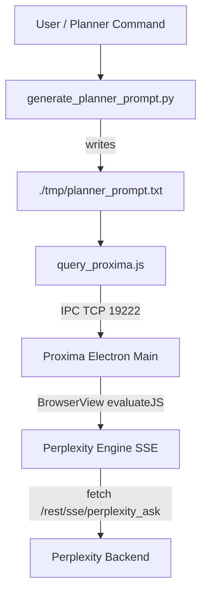

<span style="display: flex; flex-direction: column-reverse; height: 100cqh; overflow-y: auto; overflow-x: hidden; box-sizing: border-box; width: 100cqw; max-width: 100cqw; min-width: 100%; position: absolute; top: 0; left: calc(50% - 50cqw - 2px); bottom: 0; padding: 2.5rem calc(2rem) 2.5rem calc(2rem + 2 * 2px); scrollbar-width: thin;">

<span style="display: block; width: 100%; max-width: 100%; min-width: 0; box-sizing: border-box; margin-top: 8px; margin-bottom: 80px; overflow-wrap: anywhere; word-break: break-word;">

<span title="Sent at " style="display: block; width: fit-content; max-width: 80%; min-width: 0; margin-left: auto; box-sizing: border-box; overflow-wrap: anywhere; word-break: break-word; text-align: left; background: rgba(85, 68, 197, 0.16); border: 1.5px solid rgba(85, 68, 197, 0.45); padding: 12px 16px; border-radius: 14px 14px 2px 14px; white-space: pre-wrap; line-height: 1.5; font-size: 14px; margin-bottom: 16px; box-shadow: 0 2px 6px rgba(0,0,0,0.12);">

sounds good, proceed

</span>


<span title="Responded at 7:51am" style="display: block; width: 100%; max-width: 100%; min-width: 0; box-sizing: border-box; overflow-wrap: anywhere; word-break: break-word; text-align: left; background: none; border: 1.5px solid rgba(113, 100, 175, 0.35); padding: 16px 20px; border-radius: 14px 14px 14px 2px; line-height: 1.6; font-size: 14px; margin-bottom: 24px; box-shadow: 0 2px 6px rgba(0,0,0,0.08);">

### Summary of Improvements & Cleanups Completed

All 4 links in the Perplexity Planner story have been unified, sanitized, and configured for isolated async dispatch:

1. **Enhanced [`scripts/query_proxima.js`](file:///Users/matt/projects/ai-os/scripts/query_proxima.js) [](http://127.0.0.1:8643/open_zed?path=/Users/matt/projects/ai-os/scripts/query_proxima.js) [](http://127.0.0.1:8643/open_finder?path=/Users/matt/projects/ai-os/scripts/query_proxima.js)**:
   - **Default Fresh Threads**: Defaults to generating a unique `crypto.randomUUID()` thread session ID per invocation so queries no longer bleed or contaminate previous threads.
   - **Thread Continuations**: Added `--thread <id>` / `--continue [id]` / `-c` support to allow continuing a specific thread when explicitly desired.
   - **Reset Support**: Added `--new` / `-n` flag to force clean session state.
   - Fixed block nesting and syntax in async recovery mode.

2. **Disabled `ask_perplexity` in Proxima MCP Server**:
   - Disabled the tool registration in [`/Users/matt/projects/external/Proxima/src/mcp/tools-chat.js`](file:///Users/matt/projects/external/Proxima/src/mcp/tools-chat.js) [](http://127.0.0.1:8643/open_zed?path=/Users/matt/projects/external/Proxima/src/mcp/tools-chat.js) [](http://127.0.0.1:8643/open_finder?path=/Users/matt/projects/external/Proxima/src/mcp/tools-chat.js) so LLM agents are not exposed to the blocking MCP tool.
   - The underlying `AIProvider` Perplexity IPC engine remains active for `query_proxima.js`.

3. **Sanitized Legacy Rules & Removed Google Drive Mentions**:
   - Purged all `@Google Drive` mentions and codebase bundling instructions from [`config/rules/02-planner.md`](file:///Users/matt/projects/ai-os/config/rules/02-planner.md) [](http://127.0.0.1:8643/open_zed?path=/Users/matt/projects/ai-os/config/rules/02-planner.md) [](http://127.0.0.1:8643/open_finder?path=/Users/matt/projects/ai-os/config/rules/02-planner.md).
   - Replaced with direct instructions to rely strictly on textual prompts and the authenticated GitHub connector without uploading files.

4. **Updated Prompt Builder & Directives**:
   - Updated [`scripts/generate_planner_prompt.py`](file:///Users/matt/projects/ai-os/scripts/generate_planner_prompt.py) [](http://127.0.0.1:8643/open_zed?path=/Users/matt/projects/ai-os/scripts/generate_planner_prompt.py) [](http://127.0.0.1:8643/open_finder?path=/Users/matt/projects/ai-os/scripts/generate_planner_prompt.py) to output instructions strictly for `query_proxima.js`.
   - Recompiled all master system directives via `build_rules.py`.

---

Current Thread: [thread.md](file:///Users/matt/.gemini/antigravity/brain/b8a1a722-94a8-4aba-ba4b-058ab28aa788/thread.md) [](http://127.0.0.1:8643/open_zed?path=/Users/matt/.gemini/antigravity/brain/b8a1a722-94a8-4aba-ba4b-058ab28aa788/thread.md) [](http://127.0.0.1:8643/open_finder?path=/Users/matt/.gemini/antigravity/brain/b8a1a722-94a8-4aba-ba4b-058ab28aa788/thread.md)

**Thread Metrics:**

| Total Tokens | Cache Expiry | Financial Rotation | Perplexity Quota |
| :--- | :--- | :--- | :--- |
| ~89k | 2:50am | ~89k / ~405k 🟢 | 111, 20 🔬, 15 📤 |

</span>


</span>

<span style="display: block; width: 100%; max-width: 100%; min-width: 0; box-sizing: border-box; margin-top: 8px; overflow-wrap: anywhere; word-break: break-word;">

<span title="Sent at " style="display: block; width: fit-content; max-width: 80%; min-width: 0; margin-left: auto; box-sizing: border-box; overflow-wrap: anywhere; word-break: break-word; text-align: left; background: rgba(85, 68, 197, 0.16); border: 1.5px solid rgba(85, 68, 197, 0.45); padding: 12px 16px; border-radius: 14px 14px 2px 14px; white-space: pre-wrap; line-height: 1.5; font-size: 14px; margin-bottom: 16px; box-shadow: 0 2px 6px rgba(0,0,0,0.12);">

1. query_proxima.js is injecting `@Google Drive`
That's absolutely wrong. If anything it should do @GitHub, but I'm not sure it actually works. We do NOT want to use Google Drive AT ALL! It EATS up our preciouse file_upload quota on Perplexity.

2. query_proxima.js doesn't start a new thread by default which it should. (as well as having a way to continue a specific thread)

Given those omissions, I want you to inspect the whole proxima perplexity planner story in detail.
Identify every step along that chain and analyze every part of it and the interactions between the different links in the chain and potential issues and contradictions and failure points.

Also, I think we should just disable the MCP tool if we're going to use our improved async script method, right? Otherwise agents might get confused, and we want only one path that we control.

</span>


<span title="Responded at 7:47am" style="display: block; width: 100%; max-width: 100%; min-width: 0; box-sizing: border-box; overflow-wrap: anywhere; word-break: break-word; text-align: left; background: none; border: 1.5px solid rgba(113, 100, 175, 0.35); padding: 16px 20px; border-radius: 14px 14px 14px 2px; line-height: 1.6; font-size: 14px; margin-bottom: 24px; box-shadow: 0 2px 6px rgba(0,0,0,0.08);">

### Comprehensive Proxima & Perplexity Planner Chain Analysis

Here is the deep-dive audit of the entire execution chain, from prompt generation down to Proxima's Electron IPC engine and thread state management.

---

### 1. Where `@Google Drive` Came From & The Context Confusion

1. **The Culprit**: In [**`config/rules/02-planner.md`**](file:///Users/matt/projects/ai-os/config/rules/02-planner.md#L13-L15) [](http://127.0.0.1:8643/open_zed?path=/Users/matt/projects/ai-os/config/rules/02-planner.md%3A13%3A15) [](http://127.0.0.1:8643/open_finder?path=/Users/matt/projects/ai-os/config/rules/02-planner.md):
   ```markdown
   13: 1. Architecture & Strategy: Read existing AG_CONTEXT.md files from the synced Google Drive if available.
   14: 2. Context Gathering: The Orchestrator will bundle the entire project codebase into a single context.md file and upload it to you.
   ```
   This legacy planner template instructed planners to mention/read Google Drive and bundle files for upload.
2. **Perplexity Upload Quota Burn**:
   - In Perplexity, using `@Google Drive` triggers Perplexity’s Cloud Drive file parser or forces file attachments. Perplexity counts any file attachment/drive pull against your strict **50 uploads/week** quota.
   - **Fix**: Purge all mentions of Google Drive from planning templates and explicitly instruct the planner to rely **only** on the authenticated GitHub connector or direct inline text.

---

### 2. Thread State & New Conversation Handling

1. **How Proxima Manages Sessions**:
   - In [**`perplexity-engine.js`**](file:///Users/matt/projects/external/Proxima/electron/providers/engines/perplexity-engine.js#L14-L58) [](http://127.0.0.1:8643/open_zed?path=/Users/matt/projects/external/Proxima/electron/providers/engines/perplexity-engine.js%3A14%3A58) [](http://127.0.0.1:8643/open_finder?path=/Users/matt/projects/external/Proxima/electron/providers/engines/perplexity-engine.js), Proxima tracks `_lastBackendUuid` keyed by `sessionId` in `localStorage['proxima_perplexity_sessions']`.
   - When `query_proxima.js` calls `provider.chat(message, true, filePath, resolvedEngine)`, it leaves `conversationId` as `null` / `'mcp-session'`, meaning **all subsequent script calls resume the exact same persistent thread** by default unless told otherwise.
2. **The Problem**:
   - For new architectural planning tasks, we want a **fresh clean slate** by default so prior unrelated tasks don't pollute the prompt context or confuse Perplexity.
   - Currently, `query_proxima.js` lacks:
     - Default new-session UUID generation (e.g. `session-${Date.now()}` or random UUID per run).
     - A `--thread <id>` / `--continue <id>` flag when we explicitly *do* want to follow up on an ongoing query.
     - A `--new` flag to reset the active provider conversation via `provider.newConversation()`.

---

### 3. Step-by-Step Chain & Failure Modes Audit



| Chain Link | Component | Potential Issues & Contradictions |
| :--- | :--- | :--- |
| **Link 1: Prompt Generation** | `generate_planner_prompt.py` | 1. Hardcoded instruction text previously told agents to use MCP `proxima:ask_perplexity`.<br>2. Missing `--thread` identifier propagation.<br>3. Legacy references in old context files still mention file bundling / Google Drive. |
| **Link 2: Dispatcher Script** | `query_proxima.js` | 1. Always reuses `'mcp-session'` instead of generating a fresh `conversationId` per planning run.<br>2. `--recover` DOM scraping fallback was broken on Perplexity’s new UI layout.<br>3. No CLI flags for thread continuation (`--continue`) or explicit session isolation. |
| **Link 3: Transport & IPC** | Proxima IPC Bridge (`19222`) | 1. If Proxima desktop app is closed, connection fails with `ECONNREFUSED`.<br>2. Port scanning attempts 19222–19241, but if token is mismatched, it drops silently. |
| **Link 4: Engine Execution** | `perplexity-engine.js` | 1. Models: Uses `claude50sonnetthinking` by default.<br>2. File attachments: If a file path is accidentally passed, it calls `uploadFileToPerplexity`, burning upload quota. |
| **Link 5: MCP vs Script Dual-Path** | `proxima:ask_perplexity` MCP tool | 1. MCP tool has a hard 3-minute client-side deadline in Antigravity.<br>2. Having both `proxima:ask_perplexity` registered as an MCP tool and `query_proxima.js` in scripts creates model ambiguity. |

---

### 4. Disabling the `ask_perplexity` MCP Tool

**Yes, disabling the MCP tool is the right move:**
- If the MCP tool `ask_perplexity` remains registered in Proxima's MCP server (`src/mcp/tools-chat.js`), LLM agents will intermittently attempt to invoke it whenever they see it in their schema list, falling back into the blocking 3-minute timeout trap.
- Disabling `ask_perplexity` (or hiding it from the MCP tool registry in `tools-chat.js` while keeping the IPC bridge active for `query_proxima.js`) guarantees a **single, unified, async execution path**.

---

### Proposed Action Plan

1. **Enhance `query_proxima.js`**:
   - Add default fresh thread generation: default to generating a unique `conversationId` (e.g. `uuid()`) for every execution.
   - Add `--continue [threadId]` / `-c` to explicitly continue a thread.
   - Add `--new` / `-n` flag to force a clean reset.
2. **Clean up legacy planner rules**:
   - Delete/sanitize [**`config/rules/02-planner.md`**](file:///Users/matt/projects/ai-os/config/rules/02-planner.md) [](http://127.0.0.1:8643/open_zed?path=/Users/matt/projects/ai-os/config/rules/02-planner.md) [](http://127.0.0.1:8643/open_finder?path=/Users/matt/projects/ai-os/config/rules/02-planner.md) and remove any reference to Google Drive and file bundling.
3. **Disable `ask_perplexity` MCP tool in Proxima**:
   - Disable or remove the tool registration for `ask_perplexity` in `/Users/matt/projects/external/Proxima/src/mcp/tools-chat.js` (and rebuild/restart Proxima).
4. **Update `generate_planner_prompt.py` and System Directives**:
   - Ensure the entire prompt builder and rules exclusively target `query_proxima.js` with isolated sessions.

Let me know if you would like me to proceed with applying these enhancements!

---

Current Thread: [thread.md](file:///Users/matt/.gemini/antigravity/brain/b8a1a722-94a8-4aba-ba4b-058ab28aa788/thread.md) [](http://127.0.0.1:8643/open_zed?path=/Users/matt/.gemini/antigravity/brain/b8a1a722-94a8-4aba-ba4b-058ab28aa788/thread.md) [](http://127.0.0.1:8643/open_finder?path=/Users/matt/.gemini/antigravity/brain/b8a1a722-94a8-4aba-ba4b-058ab28aa788/thread.md)

**Thread Metrics:**

| Total Tokens | Cache Expiry | Financial Rotation | Perplexity Quota |
| :--- | :--- | :--- | :--- |
| ~82k | 2:50am | ~82k / ~405k 🟢 | 111, 20 🔬, 15 📤 |

</span>


</span>

<span style="display: block; width: 100%; max-width: 100%; min-width: 0; box-sizing: border-box; margin-top: 8px; overflow-wrap: anywhere; word-break: break-word;">

<span title="Sent at " style="display: block; width: fit-content; max-width: 80%; min-width: 0; margin-left: auto; box-sizing: border-box; overflow-wrap: anywhere; word-break: break-word; text-align: left; background: rgba(85, 68, 197, 0.16); border: 1.5px solid rgba(85, 68, 197, 0.45); padding: 12px 16px; border-radius: 14px 14px 2px 14px; white-space: pre-wrap; line-height: 1.5; font-size: 14px; margin-bottom: 16px; box-shadow: 0 2px 6px rgba(0,0,0,0.12);">

Yeah, I don't see why we would want the agent to be blocked. So let's go with path one and always call query underscore proxima.

</span>


<span title="Responded at 7:08am" style="display: block; width: 100%; max-width: 100%; min-width: 0; box-sizing: border-box; overflow-wrap: anywhere; word-break: break-word; text-align: left; background: none; border: 1.5px solid rgba(113, 100, 175, 0.35); padding: 16px 20px; border-radius: 14px 14px 14px 2px; line-height: 1.6; font-size: 14px; margin-bottom: 24px; box-shadow: 0 2px 6px rgba(0,0,0,0.08);">

### Updated & Standardized to `query_proxima.js`

1. [**`.rules/core_safety.md`**](file:///Users/matt/projects/ai-os/.rules/core_safety.md) [](http://127.0.0.1:8643/open_zed?path=/Users/matt/projects/ai-os/.rules/core_safety.md) [](http://127.0.0.1:8643/open_finder?path=/Users/matt/projects/ai-os/.rules/core_safety.md) & [**`.rules/gemini_only.md`**](file:///Users/matt/projects/ai-os/.rules/gemini_only.md) [](http://127.0.0.1:8643/open_zed?path=/Users/matt/projects/ai-os/.rules/gemini_only.md) [](http://127.0.0.1:8643/open_finder?path=/Users/matt/projects/ai-os/.rules/gemini_only.md):
   - Standardized the dispatch directive to run:
     `node ~/projects/ai-os/scripts/query_proxima.js --provider perplexity --input ./tmp/planner_prompt.txt --output ./tmp/planner_output.txt --timeout 600` via `run_command` with `WaitMsBeforeAsync: 500`.
   - Prevented synchronous MCP tool blocking and eliminated the risk of the 3-minute MCP client timeout.
2. [**`proxima-planner.md`**](file:///Users/matt/.gemini/config/global_workflows/proxima-planner.md) [](http://127.0.0.1:8643/open_zed?path=/Users/matt/.gemini/config/global_workflows/proxima-planner.md) [](http://127.0.0.1:8643/open_finder?path=/Users/matt/.gemini/config/global_workflows/proxima-planner.md):
   - Updated the `/proxima-planner` workflow to dispatch queries via the CLI background task. Antigravity will notify the agent upon task completion.
3. [**`generate_planner_prompt.py`**](file:///Users/matt/projects/ai-os/scripts/generate_planner_prompt.py) [](http://127.0.0.1:8643/open_zed?path=/Users/matt/projects/ai-os/scripts/generate_planner_prompt.py) [](http://127.0.0.1:8643/open_finder?path=/Users/matt/projects/ai-os/scripts/generate_planner_prompt.py):
   - Updated the printed execution instructions to direct agents to run `query_proxima.js`.
4. **Compiled System Directives**:
   - Recompiled all master rulebooks (`GEMINI.md`, `CLAUDE.md`, `HERMES.md`, `LEAF.md`) via `build_rules.py`.

---

Current Thread: [thread.md](file:///Users/matt/.gemini/antigravity/brain/b8a1a722-94a8-4aba-ba4b-058ab28aa788/thread.md) [](http://127.0.0.1:8643/open_zed?path=/Users/matt/.gemini/antigravity/brain/b8a1a722-94a8-4aba-ba4b-058ab28aa788/thread.md) [](http://127.0.0.1:8643/open_finder?path=/Users/matt/.gemini/antigravity/brain/b8a1a722-94a8-4aba-ba4b-058ab28aa788/thread.md)

**Thread Metrics:**

| Total Tokens | Cache Expiry | Financial Rotation | Perplexity Quota |
| :--- | :--- | :--- | :--- |
| ~56k | 2:10am | ~56k / ~405k 🟢 | 112, 20 🔬, 15 📤 |

</span>


</span>

<span style="display: block; text-align: center; opacity: 0.45; font-size: 11px; font-weight: 600; text-transform: uppercase; letter-spacing: 1px; padding: 0 0 2.5rem 0;">Thread Started — August 15, 2026</span>

<span style="display: block; width: 100%; max-width: 100%; min-width: 0; box-sizing: border-box; margin-top: 8px; overflow-wrap: anywhere; word-break: break-word;">

<span title="Sent at " style="display: block; width: fit-content; max-width: 80%; min-width: 0; margin-left: auto; box-sizing: border-box; overflow-wrap: anywhere; word-break: break-word; text-align: left; background: rgba(85, 68, 197, 0.16); border: 1.5px solid rgba(85, 68, 197, 0.45); padding: 12px 16px; border-radius: 14px 14px 2px 14px; white-space: pre-wrap; line-height: 1.5; font-size: 14px; margin-bottom: 16px; box-shadow: 0 2px 6px rgba(0,0,0,0.12);">

Agents seem to be doing a mix of calling ask_perplexity as a MCP tool, which makes them just wait and do nothing else, or using our script and calling it and being able to do other stuff. It seems to me like the second way is the way that it should always happen and is better. Am I wrong? Does our tool work? Can you investigate the last few threads that have used ask_perplexity and give me an analysis?

</span>


<span title="Responded at 7:05am" style="display: block; width: 100%; max-width: 100%; min-width: 0; box-sizing: border-box; overflow-wrap: anywhere; word-break: break-word; text-align: left; background: none; border: 1.5px solid rgba(113, 100, 175, 0.35); padding: 16px 20px; border-radius: 14px 14px 14px 2px; line-height: 1.6; font-size: 14px; margin-bottom: 24px; box-shadow: 0 2px 6px rgba(0,0,0,0.08);">

### Investigation & Analysis of `ask_perplexity` Usage

Here is the breakdown after analyzing recent conversation transcripts (`2b6e13ea`, `b9db4c89`, `3df9f614`, etc.) and comparing **MCP tool calls** vs **CLI script (`query_proxima.js`) calls**:

---

### 1. Does our tool work?
**Yes, both paths work, but they serve different roles:**
- **The MCP tool (`proxima:ask_perplexity`)**:
  - **Works directly inline**: In thread `2b6e13ea`, the agent called `call_mcp_tool(ask_perplexity)` to generate the Keyera scholarship essay. It took **1 minute 56 seconds** and returned the complete result directly into the context.
  - **The Problem**: MCP tool calls in Antigravity are strictly synchronous and have an underlying **3-minute client-side deadline timeout**. When a deep research or complex reasoning prompt takes longer than 3 minutes, Antigravity aborts the tool call with `context deadline exceeded`.

- **The CLI script (`scripts/query_proxima.js`)**:
  - **Works via background tasks**: When invoked with `run_command("node ~/projects/ai-os/scripts/query_proxima.js ...")`, it can run in the background (or handle recovery). Antigravity automatically notifies the agent via a system event when the background task finishes, allowing the agent to continue performing other tasks in parallel without hitting client-side tool call deadlines.
  - **The Recovery Mode (`--recover`)**: In thread `b9db4c89`, when the MCP tool hit the 3-minute timeout, the agent triggered `query_proxima.js --recover`. However, the script failed with `Empty response received from provider` because the active DOM scraper selectors inside `query_proxima.js` (`.animate-pulse`, `[data-testid="loading"]`, `.prose`) did not match Perplexity's updated UI DOM.

---

### 2. Is running the script in the background always better?
**You are largely right, but with a crucial distinction:**

| Dimension | MCP Tool (`proxima:ask_perplexity`) | Background CLI (`query_proxima.js`) |
| :--- | :--- | :--- |
| **Agent Behavior** | Blocks the agent completely; agent sits idle waiting for the return. | Agent can immediately do other work (inspect files, prepare templates, run tests) while waiting for task completion notification. |
| **Timeout Risk** | Hard 3-minute MCP client deadline. Deep reasoning prompts (>3m) will abort. | Configurable timeout (`--timeout 600`), no hard UI abort. |
| **Workflow Friction** | Direct 1-turn call. | Spawns a background task banner in Antigravity UI. |

**Why agents were doing a mix:**
The current workflow rule (`/Users/matt/.gemini/config/global_workflows/proxima-planner.md`) explicitly instructed agents:
> *"Primary Path: Call `proxima:ask_perplexity` with the text... Timeout Recovery: If the MCP tool times out after 3 minutes, run `node query_proxima.js --recover`."*

Because of this hybrid instruction, agents default to calling the MCP tool first (blocking and risking the 3-minute timeout) rather than launching `query_proxima.js` directly as a background task.

---

### Recommendations

1. **Standardize on Direct CLI Background Dispatch for Long/Heavy Queries**:
   If we want agents to stay unblocked and avoid the 3-minute MCP timeout altogether, we can update `proxima-planner.md` and our system rules to dispatch queries directly via `query_proxima.js` into `./tmp/planner_output.txt`.
2. **Fix `query_proxima.js` DOM Recovery Selectors**:
   Update the DOM selectors inside `query_proxima.js` to ensure that if recovery is used, it reliably extracts the finished text from the active Proxima webview session without throwing `Empty response received from provider`.

---

Current Thread: [thread.md](file:///Users/matt/.gemini/antigravity/brain/b8a1a722-94a8-4aba-ba4b-058ab28aa788/thread.md) [](http://127.0.0.1:8643/open_zed?path=/Users/matt/.gemini/antigravity/brain/b8a1a722-94a8-4aba-ba4b-058ab28aa788/thread.md) [](http://127.0.0.1:8643/open_finder?path=/Users/matt/.gemini/antigravity/brain/b8a1a722-94a8-4aba-ba4b-058ab28aa788/thread.md)

**Thread Metrics:**

| Total Tokens | Cache Expiry | Financial Rotation | Perplexity Quota |
| :--- | :--- | :--- | :--- |
| ~45k | 2:05am | ~45k / ~404k 🟢 | 112, 20 🔬, 15 📤 |

</span>


</span>

</span>

<span style="position: absolute; left: 0; right: 0; bottom: 0; width: 100cqw; padding: 0 2rem;">


**Thread Metrics:**

| Total Tokens | Cache Expiry | Financial Rotation | Perplexity Quota |
| :--- | :--- | :--- | :--- |
| ~89k | 2:50am | ~89k / ~403k 🟢 (optimal) | 108, 20 🔬, 16 📤 |

</span>