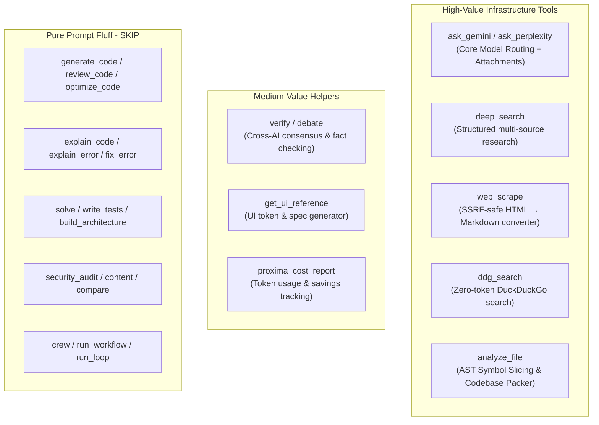

✅ **Approved Plan/Artifact**: [implementation_plan.md](file:///Users/matt/.gemini/antigravity/brain/c2a053c2-1462-43a0-816a-ec0877766486/implementation_plan.md)  

All high-value capabilities from Proxima have been ported over to your Tauri `ai-os` architecture and verified.

For reference, the full conversation log is accessible at [thread.md](file:///Users/matt/.gemini/antigravity/brain/c2a053c2-1462-43a0-816a-ec0877766486/thread.md)   and the comprehensive walkthrough is at [walkthrough.md](file:///Users/matt/.gemini/antigravity/brain/c2a053c2-1462-43a0-816a-ec0877766486/walkthrough.md)  .

---

### Summary of What Was Implemented

1. **Unified Webview Engines**:
   - Upgraded [`apps/gemini-companion/src-tauri/engines/gemini-engine.js`](file:///Users/matt/projects/ai-os/apps/gemini-companion/src-tauri/engines/gemini-engine.js)   with Google Scotty resumable upload (`push.clients6.google.com/upload/` on `bard-storage`), dynamic 400 Bad Request session recovery, prompt warmups (>500 chars), and workspace detection.
   - Connected Perplexity S3 multipart direct uploads in [`perplexity-engine.js`](file:///Users/matt/projects/ai-os/apps/gemini-companion/src-tauri/engines/perplexity-engine.js)  .

2. **OpenAI-Compatible REST Gateway & Multimodal API**:
   - Updated [`apps/gemini-companion/src-tauri/src/server.rs`](file:///Users/matt/projects/ai-os/apps/gemini-companion/src-tauri/src/server.rs)   to expose:
     - `/v1/chat/completions` (supporting JSON and SSE streaming chunks)
     - `/v1/models` (listing available Gemini and Perplexity model choices)
     - Auto-file attachment handling for local file paths or Base64 payloads across `/api/gemini/query`, `/api/perplexity/query`, and `/v1/chat/completions`.

3. **Code Intelligence Suite ([`tools/code-intel/`](file:///Users/matt/projects/ai-os/tools/code-intel)  )**:
   - [`symbol-extractor.js`](file:///Users/matt/projects/ai-os/tools/code-intel/symbol-extractor.js)  : Multi-language AST pattern matcher (JS/TS, Python, Rust, Go, Java, Ruby, PHP) extracting function/struct/class line ranges, line counts, and signatures.
   - [`smart-slicer.js`](file:///Users/matt/projects/ai-os/tools/code-intel/smart-slicer.js)  : Question-based symbol scorer and dependency resolver (`sliceBySymbols` & `smartSlice`), reducing token waste by **60–93%**.
   - [`file-tree.js`](file:///Users/matt/projects/ai-os/tools/code-intel/file-tree.js)  : Formatted ASCII hierarchy generator with line counts.
   - [`codebase-packer.js`](file:///Users/matt/projects/ai-os/tools/code-intel/codebase-packer.js)  : Gitignore-respecting repository packager with **16 regex secret detectors** (AWS, GitHub, Slack, DB URLs, Private Keys, Stripe, etc.).
   - [`cli.js`](file:///Users/matt/projects/ai-os/tools/code-intel/cli.js)  : CLI entrypoint for running `bun tools/code-intel/cli.js <map|analyze|pack|tree> <target>`.

4. **Web Research & SSRF-Safe Scraper ([`tools/web/`](file:///Users/matt/projects/ai-os/tools/web)  )**:
   - [`web-scraper.js`](file:///Users/matt/projects/ai-os/tools/web/web-scraper.js)  : SSRF-safe scraper blocking private/internal IP ranges (`127.0.0.0/8`, `10.0.0.0/8`, `172.16.0.0/12`, `192.168.0.0/16`, link-local, IPv6 loopbacks) with HTML-to-Markdown parser.
   - [`ddg-search.js`](file:///Users/matt/projects/ai-os/tools/web/ddg-search.js)  : Keyless DuckDuckGo search returning formatted markdown.

5. **Client Script Integration**:
   - Updated [`scripts/query_proxima.js`](file:///Users/matt/projects/ai-os/scripts/query_proxima.js)   to connect directly to the Tauri companion on `http://127.0.0.1:3031` with `--file` attachment support, falling back smoothly to Proxima IPC if needed.

---

### Verification
- **Rust compilation**: `cargo check` in `apps/gemini-companion/src-tauri` passed with exit code 0.
- **Code intelligence test**: Verified symbol slicing and mapping on `server.rs` achieving a **93% token reduction** with exact symbol extraction.
- **Unit test suite**: [`tmp/test_tools.js`](file:///Users/matt/projects/ai-os/tmp/test_tools.js)   passed all checks for symbol extraction, smart slicing, secret scanning, SSRF protection, and markdown generation.

I think your analysis is pretty spot on. I didn't know about analyze_file, that sounds extremely useful. I'll have to learn more about that.
I can't believe I've never thought of the idea of: there's layers to a code file.
Roughly:
pathname: file name and location
how it fits into the project: what it does, what plugs into it and what relies on it
what specific functions it calls and exports, what variables, etc.
the literal verbatim code

And probably more layers too.
And it makes sense to avoid jumping straight to the verbatim code because it's often unnecessary for high level understanding and planning and it pollutes the context window.

Anyway... make us a plan to bring all of the good stuff you mentioned over.

I have created the detailed implementation plan:

👉 **[implementation_plan.md](file:///Users/matt/.gemini/antigravity/brain/c2a053c2-1462-43a0-816a-ec0877766486/implementation_plan.md)  **

Please review the proposed plan and let me know if you would like me to adjust anything or proceed with execution.

---
Conversation thread artifact: [thread.md](file:///Users/matt/.gemini/antigravity/brain/c2a053c2-1462-43a0-816a-ec0877766486/thread.md)  

Thread Started — August 15, 2026

What is missing from our tauri ai-os "proxima clone" that Proxima has?
I know we don't have support for ChatGPT or Claude, but I don't use those anyway so it doesn't matter.
What else do we need?
File uploads? What else?
I mean, I know proxima has a bunch of tools and shit, but which of them are really necessary to port? Probably not many. Idk. Do an audit of the Proxima project and assemble a list of things you think I ought to bring over to my app.

Here is the comprehensive audit of **Proxima** compared to our **Tauri `ai-os` (`gemini-companion`)** application.

Since you only care about **Gemini** and **Perplexity** (and don't use ChatGPT/Claude), we can ignore the OpenAI/Anthropic scrapers and focus on what actually makes Proxima powerful: its **engine internals**, **multimodal file upload protocols**, **API interoperability**, and **infrastructure utilities**.

---

### 1. Engine & Multimodal Ingestion Gaps

| Feature | Proxima Implementation | Our Current Tauri App | Priority |
| :--- | :--- | :--- | :--- |
| **Gemini File Uploads (Images/PDFs/Audio)** | Uses Google's internal **Scotty Resumable Upload protocol** (`push.clients6.google.com/upload/` with `bard-storage` tenant) returning upload tokens for `StreamGenerate`. | ❌ **Missing.** The current `gemini-engine.js` in Tauri is a truncated 292-line stub without Scotty upload logic. | **CRITICAL** |
| **Perplexity File Uploads** | Uses `/rest/uploads/batch_create_upload_urls` to generate presigned S3 URLs + direct multipart POST upload. | ⚠️ Implemented in `perplexity-engine.js` but needs frontend/IPC wiring for local file attachments. | **HIGH** |
| **Self-Healing & Token Re-extraction** | If Gemini returns a `400 Bad Request` or session expiration, it automatically re-extracts `SNlM0e` & `cfb2h` tokens from page memory/`/faq` and retries the prompt in the same turn. | ❌ Minimal fallback logic in the stubbed engine. | **HIGH** |
| **Large Prompt Warm-Up Protocol** | For fresh conversations with prompt length > 500 characters, Proxima sends a rapid `"Hello!"` handshake first to bypass Google's WAF / initial turn safety rejections. | ❌ Missing. Large initial prompts can intermittently fail or trigger silent filter drops. | **MEDIUM** |
| **Dynamic Workspace & Model Profiles** | Dynamically detects `WIZ_global_data` workspace hashes (`m3eQte`) to cleanly route between **Fast** (`3.5-flash` / `3.1-flash-lite`) and **Thinking** (`3.1-pro`), injecting internal protobuf model identifiers (`inner79`, `customIndex11`). | ⚠️ Partially stubbed, needs full profile matrix. | **HIGH** |
| **Code-Preserving Citation Stripping** | Strips Perplexity citation brackets (`[1]`, `[2]`) from prose while preserving bracketed array indexing and regex inside fenced code blocks. | ⚠️ Present in `perplexity-engine.js`. | **DONE** |

---

### 2. API & Interoperability Gaps

1. **Standard OpenAI-Compatible REST Gateway (`/v1/chat/completions`)**:
   - **What Proxima has**: A local HTTP server (`:3210`) that translates standard OpenAI JSON payloads (including streaming SSE chunks `data: {"choices": [{"delta": {"content": "..."}}]}`) into Gemini and Perplexity browser sessions.
   - **Why this matters**: With an OpenAI-compatible endpoint, tools like **LiteLLM**, **Aider**, **Hermes**, or custom scripts can treat your local Tauri app as a free frontier LLM provider without needing custom IPC code or adapters.
   - **What we have now**: Axum routes on `:3031` with custom endpoints (`/api/gemini/query`, `/api/perplexity/query`) that only return synchronous JSON strings on completion, lacking standard streaming delta events.

2. **Isolated Multi-Session Continuation (`sessionId`)**:
   - **What Proxima has**: Maps incoming `sessionId` / `conversationId` to Perplexity's `backend_uuid` and Gemini's `conversationId` in `localStorage` (supporting up to 200 concurrent threads).
   - **Why this matters**: Allows multiple subagents, background scripts, or chat tabs to query models concurrently without cross-contaminating each other's active chat context.

---

### 3. MCP Tools Audit: What to Port vs. What to Drop

Proxima advertises 40 MCP tools, but **~80% are pure prompt wrappers** (e.g. `explain_code` is literally just `smartChat("Explain this code: " + code)`). Because Antigravity and your developer agents already handle reasoning, code analysis, and test writing, wrapping simple prompts into MCP tools is useless bloat.

Here is the triage of what is actually worth bringing over:

#### High-Value Tools to Port:
1. **`analyze_file` / Symbol Slicer**: Uses AST symbol maps (`sliceBySymbols`) to send only relevant classes/functions plus imports to the model instead of full multi-thousand-line files, cutting token usage by 70–80%.
2. **`web_scrape`**: An SSRF-safe URL-to-Markdown scraper with redirect bounds and a 5MB memory guard.
3. **`ddg_search`**: Free link search that doesn't waste webview queries or provider quotas.
4. **`deep_search`**: Preconfigured prompt templates for Reddit, GitHub repos, academic sources, and fact-checking.

#### Fluff Tools to Drop:
- `generate_code`, `explain_code`, `optimize_code`, `review_code`, `solve`, `fix_error`, `build_architecture`, `write_tests`, `security_audit`, `crew`, `run_workflow`, `run_loop`.
- *Reason to drop*: They are basic prompt templates that offer no structural leverage over a direct prompt from Antigravity.

---

### 4. Recommended Roadmap for Tauri AI-OS

To achieve 100% feature parity with everything you actually use in Proxima:

1. **Upgrade `gemini-engine.js`**:
   - Port the full 768-line engine from Proxima into `apps/gemini-companion/src-tauri/engines/gemini-engine.js` (enabling Scotty uploads, 400 recovery, and dynamic fast/thinking workspace routing).
2. **Add OpenAI-Compatible REST Route (`/v1/chat/completions`) in Rust (`server.rs`)**:
   - Provide standard SSE streaming and non-streaming responses so LiteLLM and external tools can target `http://127.0.0.1:3031/v1` seamlessly.
3. **Expose Local File Upload CLI & API**:
   - Add `--file` support in `query_proxima.js` (or our new `aios query` CLI) to base64-encode local files (images, PDFs, text) and pass them directly into `uploadFileToGoogle` or `uploadFileToPerplexity`.
4. **Bundle the 5 High-Value Infrastructure Tools into AI-OS MCP**:
   - Port `deep_search`, `web_scrape`, `ddg_search`, `analyze_file` (AST slicer), and direct model execution into our native MCP toolset.

---
Conversation thread artifact: [thread.md](file:///Users/matt/.gemini/antigravity/brain/c2a053c2-1462-43a0-816a-ec0877766486/thread.md)  

| Tokens | Expiry | Committed | PPLX Quota |
| :--- | :--- | :--- | :--- |
| ~130k / ~420k 🟡 (fatigue) | 10:10pm | 🟡 Uncommitted (1) | 91 ❓, 21 📤 |

